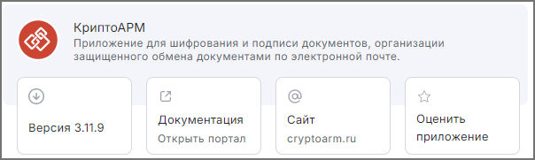

Вы можете оценить приложение и поделиться мнением.

## Оценка приложения  

1. В разделе **Начальная страница** выберите **Оценить приложение**.   

2. В открывшемся окне вы можете:

    - поставить оценку;  
    - оставить отзыв о приложении;  
    - указать имя и e-mail.   
    Поля с отзывом, именем и e-mail не являются обязательными.
    
    

3. Для отправки оценки нажмите кнопку **Отправить**.  

## Изменение оценки  

Вы можете изменить оценку даже после отправки формы:

1. Нажмите на иконку **Оценка приложения**.  
2. В открывшемся окне с заполненным отзывом нажмите кнопку **Изменить оценку**.  
3. Измените необходимые значения.  
4. Для отправки оценки нажмите кнопку **Отправить**.  
 

