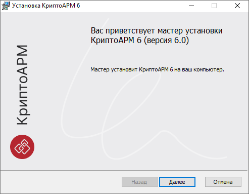
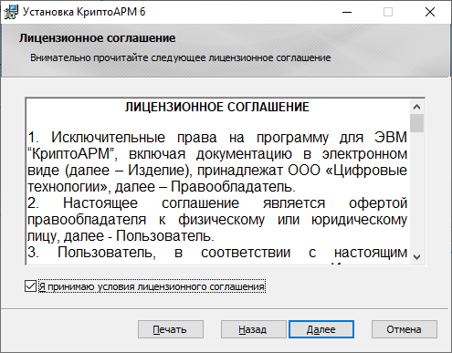
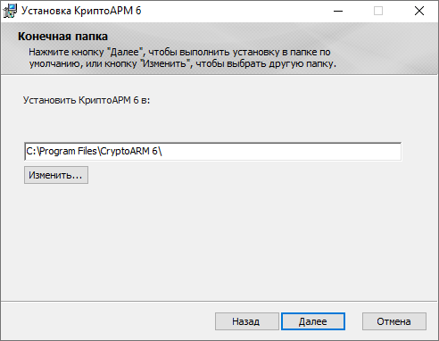
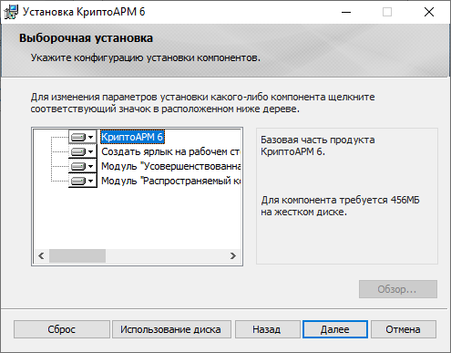
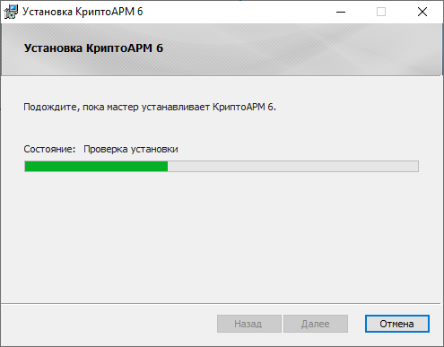
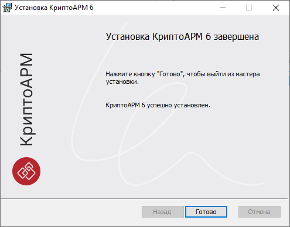

***Важно:*** дополнительно требуется установить:  

- [Распространяемые пакеты VS C++ 2013 (x64)](https://www.microsoft.com/ru-RU/download/details.aspx?id=40784).  

- [Распространяемые пакеты VS C++ 2019 (x64)](https://support.microsoft.com/ru-ru/topic/%D0%BF%D0%BE%D1%81%D0%BB%D0%B5%D0%B4%D0%BD%D0%B8%D0%B5-%D0%BF%D0%BE%D0%B4%D0%B4%D0%B5%D1%80%D0%B6%D0%B8%D0%B2%D0%B0%D0%B5%D0%BC%D1%8B%D0%B5-%D0%B2%D0%B5%D1%80%D1%81%D0%B8%D0%B8-visual-c-%D0%B4%D0%BB%D1%8F-%D1%81%D0%BA%D0%B0%D1%87%D0%B8%D0%B2%D0%B0%D0%BD%D0%B8%D1%8F-2647da03-1eea-4433-9aff-95f26a218cc0).  

Для установки приложения КриптоАРМ на платформу Microsoft Windows предлагаются дистрибутивы:  

- **cryptoarm-x.x.x-win32-x86.msi** (где x.x.x – номер версии);
- **cryptoarm-x.x.x-win64-x86.msi** (где x.x.x – номер версии).

***Важно:*** для установки приложения нужны права администратора.  

**Шаги по установке**:

1. При запуске исполняемого файла открывается мастер установки приложения КриптоАРМ 6.  

2. По кнопке **Далее** происходит переход на следующий шаг, где предлагается ознакомиться с условиями лицензионного соглашения. В случае согласия нужно **принять условия** и перейти к следующему шагу мастера, нажав кнопку **Далее**.  

3. На следующем шаге мастера можно выбрать каталог для установки КриптоАРМ 6 (по умолчанию приложение устанавливается в каталог C:\Program Files\CryptoARM 6\\).  

4. На шаге выборочной установки можно отключить создание ярлыка на рабочем столе и установку модулей для создания усовершенствованной подписи.  

5. На заключительном шаге мастера по кнопке **Установить** выполняется установка. 

6. После окончания установки окно закрывается нажатием кнопки **Готово**.  
   

Программа успешно установлена.

В указанном при установке каталоге размещаются файлы приложения.  