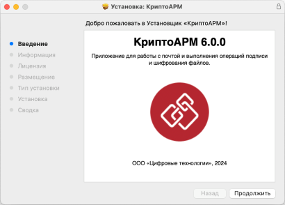
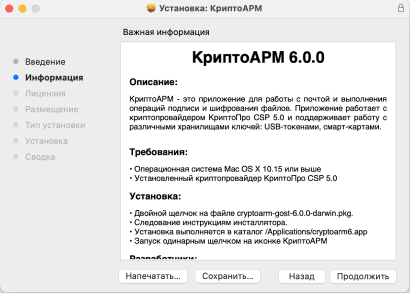
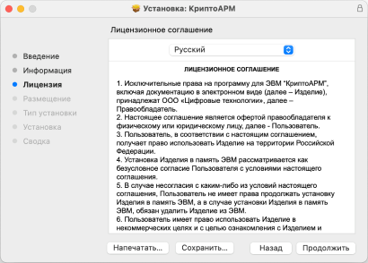
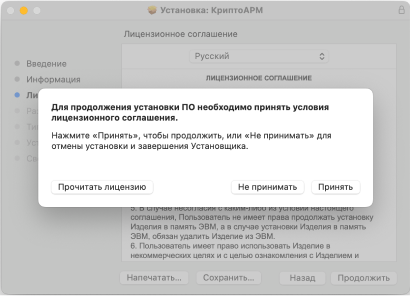
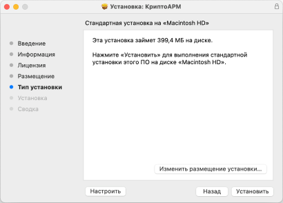
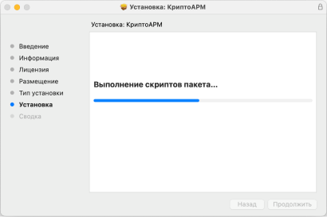
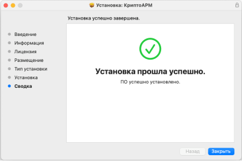

Дистрибутив приложения КриптоАРМ поставляется в упакованном виде, имеет формат .dmg и представляет собой образ диска, содержащий пакет установки **cryptoarm-x.x.x-x64.pkg,** описание приложения, каталог со скриптами удаления приложения.  

1. Для установки пакета через графический интерфейс откройте двойным щелчком образ диска с дистрибутивом **cryptoarm-x.x.x-x64.dmg** (где x.x.x – номер версии).   

2. Для установки программы КриптоАРМ запустите на исполнение файл **cryptoarm-x.x.x-64.pkg** (где x.x.x – номер версии).  

    Установочный пакет для приложения КриптоАРМ может поставляться вне образа диска. В таком случае нужно сразу запустить файл **cryptoarm-x.x.x-64.pkg** (где x.x.x – номер версии).  

3. Откроется мастер установки КриптоАРМ. Для продолжения установки следует нажать кнопку **Продолжить**. На каждом шаге можно вернуться на предыдущий шаг нажатием **Назад**.  

      

4. На следующем шаге предоставляется описание программы, которое можно распечатать или сохранить в файл. По кнопке **Продолжить** происходит переход на следующий шаг.  

      

5. На этапе ознакомления с условиями лицензионного соглашения их можно распечатать или сохранить в файл.   

      

    Принять условия лицензионного соглашения можно, нажав кнопку **Принять**. Установка продолжения продолжается. По кнопке **Не принимать** происходит отмена установки.  

      

6. На последнем шаге мастера надо нажать кнопку **Установить** для завершения установки.  

      

    Начнется установка программы на компьютер.   

      

7. По окончании установки нужно нажать кнопку **Закрыть**.  

    

После установки программы в Launchpad появится ярлык приложения КриптоАРМ 6, и в каталоге Applications (Программы) будут созданы подкаталоги приложения.