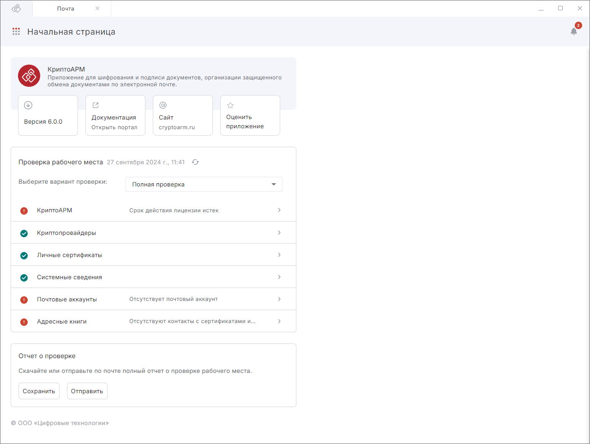
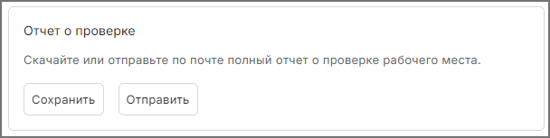

Раздел **Начальная страница** помогает проверить готовность рабочего места для работы с электронной подписью. Помимо этого **Начальная страница** содержит информацию о версии приложения, ссылку на портал с документацией, официальный сайт интернет-магазина, оценку приложения. 

  

Проверка рабочего места доступна по следующим сценариям:

- **Полная проверка** - проверяются все компоненты приложения на ошибки.
- **Защищенная почта** - проверяются компоненты, которые задействованы в обмене подписанными и зашифрованными письмами.
- **Электронная почта** - проверяются компоненты, которые необходимы для отправки писем.
- **Подпись документов со штампами времени** - проверяются компоненты, необходимые для создания подписи со штампом времени.
- **Подпись документов без штампов времени** - проверяются компоненты, необходимые для создания классической подписи.
- **Шифрование документов** - проверяются компоненты, необходимые для шифрования файлов в адрес контактов или сертификатов других пользователей.
- **Расшифрование документов** - проверяются компоненты, необходимые для расшифрования файлов.

Проверка запускается автоматически при запуске КриптоАРМ. По кнопке **Обновить** доступен повторный запуск проверки.

В блоке **Отчет о проверке** есть возможность Сохранить или Отправить по почте файл с отчетом о проверке рабочего места. 

Файл с отчетом содержит:

- сведения об операционной системе, процессоре и оперативной памяти;
- информацию о криптопровайдере;
- информацию о КриптоАРМ;
- информацию о количестве сертификатов подписи;
- информацию о почтовых аккаунтах (количество и протоколы).

Данный отчет может понадобиться при обращении в техподдержку.