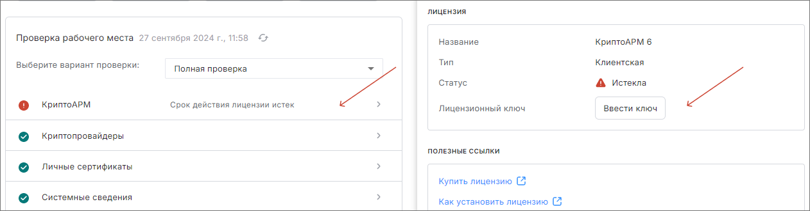

## Установка лицензионного ключа для КриптоАРМ 

Для установки лицензии на КриптоАРМ необходимо выполнить следующие действия:

1. Перейти в раздел **Начальная страница**.
2. Нажать на кнопку с названием **КриптоАРМ** и в открывшемся боковом окне нажать на кнопку **Ввести ключ**.

    
	
3. В появившемся диалоговом окне ввести лицензионный ключ и нажать кнопку **Применить**.

    

После выполненных действий статус лицензии на КриптоАРМ обновится и станет Действительным.