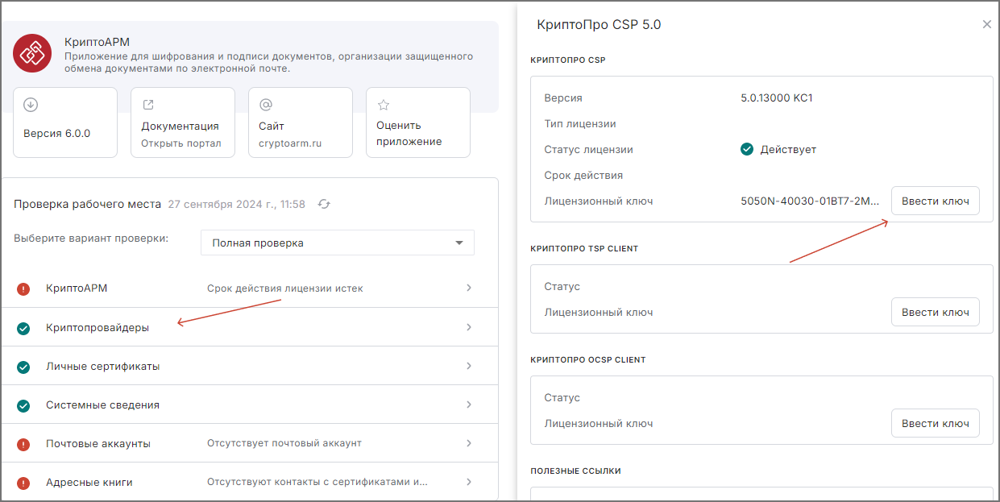

## Установка лицензионного ключа для КриптоПро CSP 

Для установки лицензии на криптопровайдер КриптоПро CSP необходимо выполнить следующие действия:

1. Перейти в раздел **Начальная страница**.
2. Нажать на кнопку с названием **Криптопровайдеры** и в открывшемся боковом окне нажать кнопку **Ввести ключ**.

    

3. В появившемся диалоговом окне ввести лицензионный ключ и нажать кнопку **Применить**.

    

После выполнения данных действий статус лицензии на КриптоПро CSP обновится и станет *Действительным*.