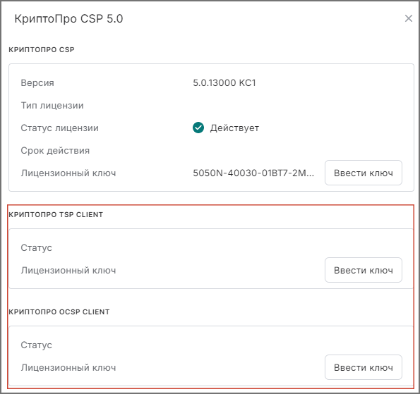

## Установка лицензионного ключа для модулей TSP и OCSP

Ввод лицензии на модули TSP client и OCSP client выполняется аналогично установке лицензии на КриптоПро CSP. 

Для этого необходимо выполнить следующие действия:

1. Перейти в раздел **Начальная страница**.
2. Выбрать **Криптопровайдеры**.
3. В блоках **КриптоПро TSP Client** и **КриптоПро OCSP Client** заполнить информацию, нажав на кнопку **Ввести ключ**.
