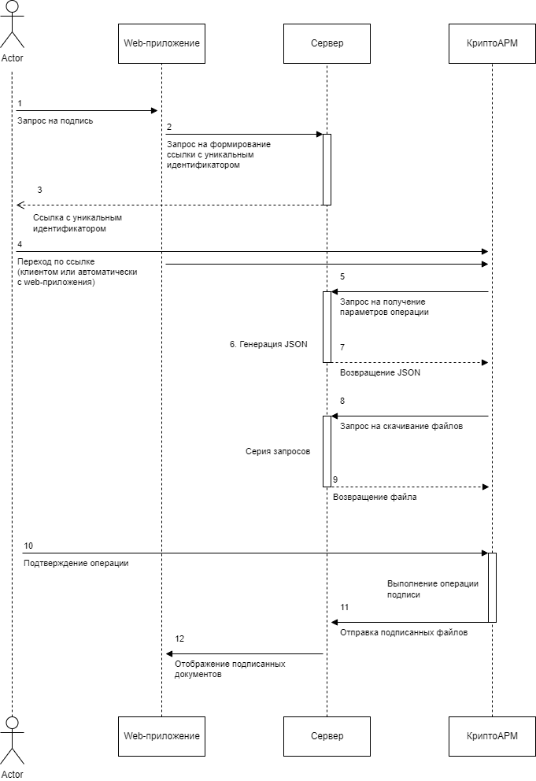

Команда `signAndEncrypt` (подпись и шифрование) используется для запроса на подпись документа или пакета документов. Может использоваться в качестве аутентификатора. 

!!! note "Внимание"

    Выполнение операции требует действующей лицензии на КриптоАРМ.

