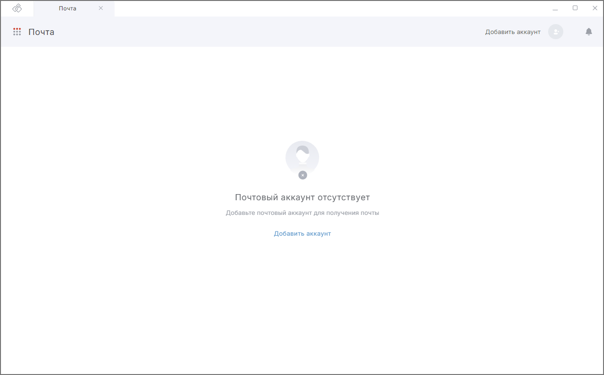
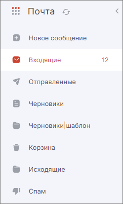
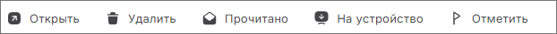
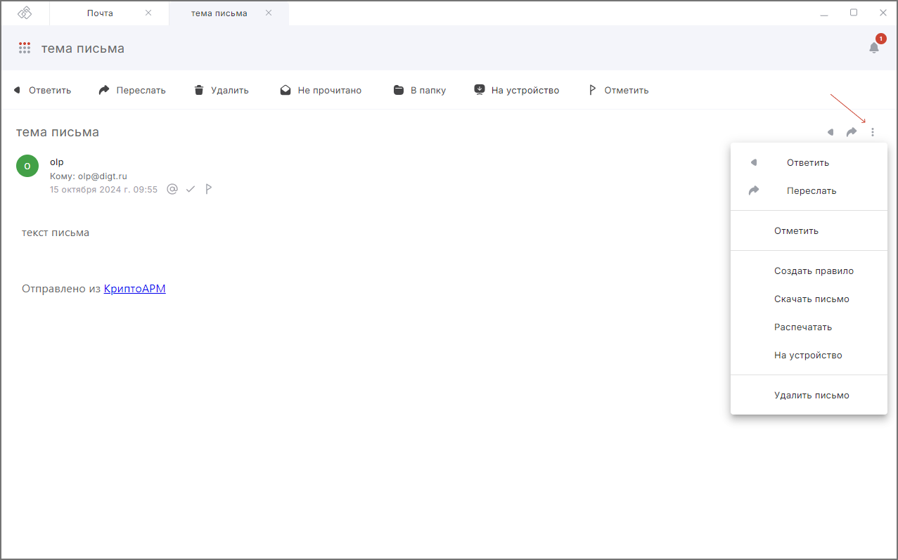

## Начало работы с почтой

Чтобы начать работать с почтой, необходимо [добавить почтовый аккаунт](./02-add-account.md) нажатием на соответствующую кнопку.

После добавления в почтовом ящике доступны следующие стандартные папки:  

- **Все входящие** — все входящие письма добавленных почтовых аккаунтов.  
- **Входящие** — все входящие письма активного аккаунта, исключая спам.  
- **Отправленные** — все отправленные письма.  
- **Черновики** — все сохраненные черновики писем.  
- **Корзина** — все письма, удаленные вручную или с помощью автоматической сортировки.  
- **Спам**.  

<!--  -->

Если у вас в почтовом аккаунте есть внутренние папки с письмами, то они тоже отображаются в списке.  

При удалении писем с сервера появляется папка **Сохранённые письма**. В ней содержатся письма, которые были удалены с сервера и хранятся локально на устройстве. Для таких писем доступны следующие действия:   

- Открыть.
- Удалить навсегда.
- Отметить Прочитано/Не прочитано. 
- Переслать.
- Распечатать.  
- Скачать.
- Удалить.  
- Сохранить на сервер.  
- Ответить.  

## Действия с письмами

**Вы можете:**   

- Cоздать новое сообщение.  
- **Открыть** выделенное в списке письмо для просмотра в отдельной вкладке.  
- **Открыть** выделенное письмо для быстрого просмотра в правой боковой панели.  
- **Удалить** выделенные письма, письма перемещаются в корзину.
- Отметить **Прочитано/Не прочитано** выделенные письма.
- Переместить **В папку** выделенные письма.  
- **Отметить** выделенные письма.
- Обновить список писем по кнопке **Обновить**.  
- Найти или отфильтровать список писем по заданным критериям с помощью поиска.  
- Сохранить **на устройство** — письма удаляются с почтового сервера, хранятся локально на устройстве и видны в папке Сохранённые письма.  
- Сохранить **на сервер** — возвращает ранее удалённое с почтового сервера письмо на сервер.  

При выделени письма (галочка слева) активируются кнопки с действиями (сверху).

**Для отдельного письма вам доступны следующие действия:**   

- ответить;  
- ответить всем — если письмо было направлено нескольким адресатам; 
- переслать; 
- отметить;
- создать правило;
- скачать письмо;  
- распечатать;  
- удалить с сервера;   
- удалить письмо;
- проверить подпись — для подписанных электронной подписью писем;  
- расшифровать — для зашифрованных писем;  
- переместить в папку.      

В верхнем правом углу раздела доступен выбор почтового аккаунта.   

## Инструкции по теме

1. [Как добавить почтовый аккаунт.](./02-add-account.md)    
2. [Как открыть письмо.](./10-view-mail.md)    
3. [Как удалять и восстанавливать удаленные письма.](./17-delete-mail.md)    
4. [Действия с электронными письмами.](./11-answer-mail.md)    