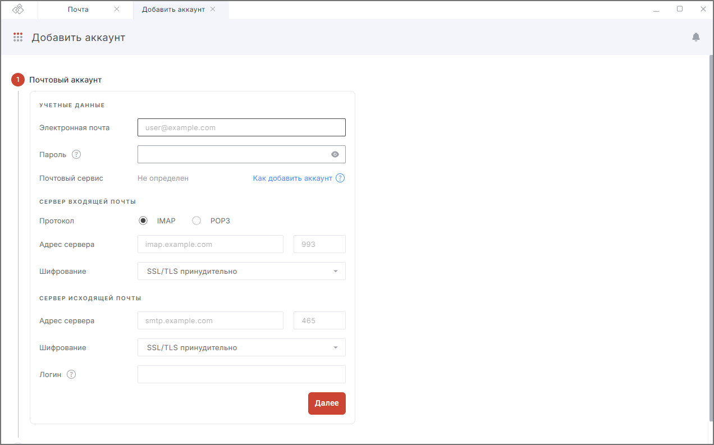
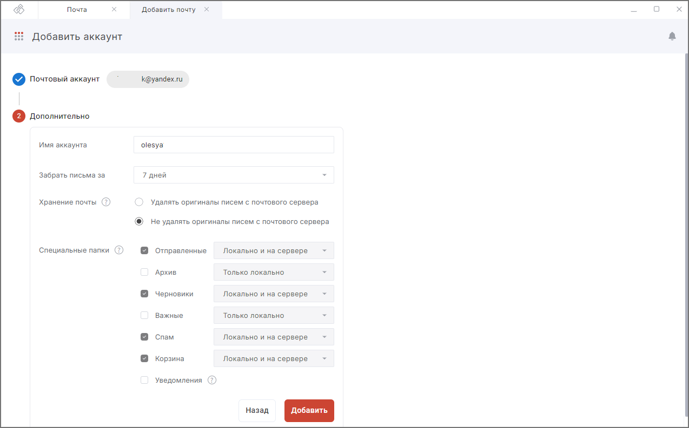

Вы можете работать с почтой разных сторонних служб: Mail, Yandex, Gmail, Tegu, iCloud, Communigate Pro, Exchange.  

Чтобы начать работать с почтой, вам нужно подключить почтовый аккаунт.  

## Добавление первого аккаунта  

1. Перейдите в раздел **Почта**.  
2. На правой боковой панели или в центральной части окна выберите **Добавить аккаунт**.  
3. Заполните поля в новой вкладке добавления аккаунта.
    
4. Нажмите на кнопку **Далее**.  
5. Укажите имя аккаунта; период, за который следует загрузить письма; параметры хранения почты; настройки папок.
    
6. Нажмите на кнопку **Добавить**. 

***Важно:*** для некоторых почтовых сервисов необходимо создать **Пароль для внешнего приложения**.  

При успешном подключении добавленный аккаунт становится активным в приложении и отображается на правой боковой панели.    

В списке писем отображаются все письма добавленного аккаунта с разделением по папкам.  

## Добавление следующего аккаунта  

1. Перейдите в раздел **Почта**.  
2. Откройте правую боковую панель и выберите **Добавить аккаунт**.  
3. Заполните поля **Почтового аккаунта**.  
4. Нажмите кнопку **Далее**.  
5. Заполните поля **Дополнительно**.  
6. Нажмите кнопку **Добавить**.  

При успешном подключении в списке писем **Все входящие** отображаются письма всех добавленных аккаунтов.  

Чтобы посмотреть письма добавленного аккаунта, нужно сделать его активным.  
После этого в списке писем **Входящие** и вложенных папках отображаются все письма добавленного аккаунта.  

## Описание полей формы добавления аккаунта  

### Почтовый аккаунт  

#### Учётные данные  

**Электронная почта** — адрес добавляемой электронной почты. Обязательное поле.  

**Пароль** — пароль к почтовому ящику. Обязательное поле.  

**Как получить пароль для внешнего приложения для почтового аккаунта:**  

- [Яндекс](https://yandex.ru/support/id/authorization/app-passwords.html?ysclid=l6c3phlj36537332539);  
- [Gmail](https://support.google.com/mail/answer/185833?hl=ru);  
- [Mail](https://help.mail.ru/mail/security/protection/external);
- [Outlook](https://support.microsoft.com/ru-ru/account-billing/%D1%81%D0%BE%D0%B7%D0%B4%D0%B0%D0%BD%D0%B8%D0%B5-%D0%BF%D0%B0%D1%80%D0%BE%D0%BB%D0%B5%D0%B9-%D0%BF%D1%80%D0%B8%D0%BB%D0%BE%D0%B6%D0%B5%D0%BD%D0%B8%D0%B9-%D0%BD%D0%B0-%D1%81%D1%82%D1%80%D0%B0%D0%BD%D0%B8%D1%86%D0%B5-%D1%81%D0%B2%D0%B5%D0%B4%D0%B5%D0%BD%D0%B8%D1%8F-%D0%BE-%D0%B1%D0%B5%D0%B7%D0%BE%D0%BF%D0%B0%D1%81%D0%BD%D0%BE%D1%81%D1%82%D0%B8-%D0%BF%D1%80%D0%B5%D0%B4%D0%B2%D0%B0%D1%80%D0%B8%D1%82%D0%B5%D0%BB%D1%8C%D0%BD%D0%B0%D1%8F-%D0%B2%D0%B5%D1%80%D1%81%D0%B8%D1%8F-d8bc744a-ce3f-4d4d-89c9-eb38ab9d4137);
- [iCloud](https://support.apple.com/ru-ru/102654);
- [Рамблер](https://support.apple.com/ru-ru/102654).

#### Сервер входящей почты

**Адрес сервера** — адрес сервера вида *imap.example.com* (*imap.google.com, imap.yandex.ru* и т.д.) и порт *993*. Обязательное поле.   

**Шифрование** — настройки способа шифрования (Не использовать, SSL/TLS принудительно или при обнаружении); зависят от почтового сервера. По умолчанию установлено **SSL/TLS принудительно**. Обязательное поле.   

#### Сервер исходящей почты  

**Адрес сервера** — адрес сервера вида *smtp.example.com* (*smtp.google.com, smtp.yandex.ru* и т.д.) и порт *465*. Обязательное поле.

**Шифрование** — настройки способа шифрования (Не использовать, SSL/TLS принудительно или при обнаружении); зависят от почтового сервера. По умолчанию стоит **SSL/TLS принудительно**. Обязательное поле.   

**Логин** — для некоторых почтовых серверов требуется обязательное наличие логина для отправки писем. Логин может совпадать с адресом электронной почты или являться его первой частью до знака @.  

**Данные для серверов входящей и исходящей почты:**  

- [Mail.ru](https://help.mail.ru/mail/mailer/popsmtp);  
- [Yandex.ru](https://yandex.ru/support/mail/mail-clients/others.html);  
- [Gmail.com](https://support.google.com/mail/answer/7126229?hl=ru#zippy=%2C%D1%88%D0%B0%D0%B3-%D0%B8%D0%B7%D0%BC%D0%B5%D0%BD%D0%B8%D1%82%D0%B5-smtp-%D0%B8-%D0%B4%D1%80%D1%83%D0%B3%D0%B8%D0%B5-%D0%BF%D0%B0%D1%80%D0%B0%D0%BC%D0%B5%D1%82%D1%80%D1%8B-%D0%B2-%D0%BA%D0%BB%D0%B8%D0%B5%D0%BD%D1%82%D0%B5);  
- [Outlook.com](https://support.microsoft.com/ru-ru/office/%D0%BD%D0%B0%D1%81%D1%82%D1%80%D0%BE%D0%B9%D0%BA%D0%B0-pop-imap-%D0%B8-smtp-%D0%B4%D0%BB%D1%8F-outlook-com-d088b986-291d-42b8-9564-9c414e2aa040);  
- [iCloud](https://support.apple.com/ru-ru/HT202304).   

### Дополнительно  

**Имя аккаунта** — имя почтового аккаунта, которое отображается в списке подключённых почтовых аккаунтов.  

**Забрать письма за** — в приложение загрузятся письма за указанный период (7 дней, 2 месяца, 3 месяца, за всё время).  

**Хранение почты** — настройки для хранения сообщений («Удалять оригиналы писем с почтового сервера», «Не удалять оригиналы писем с почтового сервера»). Письма могут быть удалены с сервера после загрузки на устройство. Для сохранения писем на сервере необходимо выбрать «Не удалять оригиналы писем с почтового сервера». По умолчанию выставлена настройка «Не удалять оригиналы писем с почтового сервера». Если активировать настройку «Удалять оригиналы писем с почтового сервера» и нажать кнопку «Добавить», то после подключения почтового аккаунта и получения всех писем оригиналы писем удаляются с почтового сервера. Все письма хранятся локально на устройстве и видны в папке «Сохранённые письма» общим списком.  

**Специальные папки** — настройка для создания локальных папок, которые будут отсутствовать на почтовом сервере. Для доступа к папкам с различных устройств необходимо выбрать «Локально и на сервере».
 
Если при подключении аккаунта возникает ошибка, она выводится как уведомление в правом верхнем углу. Вы можете посмотреть уведомления, нажав на иконку **События**. Для просмотра подробного описания ошибки или отправки в техническую поддержку нажмите кнопку **Перейти в журнал** в правой боковой панели списка уведомлений.  

## Возможные уведомления   

1. **Ошибка аутентификации** — проверьте корректность пароля в настройках почты.  
2. **Ошибка синхронизации аккаунта** — в настройках почты проверьте корректность адреса электронной почты, настройки сервера входящей и исходящей почты.    

## Инструкции по теме    

1. [Как почтовый аккаунт сделать активным.](./21-select-account.md)  
2. [Как редактировать настройки почты.](./13-edit-account.md)  
3. [Как отправлять электронные письма.](./09-send-mail.md)  
4. [Как посмотреть уведомления.](../008-cryptoarm/01-notifications.md)  

