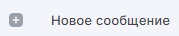
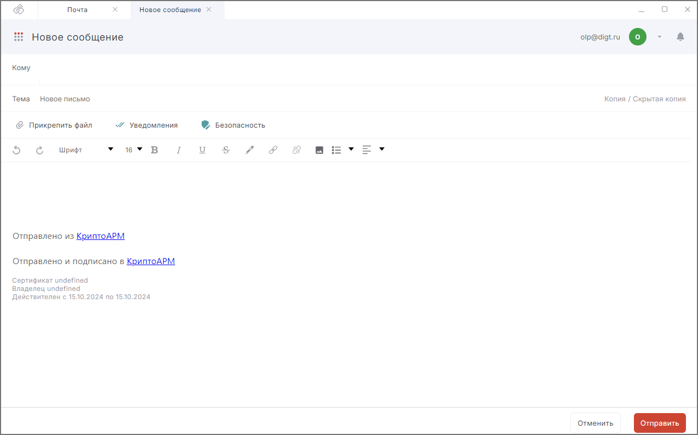
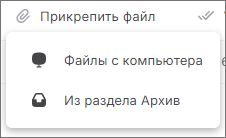
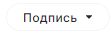

## Отправка письма  
 
1. Перейдите в раздел **Почта**.  
2. [Подключите почтовый аккаунт](./02-add-account.md), если он не был подключен.  
3. На левой боковой панели нажмите на кнопку **Новое сообщение**. Форма создания сообщения открывается в новой вкладке.  
    
4. Выберите получателей («Кому», «Копия» или «Скрытая копия»).   
    В поле установите курсор или начните вводить первые буквы имени/фамилии/адреса электронной почты. Открывается выпадающий список с контактами. Если подходящих контактов нет в списке, нажмите **Показать все контакты**.  Открывается  правая боковая панель со списком всех контактов, имеющих e-mail. Выберите контакт, нажав на него.  
    Если у вас нет контактов, вы можете добавить контакты или просто ввести e-mail.  
    Адреса получателей вводятся через запятую, точку с запятой, пробел. 
5. Укажите тему.   
6. Заполните содержимое письма.  
    
7. Для отправки сообщения нажмите на кнопку **Отправить**.  
   
## Оформление сообщения 

Для оформления сообщения вы можете воспользоваться инструментами:   

- выбор стиля шрифта;  
- размер шрифта;  
- выделение текста курсивом, жирным, подчеркнутым, зачеркнутым;  
- изменение цвета шрифта текста, фона;  
- формирование ссылки в тексте;  
- добавление изображения в тело письма;  
- маркированный список, нумерованный список и отступы;  
- выравнивание шрифта (слева, справа, по центру, выровнять).  

Инструменты для оформления текста письма расположены выше области для содержимого.

  
## Работа с вложениями  

Вы можете прикрепить один или несколько файлов с локального диска или выбрать из папки **Архив**.  

Для добавления вложений нажмите кнопку **Прикрепить файл** и в выпадающем списке выберите место расположения вложения.   

Доступны следующие места расположения вложения:

- **Файлы с компьютера** — добавляет любые файлы с локального диска.  
- **Из раздела Архив** — позволяет выбрать файлы с локального диска из папки **Архив**.  

Добавить файлы можно, перетащив их в область создания сообщения. Если перетащить папку с документами, то файлы добавляются списком.  

Для удаления ошибочно добавленного вложения нажмите кнопку **Удалить**. Для удаления всех вложений нажмите **Удалить все**.  

Для просмотра содержимого добавленного документа нажмите на него, он открывается в приложении, ассоциируемом с расширением документа.  

Вложение можно **Скачать** или открыть в мастере **Подпись и шифрование**, **Проверка и расшифрование**.  

## Сохранение черновика  

Все изменения в новом сообщении автоматически сохраняются каждые 10 секунд в виде черновика.  

Для перехода в раздел с черновиками выберите в левом меню стандартную папку **Черновики**.  

Для черновиков вы можете выполнить следующие действия:  

- **Открыть** — письмо открывается в режиме редактирования в новой вкладке. Вы можете дописать его и отправить.  
- **Удалить** — черновик перемещается в папку **Корзина**.  
- отметить **Прочитано/Не прочитано** выделенные письма;  
- переместить **В папку** — переместить в выбранную папку писем;  
- **Удалить с сервера** — удалить письмо с почтового сервера. Письмо будет доступно локально на компьютере.  

## Выбор подписи письма  

Вы можете создать подпись, которая будет автоматически подставляться в новое письмо при ответе или пересылке.    

Подписи создаются в настройках почты.   

По умолчанию в приложении задана дефолтная подпись с текстовкой **Отправлено из КриптоАРМ** и ссылкой на магазин [cryptoarm.ru](https://cryptoarm.ru/).  

Если у вас одна подпись, то она автоматически добавляется при создании сообщения.  

Если у вас несколько подписей, то на форме нового письма вам доступна возможность выбора подписи с помощью кнопки.  

   

Открывается список с подписями.  

При выборе **Настроить подписи** открывается новая вкладка с настройками почты, где вы можете редактировать подписи.  

Если при отправке письма возникает ошибка, она выводится как уведомление в правом верхнем углу. Вы можете посмотреть уведомления, нажав на иконку.  

 

Для просмотра подробного описания ошибки или отправки в техническую поддержку нажмите кнопку **Перейти в журнал** в правой боковой панели списка уведомлений.  

## Возможные уведомления     

1. **Укажите получателей письма в полях Кому, Копия или Скрытая копия** — проверьте заполнение указанных полей.   
2. **Адреса user@aa не распознаны. Проверьте правильность ввода адресов** — проверьте электронные адреса получателей на корректность.  
3. **Не удалось отправить сообщение** — проверьте подключение к Интернету.  
4. **Ошибка при отправке** — проверьте, включены ли уведомления о доставке/прочтении письма и все ли почтовые сервера получателей поддерживают автоматические уведомления о доставке.  
5. **Ошибка соединения** — проверьте настройки сервера исходящей почты.  

## Инструкции по теме    

1. [Как добавить почтовый аккаунт.](./02-add-account.md)   
2. [Как отправить подписанное и зашифрованное сообщение.](./12-send-sign-mail.md)    
3. [Как настроить отправку писем с уведомлениями о доставке и прочтении.](./15-send-mail-notify.md)  
4. [Как редактировать настройки почты.](./13-edit-account.md)  
5. [Группировка сообщений в цепочки.](./16-chain-mail.md)  
6. [Как создать контакт.](../007-contacts/02-add-contact.md)   
7. [Как посмотреть уведомления.](../008-cryptoarm/01-notifications.md)  

