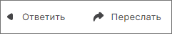
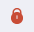

## Ответ на письма и пересылка писем

1. Перейдите в раздел **Почта**.  
2. Откройте письмо.  
3. В правом верхнем углу нажмите на кнопку **Ответить** или **Ответить всем**.    

Чтобы переслать письмо, нажмите на кнопку **Переслать**.

Форма письма открывается в новой вкладке.    

Данные действия также доступны по кнопке **Ещё** в правом верхнем углу.

## Просмотр писем

### Просмотр участников переписки  

При чтении письма отображается информация с именем отправителя.  

Участники переписки отображаются в поле **Кому**:   

- если письмо пришло только вам, то отображается ваш e-mail адрес;  
- если письмо пришло вам и кому-то еще, то для просмотра участников переписки нажмите кнопку **Еще**.   
 
Для того чтобы скрыть список получателей, нажмите на кнопку **Скрыть**.  

В поле **Скрытая копия** отображаются все получатели скрытой копии.   

### Вложения во входящих письмах  

Если в письме есть вложение, то в списке писем оно отображается в виде значка **Скрепка** .    

1. Перейдите в раздел **Почта**.  
2. Откройте письмо с вложениями.     

Вы можете:  

- Скачать все вложения одним архивом с помощью кнопки **Скачать все**.  
- Открыть все вложения в одном из мастеров с помощью выпадающего меню **Открыть в**.  

Вы можете посмотреть содержимое вложения, кликнув на него мышью. Документ открывается в программе по умолчанию. Если документ подписан электронной подписью и/или зашифрован, то открывается мастер обратных операций.    

Открыв дополнительное меню, вы можете скачать вложение и открыть в мастерах.    

### Просмотр подписанных электронной подписью писем    

***Важно:*** чтобы просматривать подписанные электронной подписью почтовые сообщения, у вас на рабочем месте должен быть установлен криптопровайдер КриптоПро CSP.   

Входящие письма, подписанные электронной подписью, отмечены иконкой:  

 -  если сертификат подписи действительный;  
 -  если сертификат недействительный.   

Чтобы просмотреть детальную информацию о подписи сообщения и сертификате, наведите на иконку указатель мыши **Посмотреть свойства**. Во всплывающем окне будут видны сведения. Для просмотра сведений о владельце подписи (его персональные данные) и составе цепочки сертификации нужно нажать на кнопку **Подробнее**.  

Отчёт о проверке электронной подписи можно **Распечатать**, **Обновить** и **Закрыть**.  

**Для недействительной подписи возможны причины:**  

- Срок действия сертификата истек — в таком случае подпись будет недействительной, такую ситуацию невозможно исправить, только попросить отправителя подписать письмо действительным сертификатом и отправить снова.
- Письмо было изменено с момента подписи — такую ситуацию невозможно исправить, только попросить отправителя подписать письмо снова и отправить.
- Нет доверия к сертификату подписи. Не установлен корневой сертификат — вы можете импортировать корневой сертификат для сертификата отправителя.
- Нет полного доверия к сертификату. Не удалось найти актуальный список отзыва — вы можете  импортировать список отзыва сертификатов для сертификата отправителя.   
  
Вы можете обновить информацию о проверке подписи, выбрав на форме просмотра письма в меню **Еще** действие **Проверить подпись**.  

### Просмотр зашифрованных писем    

***Важно:*** чтобы просматривать зашифрованные почтовые сообщения, у вас на рабочем месте должен быть установлен криптопровайдер КриптоПро CSP.

***Важно:*** для расшифрования зашифрованных почтовых сообщений необходима лицензия на ПО КриптоАРМ 6.  

Чтобы расшифровать письмо, нужно чтобы в Личном хранилище сертификатов у вас был установлен сертификат с закрытым ключом, которым будет осуществляться расшифрование.   

Письма, зашифрованные отправителем, отмечены иконкой:  

 -  если письмо расшифровано;
 -  если зашифровано, но невозможно расшифровать.

При наведении на иконку указателя мыши всплывает информация, что письмо зашифровано. 

При открытии зашифрованного письма оно расшифровывается автоматически, если найден сертификат расшифрования и введен пароль к закрытому ключу.

Вы можете повторить расшифрование. Для этого на форме просмотра письма в меню **Еще** выберите действие **Расшифровать** во всплывающем списке, которое отображается для зашифрованных писем.    

### Просмотр подписанных и зашифрованных писем  

***Важно:*** чтобы просматривать подписанные и зашифрованные почтовые сообщения, у вас на рабочем месте должен быть установлен криптопровайдер КриптоПро CSP.  

***Важно:*** для расшифрования зашифрованных почтовых сообщений необходима лицензия на ПО КриптоАРМ 6.  

Чтобы расшифровать письмо, нужно чтобы в Личном хранилище сертификатов у вас был установлен сертификат с закрытым ключом, которым будет осуществляться расшифрование.  

Письма, подписанные и зашифрованные отправителем, отмечены иконкой:  

 -  если письмо расшифровано;  
 -  если зашифровано, но невозможно расшифровать.   

При наведении на иконку указателя мыши всплывает информация, что письмо зашифровано.   

При открытии зашифрованного письма оно расшифровывается автоматически, если найден сертификат расшифрования и введен пароль к закрытому ключу.  

При наведении на иконку расшифрованного и подписанного письма отображается информация о подписи.  

### Просмотр цепочек писем   

Если вы ведете активную переписку, включите группировку писем в цепочки.     

В списке у таких писем отображается индикатор количества писем в цепочке.   

Чтобы посмотреть любое письмо из цепочки, нажмите на строку с этим письмом в области просмотра письма.   

### Сортировка писем  

Письма можно сортировать по отправителю (столбец **От**), по теме (столбец **Тема**), по дате (столбец **Дата**). Для этого нужно нажать на название столбца.  

### Отметка Важно для писем

В приложении КриптоАРМ пользователь может отметить одно или несколько писем флагом Важно. К письму будет присвоена соответствующая метка, которая будет отображаться при просмотре писем в списке, области быстрого просмотра, либо на отдельной вкладке.

При установке отметки Важно в программе КриптоАРМ, данная отметка будет отображаться у получателя письма, если получатель тоже использует приложение КриптоАРМ.

Для того, чтобы отметить письмо флагом Важно в списке писем, необходимо выполнить следующие шаги:

1. Открыть раздел **Почта**.
2. Подключить почтовый аккаунт (если не был подключен ранее).
3. Выделить одно из писем в списке и нажать кнопку **Отметить** на панели действий с письмами, либо наведя курсор на нужное письмо и нажав кнопку **Отметить** (при наведении курсора на письмо, кнопка появится в столбце со статусом письма).

Для того, чтобы отметить письмо флагом Важно на вкладке просмотра письма, необходимо выполнить следующие действия:

1. Открыть раздел **Почта**.
2. Подключить почтовый аккаунт (если не был подключен ранее).
3. Выделить одно из писем в списке и нажать кнопку **Открыть** на панели действий с письмами.
4. На вкладке просмотра письма нажать кнопку **Отметить** на панели действий с письмом.

Кнопка **Отметить** меняется на кнопку **Снять отметку**, для писем, отмеченных флагом Важно. При нажатии на кнопку **Снять отметку**, флаг Важно снимается с письма.

В расширенном поиске по письмам, есть возможность отфильтровать поиск по по отметке Важно. Для этого необходимо выполнить следующие действия:

1. Открыть раздел **Почта**.
2. Подключить почтовый аккаунт (если не был подключен ранее).
3. В строке Поиск нажать на кнопку **Открыть фильтр**.
4. Поставить флаг на фильтр С отметкой и нажать кнопку **Поиск**.

После выполнения данных действий список писем отфильтруется и будут отображены только те письма, которые содержат отметку Важно.

### Перемещение писем в папку  

1. Открыть раздел **Почта**.  
2. Выделить письмо.  
3. В верхней панели действий нажать **В папку**.  
4. В правой боковой панели выбрать папку, в которую нужно переместить письмо.  

Письмо перемещено в указанную папку. 

Письмо может быть перемещено не только между папками, но и между подключёнными аккаунтами.  

## Скачивание, распечатывание писем

### Скачивание письма    
​
Письма можно скачивать на компьютер. Скачанное письмо можно прикрепить в виде файла к другому письму и отправить.  

1. Перейдите в раздел **Почта**.  
2. Откройте письмо.  
3. Нажмите на значок **Еще** и выберите действие **Скачать письмо** во всплывающем списке.  

Письмо скачивается в формате EML.  

### Распечатывание писем   

1. Перейдите в раздел **Почта**.  
2. Откройте письмо.  
3. Нажмите на значок **Еще** и выберите действие **Распечатать** во всплывающем списке.   

## Работа с расширениями .eml, .p7s, .p7m

### Открытие файлов с расширением .eml

В КриптоАРМ, в разделе **Почта**, есть возможность открывать письма в формате .eml для чтения или импорта в любой из подключенных аккаунтов.

Для того, чтобы открыть письмо в формате .eml для чтения в КриптоАРМ, необходимо выполнить следующие действия:

1. Выделить письмо в формате .eml в файловом менеджере или на рабочем столе.
2. Нажать правую кнопку мыши на письме, для вызова контекстного меню.
3. Выбрать пункт **Открыть с помощью** и выбрать программу КриптоАРМ.
4. Приложение КриптоАРМ запустится (если не было запущено), а письмо откроется на новой вкладке для просмотра.

Открыть письмо для просмотра в КриптоАРМ можно также с помощью двойного клика по файлу .eml. 

Для того, чтобы импортировать письмо в одну из папок активного почтового аккаунта, необходимо выполнить следующие действия:

1. Запустить приложение КриптоАРМ.
2. Открыть раздел **Почта** и подключить почтовый аккаунт (если не был подключен ранее).
3. Выделить письмо в формате .eml в файловом менеджере или на рабочем столе.
4. Перетащить письмо в формате .eml в окно программы КриптоАРМ в раздел **Почта**, либо открыть письмо для чтения в КриптоАРМ, нажать кнопку **В папку** и выбрать папку для переноса письма.

В результате данных действий письмо появится в той папке, куда было перемещено. Если письмо помещено в серверную папку (не локальную), то оно будет автоматически загружено на сервер.

### Открытие файлов с расширением .p7s и .p7m

Во входящих письмах могут отображаться файлы с расширением .p7m, это говорит о том, что данное письмо зашифровано и не удалось расшифровать контент письма. Весь контент письма находится в зашифрованном виде в формате .p7m. В КриптоАРМ есть возможность расшифровать файлы такого типа и отобразить зашифрованную часть в виде письма.

Для расшифрования файла в формате .p7m, необходимо выполнить следующие действия:

1. Запустить приложение КриптоАРМ.
2. Перейти в раздел **Документы**.
3. Открыть мастер проверки и расшифрования.
4. Добавить в мастер файл с расширением .p7m.

В результате данных действий зашифрованная часть письма будет расшифрована и получен файл с расширением .eml, который можно просмотреть как письмо на отдельной вкладке.

Добавить файл в мастер проверки и расшифрования можно также с помощью двойного клика по файлу с расширением .p7m.

Расширение файла .p7s означает, что данный файл содержит электронную подпись. В случае с письмами, внутри подписанного письма могут находиться файлы в виде smime.p7s. В приложении КриптоАРМ такие письма определяются как подписанные и отображается соответствующая иконка на письмах. В сторонних приложениях проверить подпись таких писем не всегда возможно. 

Для того, чтобы проверить подпись письма, в котором есть вложение smime.p7s, необходимо выполнить следующие действия:

1. Скачать такое письмо в формате .eml через web - интерфейс почтового сервиса или через сторонний почтовый клиент.
2. Открыть письмо в формате .eml в приложении КриптоАРМ.

В результате данных действий письмо откроется для просмотра на отдельной вкладке и можно будет проверить электронную подпись письма.

Открытие письма в формате .eml описано в соответствующем разделе.

## Инструкции по теме    

1. [Как открыть письмо.](./10-view-mail.md)  
2. [Как отправлять электронные письма.](./09-send-mail.md)  
3. [Как расшифровать документ.](../004-documents/13-decrypt.md)   
4. [Как снять подпись с документа.](../004-documents/16-remove-sign.md)   
5. [Как проверить подпись документа.](../004-documents/14-verify.md)   
6. [Как установить корневой и промежуточный сертификаты.](../006-certs/05-import-UC-certs.md)  
7. [Как импортировать список отзыва сертификатов (СОС).](../006-certs/07-import-crl.md)  
8. [Как установить личный сертификат.](../006-certs/01-import-my-cert.md)  
9. [Как удалять и восстанавливать удаленные письма.](./17-delete-mail.md)  
10. [Группировка сообщений в цепочки.](./16-chain-mail.md)  