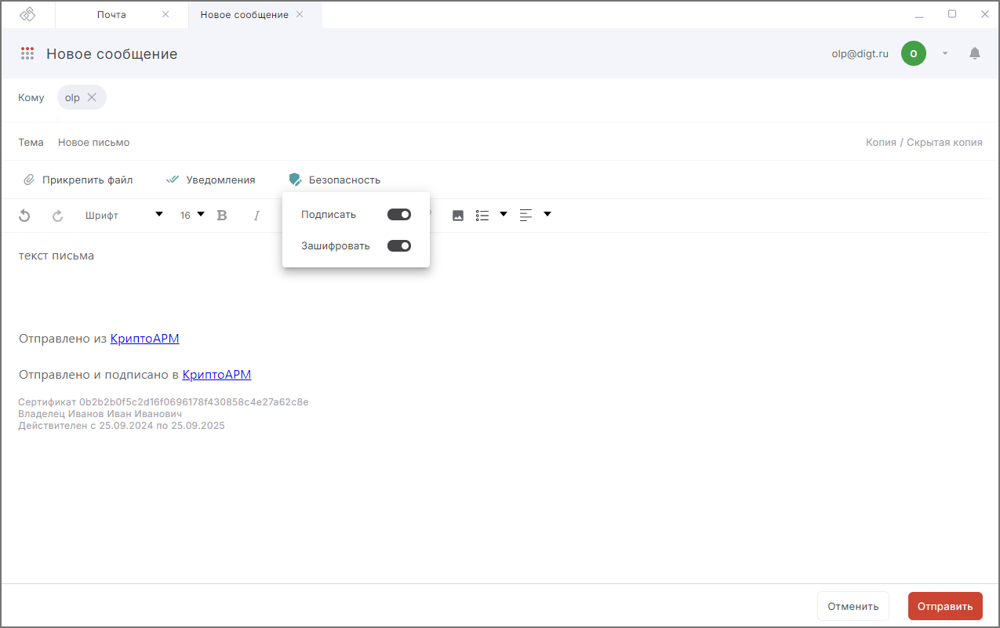
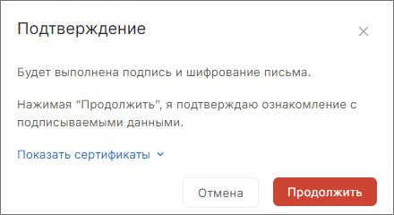
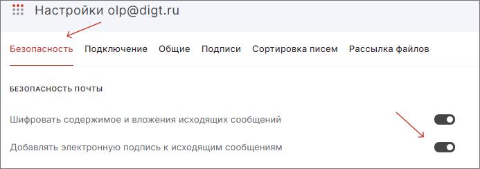
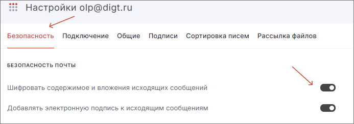

***Важно:*** чтобы подписывать или зашифровывать почтовые сообщения, у вас на рабочем месте должен быть установлен криптопровайдер КриптоПро CSP.

***Важно:*** для подписи, шифрования и расшифрования почтовых сообщений необходима лицензия на ПО КриптоАРМ 6.

Чтобы отправить подписанное и зашифрованное сообщение:

1. Перейдите в раздел **Почта**.  
2. Подключите почтовый аккаунт, если он не был подключен.  
3. На левой боковой панели нажмите кнопку **Новое сообщение**. Форма создания сообщения открывается в новой вкладке.    
4. Выберите получателей («Кому», «Копия» или «Скрытая копия»).     
    В поле установите курсор или начните вводить первые буквы имени/фамилии/адреса электронной почты. Открывается выпадающий список с контактами. Если подходящих контактов нет в списке, нажмите **Показать все контакты**.  Открывается  правая боковая панель со списком всех контактов, имеющих e-mail. Выберите контакт, нажав на него.    
    Адреса получателей вводятся через запятую или точку с запятой.   
5. Укажите тему. 
6. Заполните содержимое письма.
7. Настройте добавление электронной подписи к письму и/или шифрование писем.  
8. Для отправки сообщения нажмите кнопку **Отправить**. 

    

9. Подтвердите действие.

    

## Добавление электронной подписи к письму 

Чтобы подписывать письма электронной подписью, нужно:  

- установить в Личное хранилище сертификат с закрытым ключом;  
- в настройках почты выбрать сертификат подписи из Личного хранилища сертификатов;  
- включить подпись писем.    

При отправке письма будут подписываться.  

### Выбор сертификата подписи

**Чтобы выбрать сертификат подписи:**    

1. Откройте форму редактирования настроек почты и выберите раздел **Безопасность**.    
2. В разделе **Сертификат подписи** нажмите **Выбрать сертификат**.   
 Если сертификат выбран, его можно заменить.    
3. В открывшейся правой боковой панели выберите сертификат подписи из списка, нажав на иконку сертификата. Сертификат добавляется в раздел **Сертификат подписи**.  Если в правой боковой панели в списке нет сертификатов, то вы можете его импортировать, создать или установить.  
4. После выбора сертификата закройте правую боковую панель.  

### Включение подписи писем

Настройку подписи писем можно включить при создании нового сообщения, выбрав опцию **Подписать** по кнопке **Безопасность**.  

Также можно настроить подпись писем по умолчанию для каждого нового письма. Для этого:  

1. Откройте форму редактирования настроек почты и выберите вкладку **Безопасность**.  
2. В разделе **Безопасность почты** установите флаг **Добавлять электронную подпись к исходящим сообщениям**.  
    В таком случае в новом сообщение опция **Подписать** по кнопке **Безопасность** будет включена.  

## Шифрование письма и вложений  

Чтобы шифровать письма и вложения нужно в получателях письма («Кому», «Копия» или «Скрытая копия») выбрать контакты, у которых добавлен сертификат, и включить шифрование писем.  

Если письмо содержит вложения, то они будут зашифрованы вместе с письмом.  

**Как включить шифрование писем**    

Настройку шифрования писем вы можете включить при создании нового сообщения, выбрав опцию **Зашифровать** по кнопке **Безопасность**.  

Вы можете настроить шифрование писем по умолчанию для каждого нового письма. Для этого:  

1. Откройте форму редактирования настроек почты и выберите вкладку **Безопасность**.   
2. В разделе  **Безопасность почты** установите флаг **Шифровать содержимое и вложения исходящих сообщений**.   

 

## Шифрование писем в свой адрес  

Для шифрования писем в свой адрес необходимо:  

1. [Создать контакт](../007-contacts/02-add-contact.md) с адресом своей электронной почты.  
2. Привязать к созданному контакту свой сертификат электронной подписи.  
3. В разделе **Почта** на левой боковой панели нажать кнопку **Новое сообщение**. Форма создания сообщения открывается в новой вкладке.  
4. Выбрать получателей (созданный контакт).    
5. Указать тему.   
6. Заполнить содержимое письма.  
7. Настроить шифрование писем.  
8. Для отправки сообщения нажать кнопку **Отправить**.   

## Настройка подписи и шифрования письма  

Если вам требуется отправить подписанное электронной подписью и зашифрованное письмо:  

- Настройте **добавление электронной подписи к письму**.  
- Настройте **шифрование письма и вложений**.  

***Примечание:*** если в списке получателей письма контакты или адреса электронной почты подсвечиваются красным цветом, проверьте, есть ли у этих получателей привязанные сертификаты.  

Если при отправке письма возникает ошибка, она выводится как уведомление в правом верхнем углу. Вы можете посмотреть уведомления, нажав на иконку.   

 

Для просмотра подробного описания ошибки или отправки в техническую поддержку нажмите кнопку **Перейти в журнал** в правой боковой панели списка уведомлений.   

## Возможные уведомления 

1. Укажите получателей письма в полях Кому, Копия или Скрытая копия — проверьте заполнение указанных полей.  
3. Адреса user@aa не распознаны. Проверьте правильность ввода адресов - проверьте электронные адреса получателей на корректность.  
4. Не найден личный сертификат электронной подписи — вы можете отправить неподписанное письмо или вернуться к письму и выбрать сертификат подписи в настройках почты, а затем отправить письмо снова.  
5. Личный сертификат недействителен — вы можете подписать письмо недействительным сертификатом или  вернуться к письму и заменить сертификат подписи в настройках почты, а затем отправить письмо снова.  
6. Один или несколько сертификатов отсутствуют — проверьте наличие сертификатов у получателей, добавьте сертификаты к контактам и повторите отправку письма.  
7. Не удалось отправить сообщение — проверьте подключение к Интернету.  

## Инструкции по теме    

1. [Установка КриптоПро CSP на платформу Windows.](../002-installation/04-install-cryptopro-windows.md)  
2. [Установка КриптоПро CSP на платформу Linux.](../002-installation/06-install-cryptopro-linux.md)  
3. [Как установить личный сертификат.](../006-certs/01-import-my-cert.md)  
4. [Как привязать сертификат к контакту.](../007-contacts/05-link-contact-cert.md)  
5. [Как отправлять электронные письма.](./09-send-mail.md)  
6. [Как редактировать настройки почты.](./13-edit-account.md)  
7. [Как настроить отправку писем с уведомлениями о доставке и прочтении.](./15-send-mail-notify.md)  
8. [Как посмотреть уведомления.](../008-cryptoarm/01-notifications.md)  

