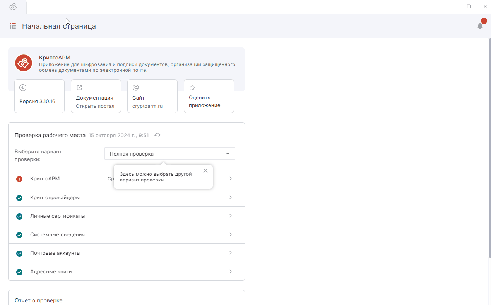
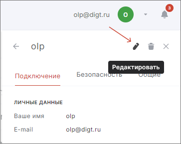
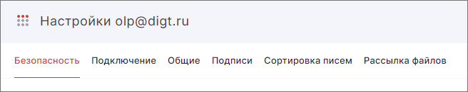
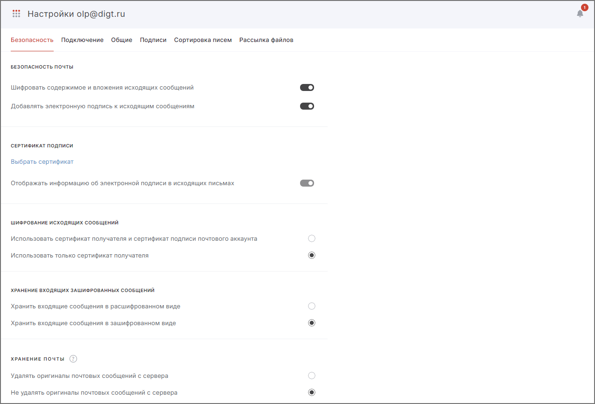
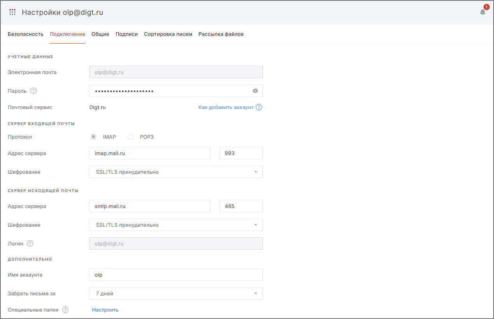
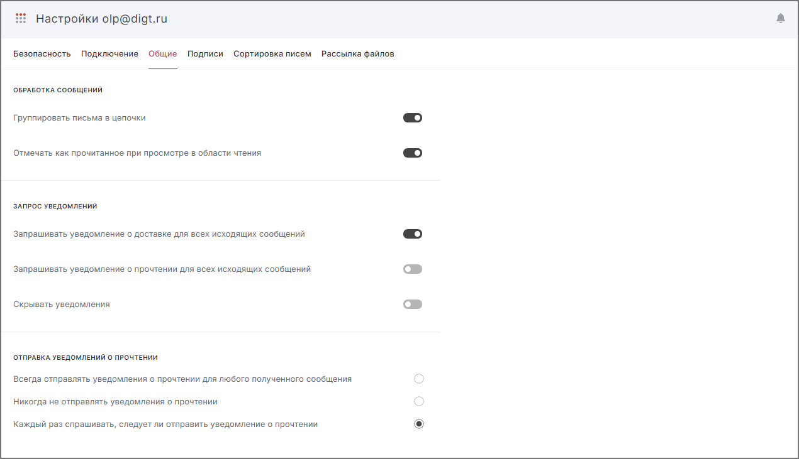
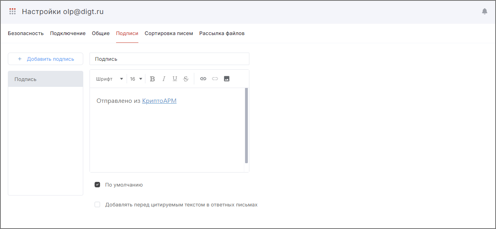
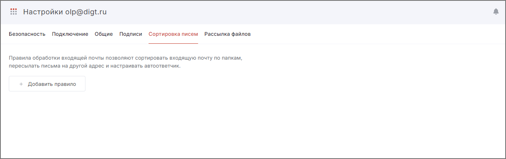

Вы можете настроить шифрование и электронную подпись сообщений, системные уведомления и изменить другие параметры почты.  

## Переход в настройки почты  

1. Перейдите в раздел **Почта**.  
2. Откройте правую боковую панель и в списке наведите курсор на почтовый аккаунт, настройки которого надо изменить.    
3. Нажмите всплывающую иконку **Настройки**.  

   

На боковой панели открывается форма просмотра настроек аккаунта. 

Настройки состоят из вкладок: 

- **Безопасность** — отображает параметры управления подписанными и зашифрованными сообщениями. 
- **Подключение** — содержит настройки подключения почтового аккаунта.  
- **Общие** — показывает настройки действий с входящими сообщениями и уведомлениями о доставке и прочтении.   
- **Подписи** — отображает подписи для исходящих писем.  
- **Сортировка писем** — содержит настройки для обработки входящей корреспонденции: сортировка по папкам, пересылка писем и автоответчик.  
- **Рассылка файлов** — позволяет настроить автоматическую рассылку файлов в виде почтовых писем.  

## Редактирование настроек 

Чтобы изменить настройки:

1. В форме просмотра настроек аккаунта нажмите кнопку **Редактировать**. Форма редактирования открывается в новой вкладке.  

    

2. Выберите одну из вкладок. 

    

3. Внесите изменения.  

## Описание настроек безопасности  

На форме редактирования настроек аккаунта выберите вкладку **Безопасность**. 

### Безопасность почты

- **Шифровать содержимое и вложения исходящих сообщений** — при включенной настройке исходящие письма будут шифроваться в адрес получателей при условии, что к контакту получателя привязан сертификат.     
- **Добавлять электронную подпись к исходящим сообщениям** — при включенной настройке исходящие письма будут подписываться электронной подписью при условии, что в настройках почты выбран сертификат подписи.  

### Сертификат подписи  

Привязанный сертификат используется по умолчанию при подписи писем.
Вы может выбрать только один сертификат подписи из хранилища личных сертификатов.  

Если у вас нет личного сертификата, вы можете установить его, в том числе импортировав, или создать.  

**Отображать информацию об электронной подписи в исходящих письмах** — при отправке подписанного письма информация о сертификате, его владельце и сроке действия автоматически добавляется в письмо и будет видно получателям писем, на устройствах которых не установлено приложение КриптоАРМ.

### Шифрование исходящих писем   

- **Использовать сертификат получателя и сертификат подписи почтового аккаунта** — при включённой настройке исходящие письма будут шифроваться в адрес сертификатов получателей и в адрес сертификата, привязанного к почтовому аккаунту. В папке исходящих писем можно ознакомиться с содержимым зашифрованного отправленного письма.  
- **Использовать только сертификат получателя** — при включённой настройке исходящие письма будут шифроваться только в адрес сертификатов получателей. В папке исходящих писем расшифровать такое письмо и ознакомиться с его содержанием нельзя.  

### Хранение входящих зашифрованных сообщений   

- **Хранить входящие сообщения в расшифрованном виде** — выбор параметра означает, что все полученные зашифрованные сообщения, которые были хотя бы один раз прочитаны, будут храниться в расшифрованном виде.  
- **Хранить входящие сообщения в зашифрованном виде** — выбор параметра означает, что все полученные зашифрованные сообщения, даже прочитанные, будут храниться в зашифрованном виде.     

### Хранение почты  

- **Удалять оригиналы писем с почтового сервера** — оригиналы писем будут удаляться с почтового сервера после синхронизации. Все письма данного почтового аккаунта будут храниться на этом устройстве и видны в папке  «Сохранённые письма».  
- **Не удалять оригиналы писем с почтового сервера** — данная настройка стоит по умолчанию. Письма не удаляются с почтового сервера автоматически.  

## Описание настроек подключения почтового аккаунта  

На форме редактирования настроек аккаунта выберите вкладку **Подключение**.

Вы можете редактировать поля: **Электронная почта**, **Пароль**, **Сервер входящей почты**, **Сервер исходящей почты**, **Имя аккаунта**, **Забрать письма за**, **Специальные папки**.   

При изменении адреса электронной почты список писем обновляется для нового адреса.  

После смены пароля вы автоматически выйдете из аккаунта. Если вы ввели правильный пароль, письма аккаунта обновятся.   

При увеличении периода, за который необходимо загрузить письма, в раздел **Почта** подгрузятся более старые сообщения.  

При редактировании параметров **Сервер входящей почты**, **Сервер исходящей почты** письма подключенного аккаунта останутся в списке, но не будет синхронизации с почтовым сервером. Вы не увидите новых писем и не отправите свои.  

## Описание общих настроек   

На форме редактирования настроек аккаунта выберите вкладку **Общие**.  

### Обработка сообщений  

- **Группировать письма в цепочки** — при включенной опции письма группируются в цепочки по теме письма.  
- **Отмечать как прочитанное при просмотре в области чтения** — при установленном флаге при быстром просмотре сообщения оно помечается как прочитанное.  

### Запрос уведомлений

- **Запрашивать уведомление о доставке для всех исходящих сообщений**.    
- **Запрашивать уведомление о прочтении для всех исходящих сообщений**. При выборе данных опций кнопки с запросом уведомлений при написании нового сообщения будут всегда активны.    
- **Скрывать уведомления**.

### Отправка уведомлений о прочтении

- Всегда отправлять уведомления о прочтении для любого полученного сообщения.  
- Никогда не отправлять уведомления о прочтении.  
- Каждый раз спрашивать, следует ли отправить уведомление о прочтении.   

Вы можете выбрать только одну опцию, настроив отправку/запрет на отправку уведомлений  о прочтении письма.   

## Описание настроек подписи писем  

На форме редактирования настроек аккаунта выберите вкладку **Подписи**.  

Вы можете создать подпись, которая будет автоматически подставляться в новое письмо, а также при ответе или пересылке.   

По умолчанию в приложении задана подпись с текстом **Отправлено из КриптоАРМ** и ссылкой на интернет-магазин [cryptoarm.ru](https://cryptoarm.ru/).  

### Создание подписи  

Создание новой подписи доступно по кнопке **Добавить подпись**.    

Укажите название и содержимое подписи.   

При установке флага **По умолчанию** данная подпись будет добавлена  в новое сообщение.  

Флаг **Добавлять перед цитируемым текстом в ответных письмах** позволит добавить подпись сразу после текста ответа, а не в конце всех писем в цепочке.   

### Оформление подписи  

Содержимое текста можно редактировать:  выбрать стиль и размер шрифта, выделить текст курсивом, жирным, подчеркнутым, зачеркнутым.  

Помимо текста вы можете вставить в подпись:  

-  Изображение.
   Формат изображения может быть .jpeg, .jpg, .png, .gif, максимальный размер — 1024х1024 пикселей, максимальный объем: 2 МБ.   
- Ссылку.  
   Для добавления ссылки выделите текст, нажмите кнопку **Вставить ссылку** , в появившемся окне укажите адрес ссылки.
     
   Вы можете удалить ссылку из подписи, выделив текст и нажав кнопку **Удалить ссылку**  . 
    
### Удаление подписи  

Для удаления подписи наведите курсор мыши на название подписи и нажмите на всплывающую иконку **Удалить подпись**.  

## Сортировка писем

На форме редактирования настроек аккаунта выберите вкладку **Сортировка писем**.

Здесь можно добавить правило для обработки входящих писем. Для создания нового правила нажмите на кнопку **Добавить правило**.

В правой части окна откроется форма для добавления правила.

Заполните поля:

1. **Название правила**.
2. **Если выполнены условия**. Выберите одно из условий из выпадающего списка:

      - От кого;
      - Кому;
      - Тема письма;
      - Содержание письма;
      - Дата получения;
      - Название вложения;
      - Статус;
      - Размер;
      - Ко всем входящим письмам.

3. **Выполнить действие** для писем, удовлетворяющих условию:

      - **Поместить в...** — письма будут помещены в указанную папку.
      - **Пометить как прочитанное** — письма будут автоматически отмечены как прочитанные.
      - **Пометить флагом** — письма будут помечены флагом.
      - **Автоматический ответ** — можно написать текст письма, которое будет отправлено в ответ.
      - **Переслать письмо** — указывается, кому будет переслано письмо.
      - **Сохранить вложения из письма в** — вложения будут сохранены в указанную папку.
      - **Прекратить выполнение дальнейших правил** — все правила, которые находятся ниже, будут игнорироваться. Правила, расположенные выше, выполняются по умолчанию.
      - **Применить к существующим письмам** — правило будет применено не только к письмам, которые придут после создания правила, но и к существующим.

Для сохранения изменений нажмите на кнопку **Создать**.

## Рассылка файлов  

Перейдите на вкладку **Рассылка писем**. Данная настройка позволяет добавить автоматическую рассылку файлов в виде почтовых писем.  

Для создания рассылки файлов необходимо:

1. Нажать **Добавить рассылку**.
2. Указать название рассылки.
3. Выбрать папки для сканирования с устройства, из которых будут взяты файлы для рассылки. В рассылку попадут файлы только из корневой папки.
4. Написать сопроводительное письмо, указав получателей, тему и текст. 
5. При необходимости активировать функции **Отследить доставку письма** и **Запросить подтверждение о прочтении письма**.
6. Дополнительно можно указать, что должно быть с файлами, которые были отправлены: файлы могут быть удалены с устройства либо перемещены в выбранную папку. Файлы, которые не удалось отправить, можно удалить, оставить в исходной папке либо переместить в выбранную папку.
7. **Запустить рассылку активной** — сканирование папок запустится после сохранения рассылки при следующем обмене с почтовым сервером;   
8. **Сохранить** настройки для рассылки. 

Рассылки можно удалить по отдельности или вместе, редактировать и перемещать между собой.

Если при сохранении аккаунта возникает ошибка, она выводится как уведомление в правом верхнем углу. Вы можете посмотреть уведомления, нажав на иконку.  

Для просмотра подробного описания ошибки или отправки в техническую поддержку нажмите **Перейти в журнал** в правой боковой панели списка уведомлений.  

## Возможные уведомления

1. **Ошибка аутентификации** — проверьте корректность пароля в настройках почты.  
2. **Ошибка синхронизации аккаунта** — в настройках почты проверьте корректность адреса электронной почты, настройки сервера входящей и исходящей почты.  

## Инструкции по теме  

1. [Как добавить почтовый аккаунт.](./02-add-account.md)  
2. [Как отправить подписанное и зашифрованное сообщение.](./12-send-sign-mail.md)  
3. [Как привязать сертификат к контакту.](../007-contacts/05-link-contact-cert.md)
4. [Как установить личный сертификат.](../006-certs/01-import-my-cert.md)  
5. [Как отправлять электронные письма.](./09-send-mail.md)  
6. [Группировка сообщений в цепочки.](./16-chain-mail.md)  
7. [Как просматривать письма.](./10-view-mail.md)  
8. [Как посмотреть уведомления.](../008-cryptoarm/01-notifications.md)  