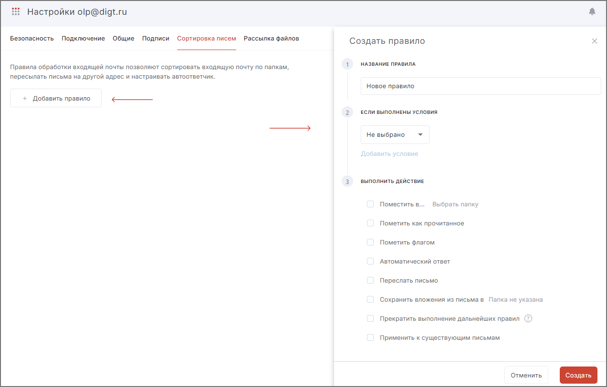

Правила обработки входящей почты позволяют сортировать входящие сообщения по папкам, пересылать письма на другой адрес и настраивать автоответчик.  

Для сортировки писем необходимо:

1. Нажать **Добавить правило** в настройках почты на вкладке **Сортировка писем**.
2. Ввести название правила.
3. Добавить условие.
4. Указать выполняемое действие.
5. Нажать **Создать**.   

Можно выбрать следующие условия:  

- от кого;  
- кому;  
- тема письма;  
- содержание письма;  
- дата получения;  
- название вложения;  
- статус;  
- размер;  
- ко всем входящим письмам. 

Выбранные условия могут содержать/не содержать/совпадать/не совпадать с введённым значением.

Можно выполнить следующие действия:  

- поместить в выбранную папку;  
- пометить как прочитанное;  
- направить автоматический ответ с набранным текстом;  
- переслать письмо, указав получателя;  
- сохранить вложения из письма в выбранную папку;  
- прекратить выполнение дальнейших правил — все правила, которые находятся ниже, будут игнорироваться. Правила, расположенные выше, выполняются по умолчанию;  
- применить к существующим письмам.  

Создать правило можно также из списка писем. **Для создания правила из письма** необходимо выполнить следующие действия:

1. Выделить одно из писем в списке.
2. Открыть письмо в области просмотра или на отдельной вкладке.
3. В меню действий с письмом (кнопка **Еще**) выбрать пункт **Создать правило**.

В результате данных действий справа откроется боковая панель создания нового правила, где будет выбрано по умолчанию условие От кого и Совпадает с, а в поле с адресатом подставлен адрес электронной почты отправителя письма. После создания правила из письма боковая панель закроется, а созданное правило автоматически станет активным и будет отображаться в настройках почтового аккаунта на вкладке Сортировка писем.

Созданные правила можно удалить по-отдельности или вместе, редактировать или переместить между собой.