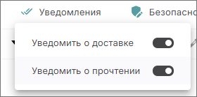
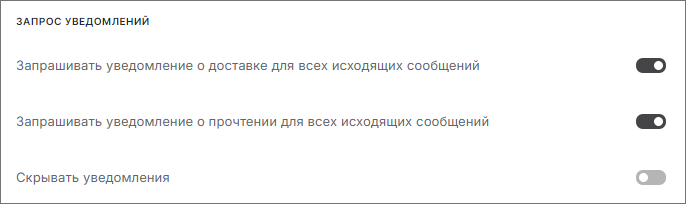
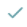
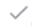

Уведомление о доставке подтверждает доставку сообщения электронной почты в почтовый ящик получателя, но не гарантирует, что оно было просмотрено или прочитано.   

Уведомление о прочтении подтверждает открытие отправленного сообщения.  

Чтобы использовать уведомления о доставке и прочтении письма, необходимо включить запрос уведомлений в настройках почты или при создании нового сообщения.  

## Настройка уведомлений о доставке и прочтении в новом сообщении  

1. Откройте форму создания нового сообщения.  
2. Выберите опцию **Уведомить о доставке** и/или **Уведомить о прочтении** по кнопке **Уведомления**.  

## Настройка уведомлений о доставке и прочтении в настройках аккаунта  

1. Откройте форму редактирования настроек почты и выберите вкладку **Общие**.  
2. В разделе **Запрос уведомлений** установите флаг **Запрашивать уведомление о доставке для всех исходящих сообщений** и/или  **Запрашивать уведомление о прочтении для всех исходящих сообщений**.  
    В таком случае в новом сообщении опция **Запрашивать уведомление о доставке для всех исходящих сообщений** и/или  **Запрашивать уведомление о прочтении для всех исходящих сообщений** по кнопке **Уведомления** будет включена.  

    
Уведомления о доставке направляются отправителю автоматически почтовым сервисом при отправке письма на сервер адресата.  

## Просмотр уведомления о доставке и прочтении  

Посмотреть результат уведомлений можно в папке **Отправленные**.   

На панели с письмами отображается несколько статусов:  
-  Прочитано всеми/Доставлено   
-  Прочитано не всем получателям/Не доставлено  
-  Доставлено всем    
-  Доставлено не всем получателям.  
  
Вы можете посмотреть детальную информацию о доставке/прочтении писем, кликнув курсором мыши на статусы.  

## Инструкции по теме  

1. [Как отправлять электронные письма.](./09-send-mail.md)  
2. [Как редактировать настройки почты.](./13-edit-account.md)  