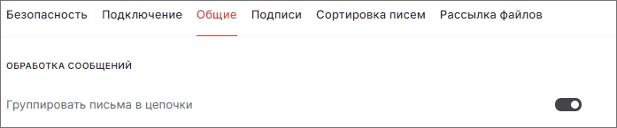

Вы можете выбрать, показывать ли каждое новое сообщение по отдельности или группировать переписку в цепочки.  

Переписка группируется в цепочки, показывая новые ответы ниже предыдущих сообщений.   

Если в цепочке более четырех писем, в интерфейсе отображается первое и два последних письма, промежуточные скрываются.   

## Включение группировки писем в цепочки  

1. Перейдите в раздел **Почта**.  
2. Откройте форму редактирования настроек почты и выберите вкладку **Общие**.    
3. В разделе **Обработка сообщений** установите флаг **Группировать письма в цепочки**.  

Для отключения группировки писем в цепочке выключите флаг **Группировать письма в цепочки**.  

## Инструкции по теме

1. [Как редактировать настройки почты.](./13-edit-account.md)  
2. [Как просматривать письма.](./10-view-mail.md)  

