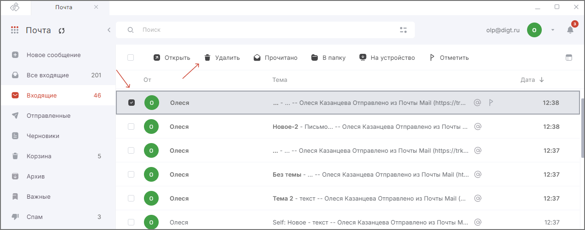
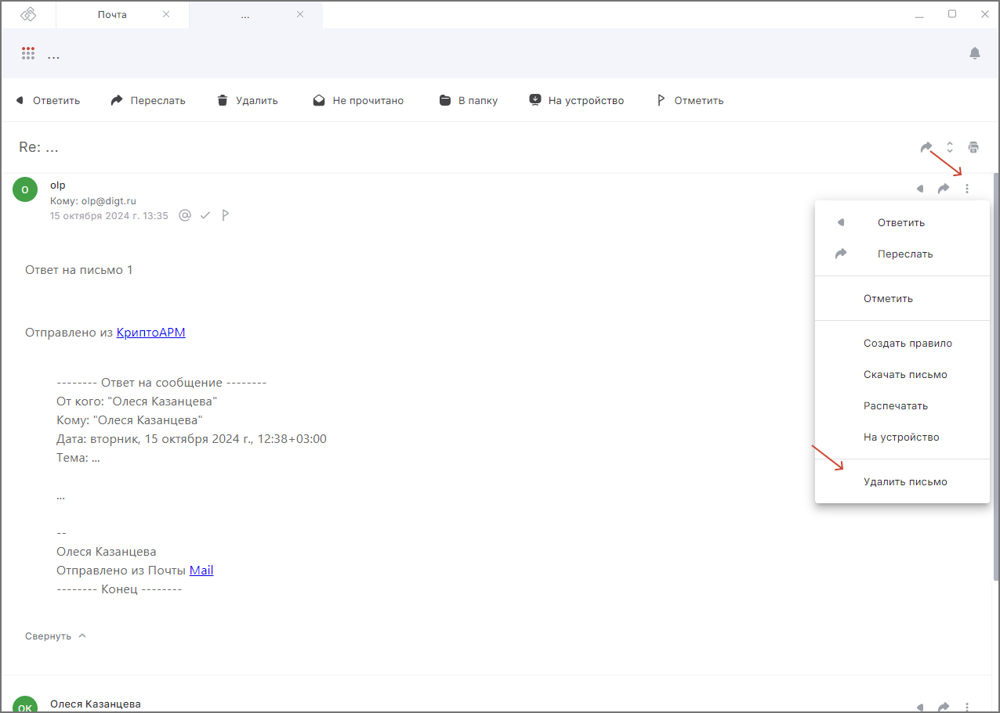
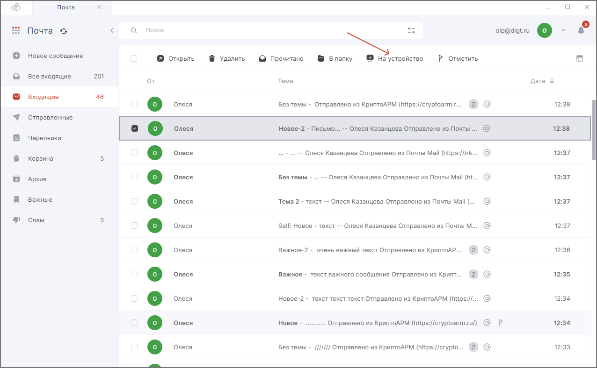

Удаленные сообщения хранятся в корзине.  

## Удаление писем

### Удаление отдельного письма  

1. Перейдите в раздел **Почта**.  
2. Выделите письмо в списке нажатием курсора.  
3. В верхней панели действий с письмами нажмите на кнопку **Удалить**.  

### Удаление одного письма из цепочки  

1. Откройте письмо.  
2. Выберите письмо в цепочке, которое хотите удалить.  
3. Нажмите на значок **Ещё** и нажмите во всплывающем списке действий кнопку **Удалить письмо**.  

### Одновременное удаление нескольких писем   

1. Перейдите в раздел **Почта**.  
2. Установите флажки слева от писем.  
3. В верхней панели нажмите на кнопку **Удалить**.  

### Удаление всех писем  

1. Перейдите в раздел **Почта**.  
2. Выберите все письма, активировав флаг **Выбрать все** с левой стороны на панели действий со списком писем.  
3. На панели действий со списком писем нажмите кнопку **Удалить**.  

### Удаление письма из сервера  

1. Перейдите в раздел **Почта**.  
2. Выделите письмо в списке нажатием курсора.   
3. В верхней панели действий с письмами нажмите на кнопку **На устройство**.   

   
Письмо удалено с сервера (его не видно при просмотре почтового аккаунта через браузер), но хранится локально на устройстве в папке **Сохранённые письма**.   

Для удаления письма с устройства в папке **Сохранённые письма** выбрать письмо и нажать в верхней панели на кнопку **Удалить навсегда**. 

## Корзина

### Просмотр содержимого корзины  

1. Перейдите в раздел **Почта**.  
2. В левом боковом меню  выберите **Корзина**.  

### Очищение корзины  

1. Перейдите в раздел **Почта**.  
2. В левом боковом меню  выберите **Корзина**.  
3. Установите флажки напротив писем, которые хотите навсегда удалить, и нажмите **Удалить навсегда**.    

***Примечание:*** параметр **Удалить навсегда** доступен только в корзине. 
Чтобы удалить все сообщения в корзине, выделите все письма в корзине и нажмите на кнопку **Удалить навсегда** на панели действий.  

## Восстановление писем  

После переноса письма в корзину его можно восстановить.    

1. Перейдите в раздел **Почта**.  
2. В левом боковом меню  выберите **Корзина**.  
3. Установите флажки напротив писем, которые нужно восстановить.  
4. В верхней панели нажмите на кнопку **В папку**.  
5. В правом боковом меню выберите нужную папку.     

## Инструкции по теме   

1. [Как открыть письмо.](./10-view-mail.md)   