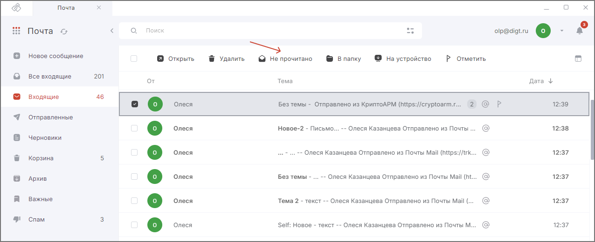

Чтобы не забыть прочитать сообщение позже, отметьте его как непрочитанное или отметьте его как прочитанное, если оно не требует вашего внимания.   

## Отметка письма как прочитанное или непрочитанное  

1. Перейдите в раздел **Почта**.  
2. Выделите письмо в списке нажатием курсора.  
3. В верхней панели действий с письмами нажмите кнопку **Прочитано** или **Не прочитано**.  

## Отметка выделенных писем как прочитанные    

1. Перейдите в раздел **Почта**.  
2. Выберите письма, установив флаг для каждого письма, или выделите все письма, установив флаг в левом верхнем углу списка.  
3. На верхней панели действий с письмами нажмите кнопку **Прочитано** или **Не прочитано**.  