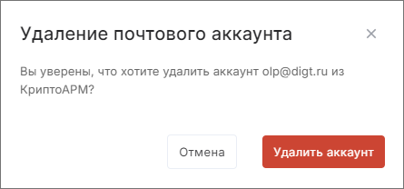

Чтобы удалить почтовый аккаунт, следуйте шагам:

1. Перейдите в раздел **Почта**.    
2. Откройте правую боковую панель и в списке наведите курсор на почтовый аккаунт, который хотите удалить.    
3. Нажмите всплывающую иконку **Настройки**.  
4. На правой боковой панели в форме просмотра настроек аккаунта нажмите кнопку **Удалить** .    
5. Подтвердите удаление.   
    

В случае использования настройки «Не удалять оригиналы писем с почтового сервера» аккаунт удаляется. Письма и папки аккаунта удаляются из списка. 

В случае использования настройки «Удалять оригиналы писем с почтового сервера» после подтверждения удаления проверяется наличие писем, удалённых с сервера. Если есть хотя бы одно такое письмо, то при удалении почтового аккаунта можно выбрать, сохранить или удалить такое письмо:  

- **Нет, удалить** — все письма удаляются навсегда.  
- **Да, сохранить** — все письма этого аккаунта сохраняются в папку Сохранённые письма, а аккаунт удаляется из списка подключённых аккаунтов.    

Если удалённый аккаунт был выбран активным, то активным становится первый в списке аккаунт.    

## Инструкции по теме

1. [Как сделать почтовый аккаунт активным.](./21-select-account.md)  
2. [Как добавить почтовый аккаунт.](./02-add-account.md)  