**Профили подписи** — набор заранее сохраненных настроек, которые можно применять для выполнения подписи, архивирования и шифрования.

Создание профиля доступно в разделе **Документы** и через раздел **Сертификаты**.

## Описание полей профиля 

| Название поля     | Описание        | 
|:-------------:|:---------------:|
| **Название профиля** |   Название, которое будет отображаться в общем списке профилей. Рекомендуется указывать в названии отличительные особенности профиля, чтобы в дальнейшем без труда найти нужный шаблон в списке. Название обязательно для заполнения      | 
| **Операции**  | Подпись, архивирование, шифрование. Выберите операции, которые будут автоматически активироваться в мастере при применении профиля  | 
| **Личная подпись** | Вы можете выбрать один из личных сертификатов из раздела Сертификаты - Личные сертификаты, выбрать стандарт подписи, а также указать путь к файлу с электронной доверенностью, которая может быть добавлена к пакету документов    | 
| **Настройки групповой подписи**    | Вы можете настроить параметры групповой подписи, которые будут применяться, при подписи нескольких документов   |
| **Настройки подписи Cades**    | Выбор кодировки подписанных документов, вид подписи, формат подписи, стандарт подписи  |  
| **Настройки подписи Pades**    | Настройка внешнего вида штампа подписи, настройка положения штампа подписи, настройка внешнего вида штампа произвольной области. Данные настройки применяются как в мастере Подпись и шифрование, так и в мастере Подпись и защита PDF (для файлов формата PDF). Включение или отключение настроек сертификации документа и конвертации в формат PDF/A - 2b  | 
| **Печатная форма**      | Настройки внешнего вида и положения штампов визуализации подписи для PDF - документов  в мастере Подпись и шифрование    | 
| **Сертификаты шифрования**       | Вы можете выбрать сертификаты шифрования для данного профиля. Для выбора доступны сертификаты из хранилища Личные, Других пользователей, а также контакты, к которым привязан сертификат     | 
| **Настройки шифрования**     | Выбор алгоритма шифрования, кодировки зашифрованных документов, настройка возможности удалять исходные файлы после шифрования     | 
| **Сохранение результатов**     | Вы можете задать путь для сохранения результатов операций. По умолчанию задан параметр Папка с исходным документом. Также вы можете сохранить копию файла, полученного в результате операции, в папке Архив, установив флаг Создать копию в папке Архиве. Файлы данного каталога отображаются в папке Архив     | 

## Создание профиля подписи

Для создания профиля подписи из раздела Документы необходимо выполнить следующие действия:

1. В разделе Документы откройте правую боковую панель со списком профилей и выберите **Добавить профиль подписи**.
2. Заполните поля профиля.
3. Нажмите кнопку **Сохранить**.

После выполнения данных действий в списке профилей появится новый профиль.

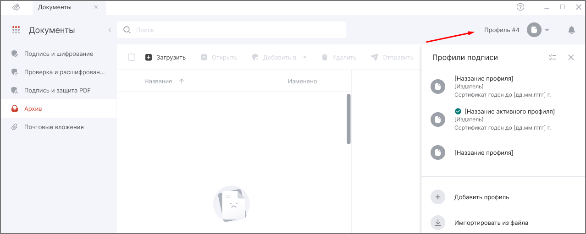

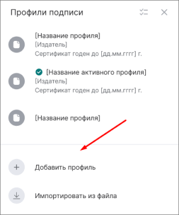

Для создания профиля подписи из раздела **Сертификаты** необходимо выполнить следующие действия:

1. Выберите в **Меню** раздел **Сертификаты**, хранилище **Личные сертификаты**.
2. В разделе **Личные сертификаты** выделите сертификат.
3. На панели действий нажмите кнопку **Создать профиль подписи**.
4. В новой вкладке создания профиля заполните поля профиля.
5. Нажмите кнопку **Сохранить**.

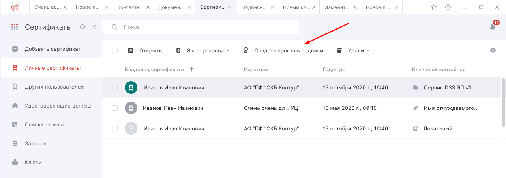

## Редактирование профиля подписи

Для редактирования профиля подписи, необходимо выполнить следующие действия:

1. В разделе **Документы** откройте правую боковую панель со списком профилей.
2. Наведите курсор на профиль, который необходимо отредактировать.
3. Нажмите на кнопку **Настройки**.
4. В открывшемся окне с параметрами профиля нажмите кнопку **Редактировать**.
5. Внесите изменения и нажмите кнопку **Сохранить**.

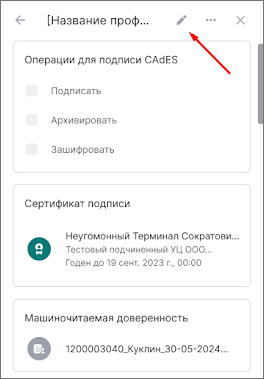

## Переключение между профилями подписи

Вы можете переключаться между профилями подписи для выполнения операций с заранее настроенными параметрами в профилях.

Для переключения на другой профиль подписи, необходимо выполнить следующие действия:

1. В разделе **Документы** или в мастере **Подпись и шифрование** откройте боковое окно со списком профилей.
2. Наведите курсор на профиль, который хотите сделать активным, и нажмите на его иконку.

После выполнения данных действий выбранный профиль становится активным.

Параметры, заданные в выбранном профиле, применяются в настройках мастеров **Подпись и шифрование** и **Подпись и защита PDF**.

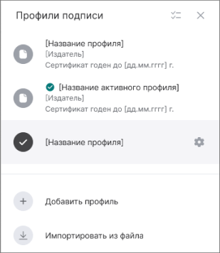

## Просмотр настроек профиля подписи

Для просмотра настроек профиля подписи, необходимо выполнить следующие действия:

1. В разделе **Документы** или в мастере **Подпись и шифрование** откройте боковое окно со списком профилей.
2. Наведите курсор на тот профиль, у которого хотите просмотреть настройки.
3. Нажмите кнопку **Настройки**.

После выполнения данных действий откроется окно со списком настроек профиля.

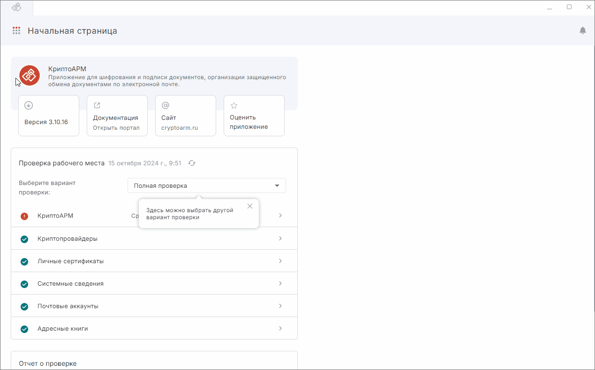

## Экспорт профиля подписи

Профили подписи можно экспортировать в файл или отправить профиль по почте.

### Экспорт профиля в файл

Для экспорта профиля в файл, необходимо выполнить следующие действия:

1. В разделе **Документы** или мастере **Подпись и шифрование** откройте боковое окно со списком профилей.
2. Наведите курсор на профиль, который хотите экспортировать в файл.
3. Нажмите кнопку **Настройки**.
4. В открывшемся окне с параметрами профиля нажмите кнопку **Еще**.
5. В выпадающем меню нажмите кнопку **Сохранить в файл**.
6. В открывшемся окне проводника выберите место сохранения файла профиля и нажмите кнопку **Сохранить**.

После выполнения данных действий профиль будет сохранен в файл с расширением .pcarm.

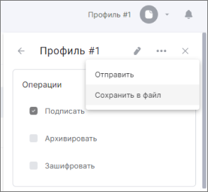

### Экспорт нескольких профилей в файл

Для экспорта нескольких профилей подписи в один файл, необходимо выполнить следующие действия:

1. В разделе **Документы** или мастере **Подпись и шифрование** откройте боковое окно со списком профилей.
2. В окне со списком профилей нажмите кнопку **Выбрать**.
3. Отметьте флагами профили, которые вы хотите экспортировать.
4. Нажмите кнопку **Сохранить в файл**.
5. В открывшемся окне проводника выберите место сохранения файла профиля и нажмите кнопку **Сохранить**.

После выполнения данных действий, профили будут сохранены в файл с расширением .pcarm

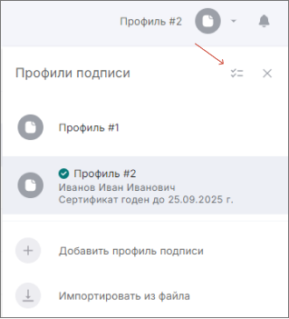

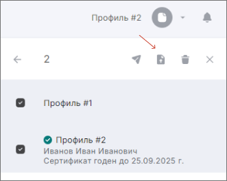

### Отправка профиля по почте

Для отправки профиля подписи по почте, необходимо выполнить следующие действия:

1. В разделе **Документы** или мастере **Подпись и шифрование** откройте боковое окно со списком профилей.
2. Наведите курсор на тот профиль, который хотите отправить по почте
3. Нажмите кнопку **Настройки**.
4. В открывшемся окне с параметрами профиля нажмите кнопку **Еще**.
5. В выпадающем меню нажмите кнопку **Отправить**.

После выполнения данных действий откроется форма создания нового письма, где во вложении будет прикреплен профиль подписи с расширением .pcarm. [Подробнее про отправку электронных писем](../003-mail/09-send-mail.md).

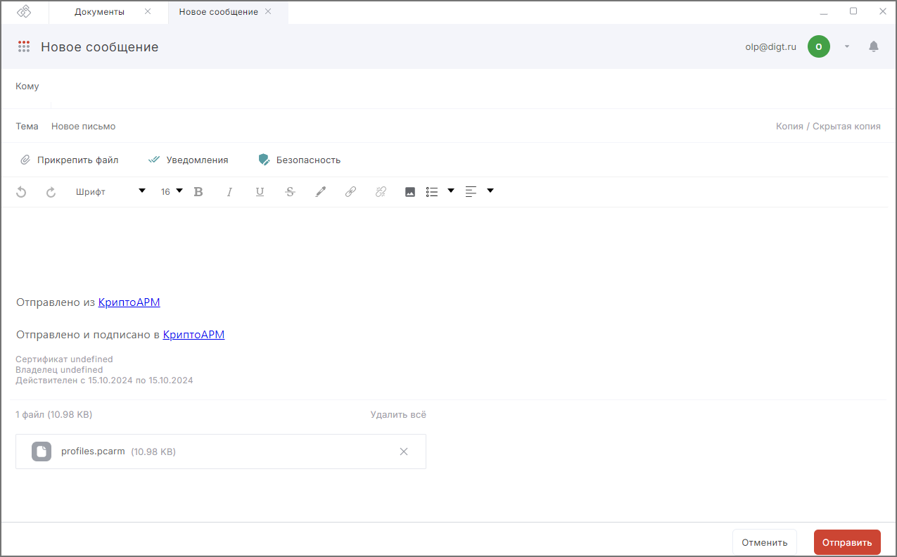

### Отправка нескольких профилей по почте

Для отправки нескольких профилей по почте необходимо выполнить следующие действия:

1. В разделе **Документы** или мастере **Подпись и шифрование** откройте боковое окно со списком профилей.
2. В окне со списком профилей нажмите кнопку **Выбрать**.
3. Отметьте флагами профили, которые вы хотите отправить по почте.
4. Нажмите кнопку **Отправить**.

После выполнения данных действий откроется форма создания нового письма, где во вложении будет прикреплен файл, содержащий профили подписи с расширением .pcarm. 

***Важно:*** для отправки профилей подписи по почте в приложении должен быть [подключен почтовый аккаунт](../003-mail/02-add-account.md).

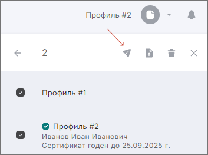

## Импорт профиля подписи

Профили подписи можно импортировать в приложение из файлов или вложений письма в формате .pcarm, .json или .xml, либо при первом запуске приложения.

При первом запуске приложения, если в системе обнаружены профили подписи из других версий КриптоАРМ, откроется диалоговое окно, с предложением импортировать профили из других версий или нет.

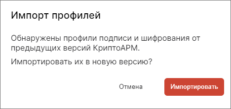

### Импорт профиля из файла

Для импорта профилей подписи из файла необходимо выполнить следующие действия:

1. В разделе **Документы** или мастере **Подпись и шифрование** откройте боковое окно со списком профилей.
2. В боковом окне со списком профилей нажмите кнопку **Импортировать из файла**.
3. В открывшемся окне проводника выберите файл профиля подписи в формате .pcarm, .json или .xml и нажмите кнопку **Открыть**.

При успешном импорте профиль сохранится в приложении и будет отображаться в списке профилей.

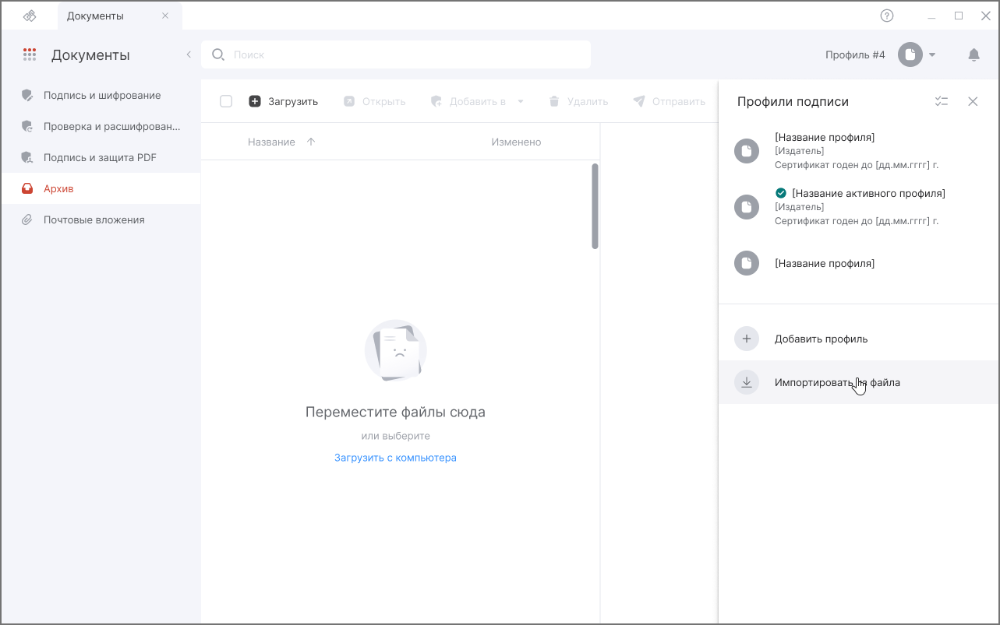

Для импорта профиля подписи из файловой системы, необходимо выполнить следующие действия:

1. Через проводник, перейдите в папку, где хранится файл с расширением .pcarm.
2. Дважды кликните по файлу, либо правой кнопкой мыши вызовите контекстное меню для файла и выберите пункт **Открыть с помощью КриптоАРМ**.

После выполнения данных действий запустится приложение КриптоАРМ (если не было запущено) и профиль будет импортирован в приложение будет отображаться в списке профилей.

### Импорт профиля из письма

Для импорта профилей подписи из вложения к письму необходимо выполнить следующие действия:

1. В разделе **Почта** откройте письмо, которое содержит во вложении профиль подписи в формате .pcarm. 
2. Кликните по названию файла в формате .pcarm, либо вызовите меню действий над вложением и нажмите на кнопку **Импортировать профиль подписи**.

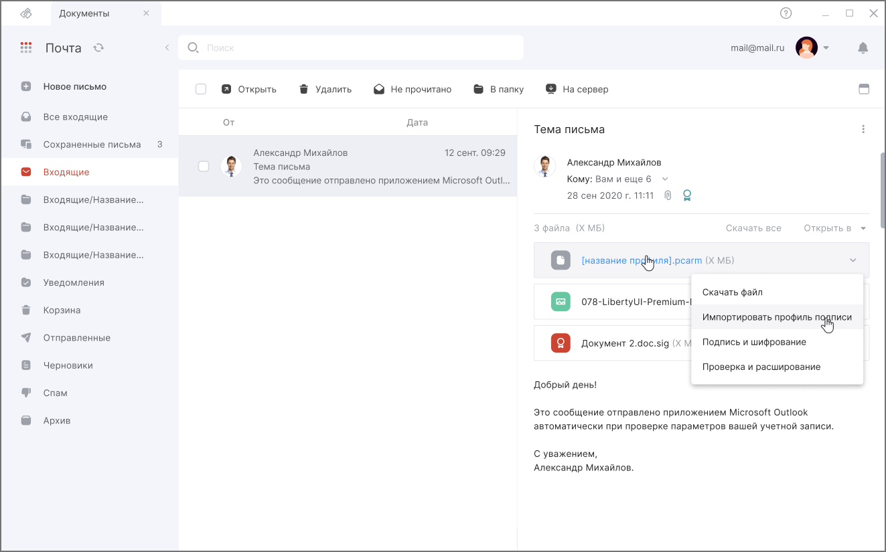

### Импорт профиля из папки Архив или Почтовые вложения

Для импорта профиля подписи из папки **Архив** или **Почтовые вложения** необходимо выполнить следующие действия:

1. Перейдите в раздел **Документы** в папку **Архив** или **Почтовые вложения**.
2. Дважды кликните по файлу профиля подписи с расширением .pcarm.

После выполнения данных действий профиль будет импортирован в приложение и будет отображаться в списке профилей.

***Важно:*** для импорта профилей из папки **Архив**, предварительно необходимо поместить в нее файл с расширением .pcarm. Для импорта профилей из папки Почтовые вложения, необходимо, чтобы в приложении был подключен почтовый аккаунт, в письмах которого, в виде вложений, содержатся файлы профилей с расширением .pcarm. 

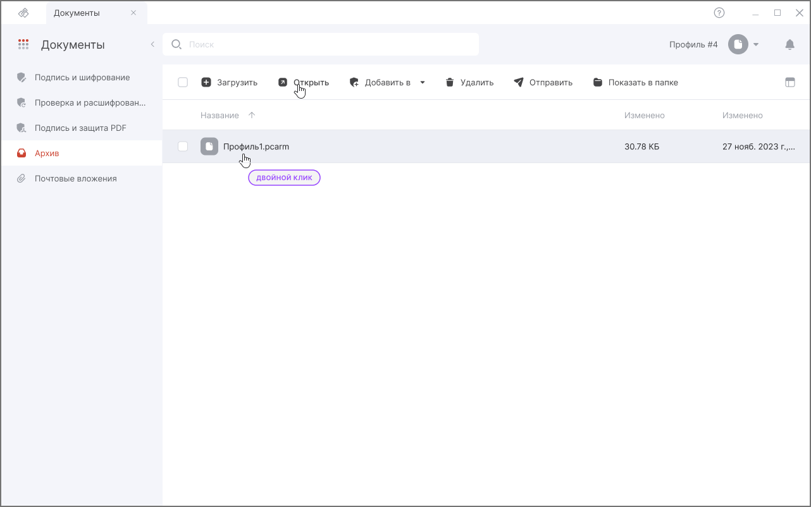

## Удаление профилей

Вы можете удалить как один, так и несколько профилей подписи.

### Удаление одного профиля подписи

Для удаления профиля подписи необходимо выполнить следующие действия:

1. В разделе **Документы** или мастере **Подпись и шифрование** откройте боковое окно со списком профилей.
2. Наведите курсор на тот профиль, который хотите удалить.
3. Нажмите на кнопку **Настройки**.
4. В открывшемся окне с параметрами профиля нажмите кнопку **Еще**.
5. В выпадающем меню нажмите кнопку **Удалить**.
6. В окне подтверждения удаления профиля, нажмите кнопку **Удалить**.

После выполнения данных действий профиль будет удален.

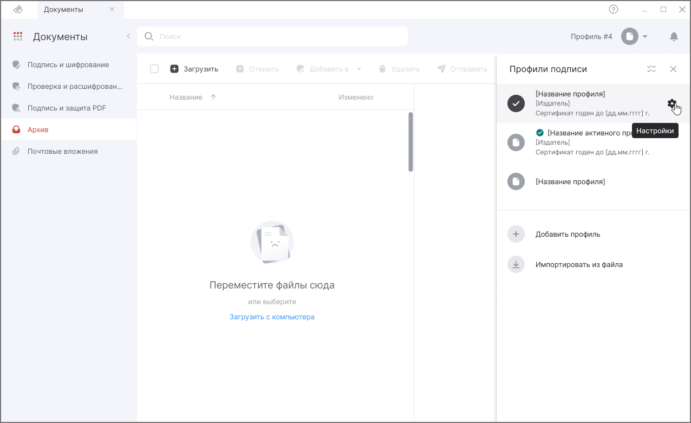

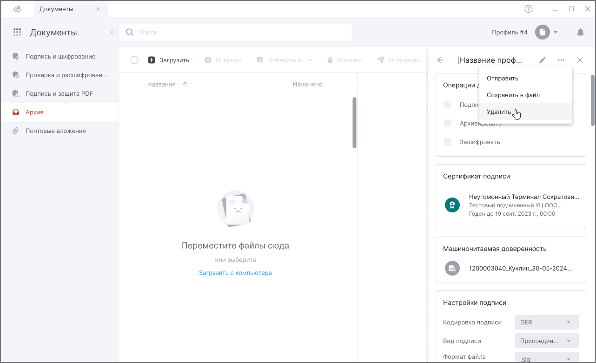

### Удаление нескольких профилей подписи

Для удаления нескольких профилей подписи, необходимо выполнить следующие действия:

1. В разделе **Документы** или мастере **Подпись и шифрование** откройте боковое окно со списком профилей.
2. В окне со списком профилей нажмите на кнопку **Выбрать**.
3. Отметьте флагами профили, которые вы хотите удалить.
4. Нажмите кнопку **Удалить**.
5. В окне подтверждения удаления профилей, нажмите кнопку **Удалить**.

После выполнения данных действий выбранные профили будут удалены.

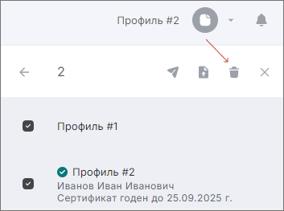

