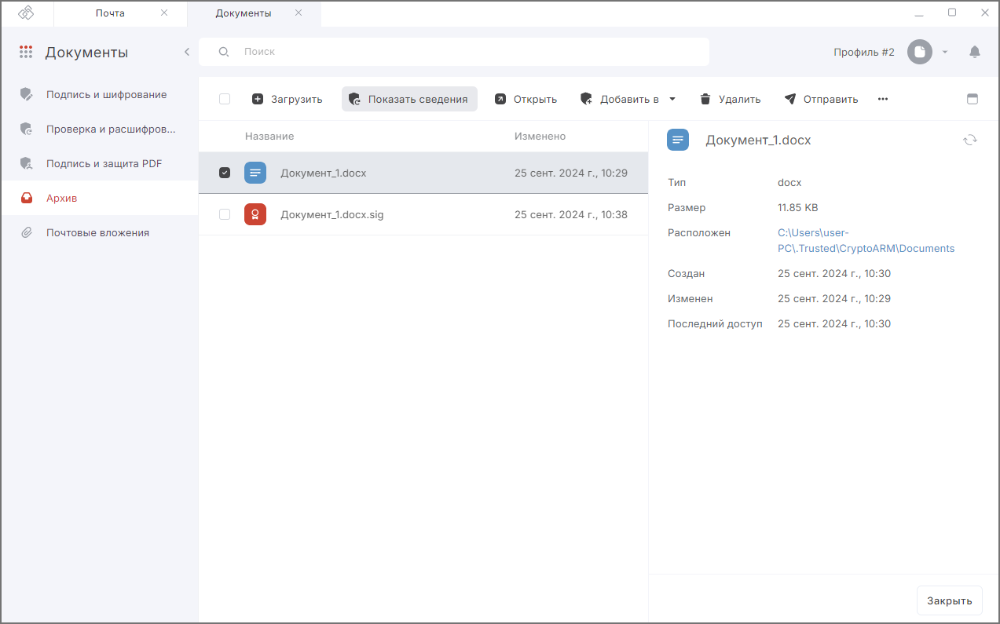
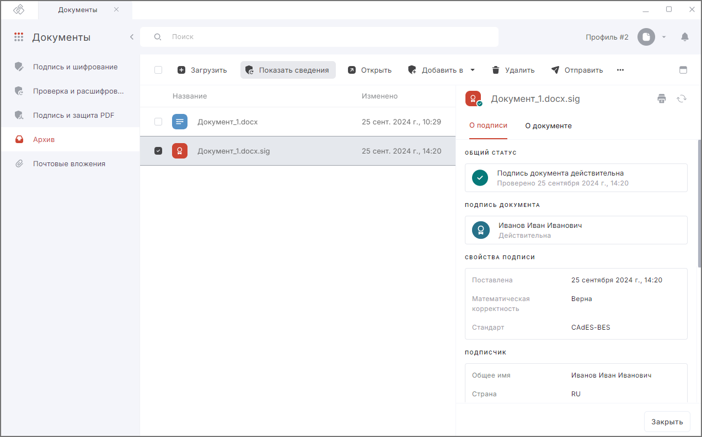

Просмотреть информацию о документе вы можете в разделе **Документы** — вкладка **Архив**, в мастере прямых или обратных операций.  

## Просмотр информации о простом или зашифрованном  документе  

1. Перейдите в раздел **Документы** — вкладка **Архив**.  
2. Выделите документ в списке цветом.  
3. Нажмите на иконку просмотра .

В области быстрого просмотра отображается информация о документе: тип, размер, даты создания и изменения, каталог расположения файла.  

При нажатии на ссылку пути расположения файла открывается каталог расположения документа в файловом менеджере.  

При нажатии на кнопку **Обновить** обновляется информация о документе.  

## Просмотр информации о подписанном документе  

1. Перейдите во вкладку **Архив**.  
2. Выделите подписанный документ в списке (с расширением .sig).  
3. Нажмите на иконку просмотра . 

В области быстрого просмотра на разных вкладках отображается информация о подписи и о документе.  

**Информация о подписи:**  

- общий статус (действительность подписи);  
- информация о подписи (кто и когда подписал документ);  
- свойства подписи (стандарт подписи, дата и время подписания);  
- информация о подписчике;  
- информация об издателе;  
- данные о сертификате (до какой даты действителен, алгоритм подписи);  
- состав цепочки сертификации.  

**Информация о документе:** тип, размер, каталог расположения файла, даты создания и изменения.  

***Важно:***  Чтобы просматривать информацию о подписи подписанных документов, у вас на рабочем месте должен быть установлен криптопровайдер КриптоПро CSP.  

При нажатии на кнопку **Обновить** обновляется информация о документе.  

При нажатии на кнопку **Печать** формируется **Отчёт о проверке электронной подписи** в формате .pdf, который можно распечатать или скачать на устройство (протокол проверки подписи).

Если при просмотре информации о документе возникла ошибка, она выводится как уведомление в правом верхнем углу. Вы можете ее посмотреть, нажав на иконку .  

Для просмотра подробного описания ошибки или отправки в техническую поддержку нажмите кнопку **Перейти в журнал** в правой боковой панели списка уведомлений.   

## Возможные уведомления

**Не удалось найти исходный файл для подписи** — данное сообщение возникает, если при отсоединённой подписи не найден исходный документ. На правой боковой панели нажмите **Указать путь к файлу** для выбора исходного документа или скопируйте исходный документ в папку с файлом подписи. В таком случае необходимо, чтобы названия исходного файла и файла подписи совпадали.  

## Инструкции по теме  

1. [Как проверить подпись документа.](./14-verify.md)  
2. [Как посмотреть уведомления.](../008-cryptoarm/01-notifications.md)  