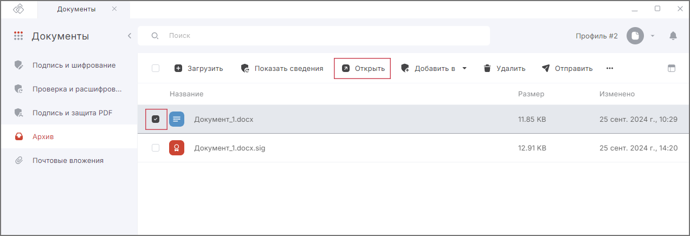

Документ для просмотра открывается в программе, которая ассоциирована с его расширением.  

Для подписанных или зашифрованных документов открывается оригинал.   

***Важно:*** чтобы просматривать подписанные и зашифрованные документы, у вас на рабочем месте должен быть установлен криптопровайдер КриптоПро CSP.  

При открытии зашифрованного документа происходит расшифрование, поэтому в хранилище личных сертификатов должен быть сертификат с закрытым ключом, в адрес которого производилось шифрование.  

Открыть документ вы можете в разделе **Документы** — вкладка **Архив**, в мастере прямых или обратных операций.  

Чтобы открыть документ:

1. Перейдите в раздел **Документы** — вкладка **Архив**.  
2. Выделите документ в списке.  
3. Нажмите на кнопку **Открыть** на верхней панели.    

Если при открытии документа возникла ошибка, она выводится как уведомление в правом верхнем углу. Вы можете ее посмотреть, нажав на иконку.     

Для просмотра подробного описания ошибки или отправки в техническую поддержку нажмите кнопку **Перейти в журнал** в правой боковой панели списка уведомлений.   

## Возможные уведомления  

- **Не удалось найти исходный файл для подписи** — данное сообщение возникает, если при отделенной подписи не найден исходный документ. На правой боковой панели нажмите **Указать путь к файлу** для выбора исходного документа или скопируйте исходный документ в папку с файлом подписи. В таком случае необходимо, чтобы названия исходного файла и файла подписи совпадали.  
- **Не удалось расшифровать файл** — данное сообщение возникает, если при просмотре документа не найден сертификат расшифрования.    

## Инструкции по теме  

1. [Как посмотреть информацию о документе.](./03-view-docs-info.md)   
2. [Как посмотреть уведомления.](../008-cryptoarm/01-notifications.md)  
