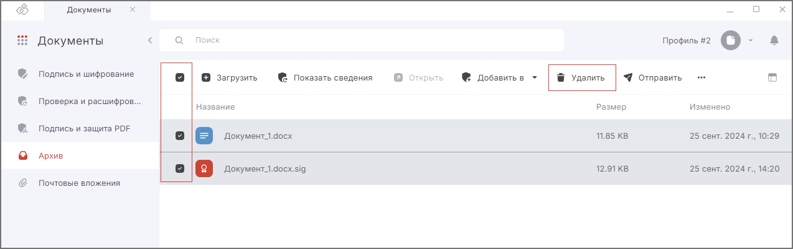

Документы можно удалить на вкладке **Архив**, тогда они удаляются из файловой системы.  

Также можно удалить в мастере **Подписи и шифрования** или **Проверки и расшифрования**, тогда происходит очищение списка без удаления из файловой системы.   

## Удаление отдельного документа  

1. Перейдите к списку документов.  
2. Выделите документ в списке нажатием курсора.  
3. В верхней панели нажмите на кнопку **Удалить**.  
   
## Удаление нескольких документов сразу  

1. Перейдите к списку документов.  
2. Установите флажки слева от документов.  
3. В верхней панели нажмите на кнопку **Удалить**.  

## Удаление всех документов 

1. Перейдите к списку документов.  
2. Выберите все документы, установив флажок в левом верхнем углу.   
3. В верхней панели нажмите на кнопку **Удалить**.  

***Важно:***   

- При удалении во вкладке **Архив** файлы удаляются из файловой системы.     
- При удалении из **Мастера** документы из файловой системы не удаляются.    
