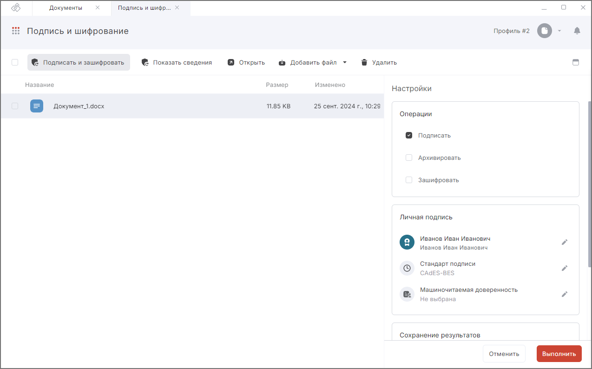

 
Чтобы подписывать документы электронной подписью, необходимо в профиле подписи или в настройках операции в мастере **Подписи и шифрования** выбрать сертификат из хранилища **Личные**, у которого есть привязка к закрытому ключу.  

Для выбора сертификата подписи в **Профиле подписи** перейдите на форму создания или редактирования профиля и выберите в нем операцию **Подпись**.  

Для выбора сертификата подписи в мастере **Подписи и шифрования**, перейдите в мастер из раздела **Документы**, добавьте в мастер файл и активируйте в правой боковой панели операцию **Подписать**. В блоке настроек **Личная подпись** выберите сертификат подписи.  

## Выбор сертификата подписи в мастере Подпись и шифрование

1. В поле **Личная подпись** нажмите кнопку **Редактировать**.  
2. Выберите сертификат подписи из хранилища Личных и нажмите кнопку **Закрыть** в боковой панели выбора сертификата.   
3. Сертификат появится в поле **Личная подпись**.  

***Примечание:*** при выборе недействительного сертификата отображается предупреждение. 

## Изменение сертификата подписи в профиле подписи  

1. Перейдите на форму создания или редактирования профиля подписи.  
2. В поле **Личный сертификат** нажмите на кнопку **Редактировать**.  
3. На правой боковой панели в списке сертификатов наведите курсор на сертификат, который хотите выбрать, и нажмите на его иконку. Сертификат подставляется в поле **Личный сертификат**. Выбор сертификат можно отменить, повторно нажав на его иконку.  
4. Закройте правую боковую панель по кнопке **Закрыть**.  
5. Сохраните изменения в профиле.  

## Удаление сертификата подписи из профиля подписи  

1. Откройте форму создания или редактирования профиля.   
2. В поле **Личный сертификат** нажмите на иконку редактирования сертификата, на правой боковой панели в списке сертификатов нажмите на иконку уже выбранного сертификата.   

Сертификат удаляется из поля **Личный сертификат**.  

## Удаление сертификата подписи из настроек операций  

1. Перейдите в мастер **Подписи и шифрования**.  
2. В поле **Личный сертификат** нажмите на кнопку редактирования сертификата
3. В правой боковой панели, в списке сертификатов, нажмите на иконку уже выбранного сертификата  

Поле **Личный сертификат** очищается.  

## Инструкции по теме

1. [Как создать профиль подписи.](./02-sign-profiles.md/#_2)  
2. [Как редактировать профиль подписи.](./02-sign-profiles.md/#_3)  
3. [Как установить личный сертификат.](../006-certs/01-import-my-cert.md)  
4. [Как подписать документ.](./10-sign.md)  

