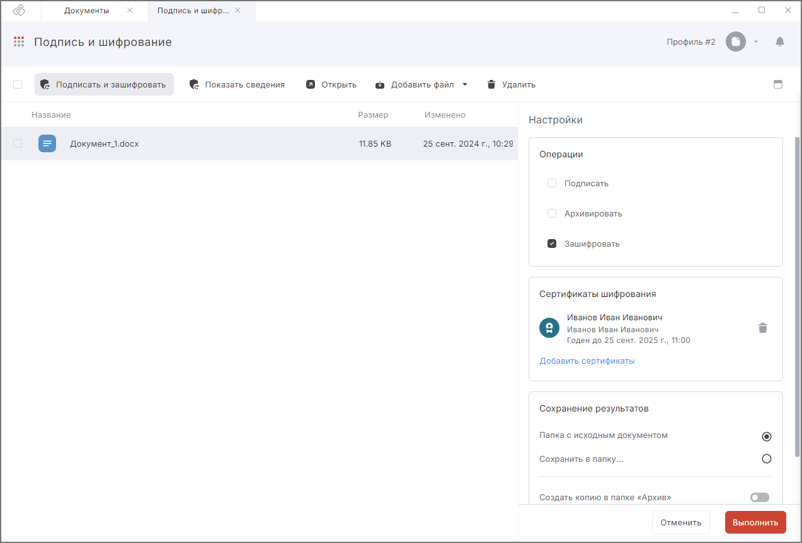
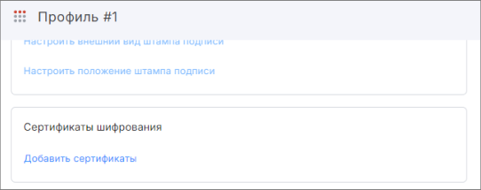
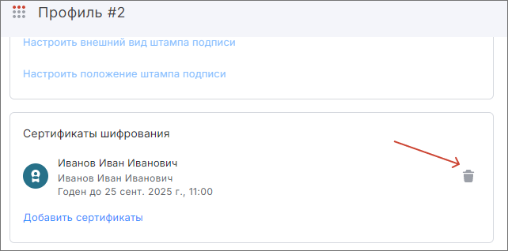

Чтобы шифровать документы, необходимо в профиле подписи или в настройках операции в мастере **Подписи и шифрования** выбрать сертификаты шифрования  из хранилища **Личные** и **Других пользователей** и/или контакты, у которых есть привязанный сертификат.  

Для выбора сертификатов шифрования в **Профиле подписи** перейдите на форму создания или редактирования профиля и выберите в нем операцию **Шифрование**. Сертификаты шифрования можно выбрать в блоке **Сертификаты шифрования**.

Для выбора сертификатов шифрования  в мастере **Подписи и шифрования** перейдите в мастер из раздела **Документы**, загрузите файл и выберите в правой панели операцию **Зашифровать**.  

## Выбор сертификатов шифрования в мастере Подпись и шифрование

1. Загрузите файл для шифрования в мастер **Подпись и шифрование**.
2. Активируйте настройку **Зашифровать** в правой боковой панели настроек операции.
3. В блоке **Сертификаты шифрования** выберите сертификаты для шифрования.
4. Закройте правую боковую панель после выбора всех сертификатов по кнопке **Закрыть**.

    

***Примечание:*** при выборе недействительного сертификата отображается предупреждение.  
   
## Добавление сертификатов шифрования в профиле подписи  

1. Откройте форму создания или редактирования профиля подписи.  
2. В поле **Сертификаты шифрования** нажмите на **Добавить сертификаты**.  
    
3. На правой боковой панели на вкладке **Сертификаты** отображаются сертификаты получателей, а на вкладке **Контакты** — контакты с привязанными сертификатами, в адрес которых будет зашифрован документ.  
Для выбора наведите курсор на сертификат или контакт и нажмите на его иконку.  
Сертификаты или контакты появляются в поле **Сертификаты шифрования** профиля.  
    
3. Закройте правую боковую панель после выбора и сохраните изменения в профиле.

***Примечание:*** при выборе недействительного сертификата отображается предупреждение.  

## Удаление сертификатов шифрования в профиле подписи  

1. Откройте форму создания или редактирования профиля подписи.  
2. В поле **Сертификаты шифрования** нажмите на иконку удаления у сертификата или в разделе **Сертификаты шифрования** нажмите на **Выбрать сертификаты**, на правой боковой панели на вкладке **Сертификаты** в списке сертификатов нажмите на иконку уже выбранного сертификата или на вкладке **Контакты** — на уже выбранный контакт.  
    
4. Сертификат или контакт удаляется из поля **Сертификаты шифрования** профиля.
5. Сохраните изменения в профиле.

## Удаление сертификатов шифрования в настройках операций мастера Подписи и шифрования

1. Перейдите в мастер **Подписи и шифрования**.  
2. В поле **Сертификаты шифрования** нажмите на иконку удаления сертификата.  
3. Сертификат или контакт удаляется из поля **Сертификаты шифрования**.  

## Инструкции по теме  

1. [Как создать профиль подписи.](./02-sign-profiles.md/#_2)    
2. [Как редактировать профиль подписи.](./02-sign-profiles.md/#_3)  
3. [Как установить личный сертификат.](../006-certs/01-import-my-cert.md)  
4. [Как импортировать сертификаты других пользователей.](../006-certs/06-import-certs.md)  
5. [Как зашифровать документ.](./11-cipher.md)  