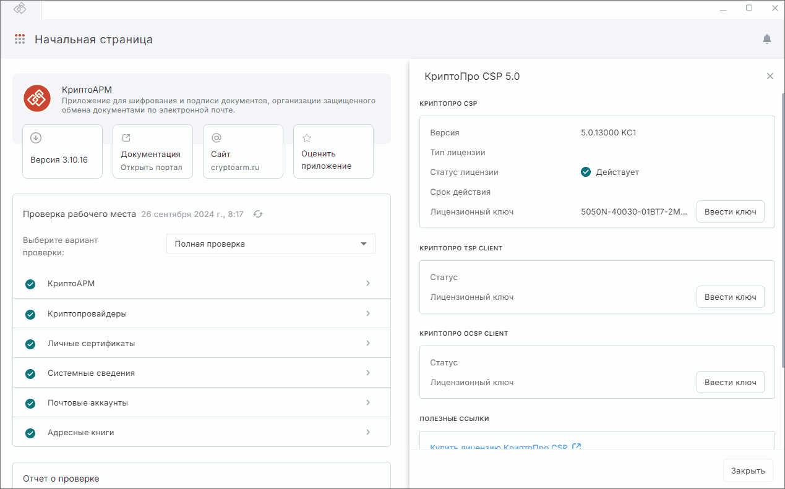

Принцип добавления документов в мастер **Подписи и шифрования** и **Проверки и расшифрования** идентичен.  

Перейти в мастер можно через левое боковое меню или через кнопку **Добавить в**.    
При этом при переходе по кнопке в мастер в список документов для операции добавляется выделенный цветом документ из списка документов вкладки **Архив**.  

## Добавление из Архива  

1. Перейдите в раздел **Документы** — вкладка **Архив**.  
2. Выделите документы в списке и перейдите в мастер **Подпись и шифрование** или **Проверка и расшифрование**.   
Если вы хотите открыть пустой мастер, то не выбирайте документы и перейдите в мастер **Подпись и шифрование** или **Проверка и расшифрование**.  
3. Если в списке нет документов, то нажмите **Добавить из Архива** в области формирования списка. Если документы уже добавлены в список, то нажмите кнопку **Из Архива** на панели действий.  
4. В открывшейся правой боковой панели нажмите на иконку документа, который хотите добавить. Документ добавляется в список. При повторном нажатии на иконку документ удаляется из списка.   
5. После выбора всех документов закройте правую боковую панель, нажав кнопку **Закрыть**.  

  
## Добавление из файлового менеджера  

1. Перейдите в раздел **Документы** — мастер **Подпись и шифрование** или **Проверка и расшифрование**.   
  
2. Добавьте документы одним из следующих способов:  
   
      - перетащите документы или папки с документами из файлового менеджера в область формирования списка файлов. При перетаскивании папки файлы добавляются одноуровневым списком;  
      - нажмите кнопку **Загрузить с компьютера** и в файловом менеджере выберите необходимые документы.  

## Инструкции по теме 

1. [Как подписать документ.](./10-sign.md)  
2. [Как зашифровать документ.](./11-cipher.md)  
3. [Как расшифровать документ.](./13-decrypt.md)  
4. [Как снять подпись с документа.](./16-remove-sign.md)  