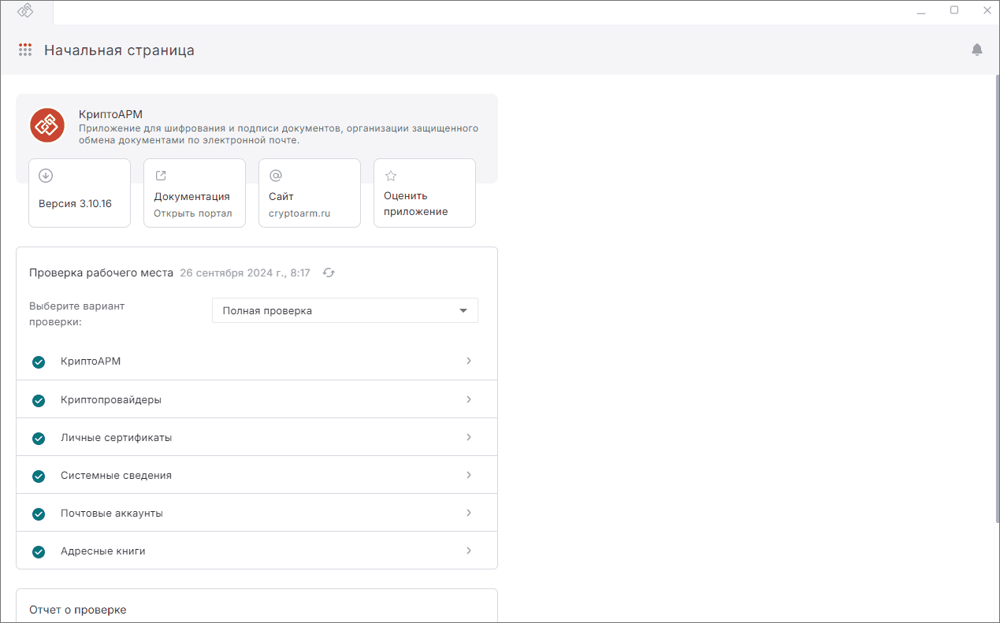
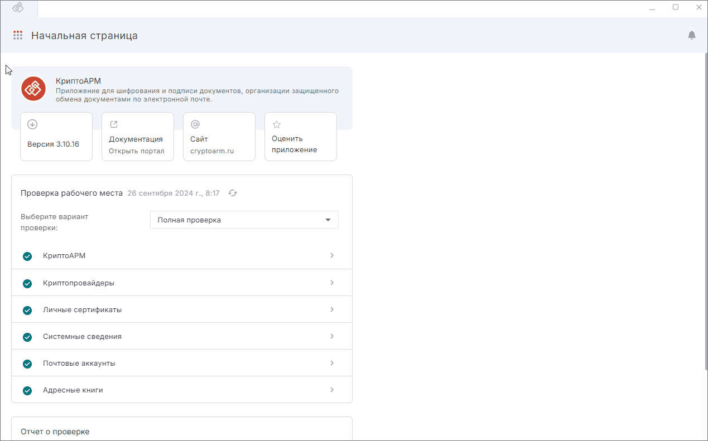

## Просмотр расположения из папки Архив

Чтобы посмотреть расположение файла из папки **Архив**:

1. Перейдите в раздел **Документы**, в папку **Архив**.
2. Выделите документ нажатием левой кнопки мыши.  
3. В верхней панели откройте дополнительное меню и нажмите кнопку **Показать в папке**.  

## Просмотр расположения из мастеров

Чтобы посмотреть расположение файла в мастере **Подпись и шифрование** и **Проверка и расшифрование**:

1. Перейдите в мастер **Подпись и шифрование** или **Проверка и расшифрование**.
2. Добавьте файл в мастер.
3. Нажмите кнопку **Показать сведения**.
4. В открывшемся боковом окне, нажмите на кнопку расположения файла.

При множественном выборе документов данная опция недоступна.    

## Инструкции по теме  

1. [Как добавить документы в мастер.](./08-add-docs.md)  
2. [Как посмотреть информацию о документе.](./03-view-docs-info.md)  

