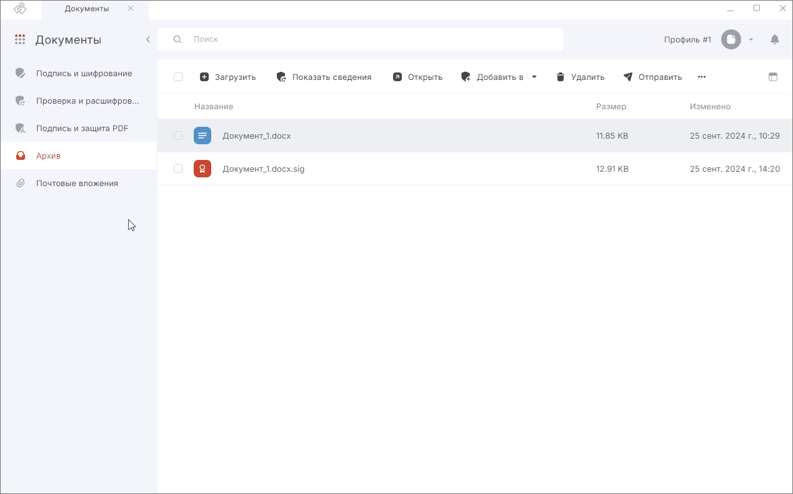

***Важно:*** чтобы подписывать документы, у вас на рабочем месте должен быть установлен криптопровайдер КриптоПро CSP.  

Чтобы подписывать документы электронной подписью, нужно установить в [Личное хранилище](../006-certs/01-import-my-cert.md) сертификат с закрытым ключом.  

Подписать документы вы можете в мастере **Подписи и шифрования** в разделе  **Документы**.  

Вы можете подписать любые произвольные документы, загрузив их с помощью drag-and-drop либо выбрав файлы из вкладки **Архив**.  

## Подпись документа с использованием профиля подписи  

Перед началом подписи документа должен быть создан [профиль подписи](./02-sign-profiles.md/#_2), в котором заданы настройки подписи. 

Чтобы подписать документ, выполните следующие действия:

1. Перейдите в раздел **Документы**.  
2. Откройте мастер **Подписи и шифрования**.  
3. Выберите профиль подписи, в котором заданы настройки подписи.  
    При выборе профиля в мастере автоматически заполняются **Настройки операции**, **Сертификат подписи**, каталоги сохранения результатов подписи, настройки подписи Pades и настройки штампа печатной формы.  
4. Добавьте документы в список с помощью drag-and-drop или кнопок **Загрузить с компьютера**, **Добавить из Архива**.  
5. Нажмите кнопку **Выполнить**.  
6. Подтвердите действие.

## Подпись документа с использованием настройки операций в мастере без изменения выбранного профиля  

Если вы хотите изменить параметры подписи, не изменяя настройки в профиле, то воспользуйтесь настройками в открытом мастере.  

1. Перейдите в раздел **Документы**.  
2. Откройте мастер **Подписи и шифрования**.
3. Добавьте файл в мастер.
4. Включите на правой панели необходимую операцию. В **Настройках операции** укажите дополнительные параметры.  
5. Нажмите кнопку **Выполнить**. 
6. Подтвердите действие.

## Подпись документа сертификатом DSS  

Подпись сертификатом DSS ничем не отличается от подписи обычным сертификатом, за исключением некоторых шагов.    

1. При выборе сертификата подписи DSS некоторые настройки операции подписи, такие как выбор стандарта подписи и установка штампов времени, недоступны.   
2. При нажатии на кнопку **Выполнить** открывается:  
   
      - Окно для ввода пароля к ключевому контейнеру. Введите пароль. 
         
         *Если пароль не задан, то данный шаг пропускается.*

      - Окно для ввода пароля для аутентификации на сервисе DSS, если для аутентификации задан пароль и время действия токена аутентификации истекло. Введите пароль.   

         *Если токен аутентификации не истек, то данный шаг пропускается.*

      - Окно для подтверждения аутентификации на сервисе DSS, если для аутентификации задан вход по SIM-карте или по мобильному приложению и время действия токена аутентификации истекло. Подтвердите операцию входа на сервис на устройстве.    
         
         *Если токен аутентификации не истек, то данный шаг пропускается.*  
         
      - Окно ожидания подтверждения операции подписи, если в настройках аутентификации стоит подтверждение операции подписи по SIM-карте или с помощью мобильного приложения.  

         *Подтвердите операцию на устройстве.*  

***Примечание:*** для DSS подписи наличие лицензии на программный продукт КриптоПро CSP необязательно.  

## Подпись документа стандартом CAdES-T  

**Стандарт подписи CAdES-T (Timestamp)** — это формат электронной подписи, в которую автоматически добавляется штамп времени на подпись.  

Создать подпись со штампом времени  вы можете только при установленном модуле
КриптоПро TSP Client и лицензии на него.  

1. Перейдите в раздел **Документы**.
2. Откройте мастер **Подписи и шифрования**.
3. Добавьте файл в мастер.
4. Создайте профиль подписи  или выберите в настройках операции с включенной опцией **Подпись** следующие параметры подписи:  
   
      - **стандарт — CAdES-T**, вид, кодировку, формат файла подписи, выберите сертификат подписи и настройте каталоги сохранения подписанных файлов;   
      - заполните в поле **Служба штампов времени (TSP)** адрес службы, который можно узнать у поставщика услуги. Например, услуги службы штампов времени могут предоставлять удостоверяющие центры. Формат адреса: \<протокол\>://\<сервер\>[:порт][/путь]. В качестве протокола может быть указан "http" и "https"; 
      - **Использовать прокси-сервер** — если при подключении к службе TSP используется прокси-сервер, то установка флага активирует его настройки: **Адрес прокси-сервера, Логин, Пароль,** которые можно узнать у системного администратора.   

5. Нажмите кнопку **Выполнить**.
6. Подтвердите действие.

## Подпись документа стандартом Cades-X Long Type 1 

Усовершенствованная квалифицированная электронная подпись поможет доказать юридическую значимость документа в спорных ситуациях. Например, когда помимо авторства и целостности документа (которые дает обычная КЭП) необходимо подтвердить, что сертификат был действителен в момент подписания документа.  

Формат усовершенствованной подписи предусматривает включение в электронную подпись информации о времени создания подписи (TSP) и о статусе сертификата электронной подписи (OCSP) в момент подписания.  

Вы можете создать усовершенствованную подпись только при наличии установленных модулей TSP Client и OCSP Client и лицензий на них.  

1. Перейдите в раздел **Документы**.  
2. Откройте мастер **Подписи и шифрования**.
3. Добавьте файл в мастер.
4. Создайте профиль подписи  или выберите в настройках операции с включенной опцией **Подпись** следующие параметры подписи:  
   
      - **стандарт — CAdES-X Long Type 1**, вид, кодировку, формат файла подписи, выберите сертификат подписи и настройте каталоги сохранения подписанных файлов;  
      - заполните в поле **Служба штампов времени (TSP)** адрес службы, который можно узнать у поставщика услуги. Например, услуги службы штампов времени могут предоставлять удостоверяющие центры. Формат адреса: \<протокол\>://\<сервер\>[:порт][/путь]. В качестве протокола может быть указан "http" и "https";
      - при необходимости заполните поле **Служба онлайн статусов (OCSP)** — адрес службы OCSP. Данное поле не обязательно для заполнения, чаще всего адрес прописан в самом сертификате, которым создается подпись;
      - **Использовать прокси-сервер** — если при подключении к службе TSP используется прокси-сервер, то установка флага активирует его настройки: **Адрес прокси-сервера, Логин, Пароль,** которые можно узнать у системного администратора.   

5. Нажмите кнопку **Выполнить**.  
6. Подтвердите действие.

## Подпись документа стандартом CAdES-A  

**Стандарт подписи CAdES-A (Archival)** — формат электронной подписи, сформированный на основе CAdES-X Long Type 1 или Type 2 путём добавления одного или нескольких атрибутов archive-time-stamp, представляющих собой архивные штампы времени. Данный формат используется для архивации долгосрочных подписей.  

Вы можете создать подпись стандартом CadesA, только при наличии установленных модулей TSP Client и OCSP Client и лицензий на них.

Для создания такой подписи:

1. Перейдите в раздел **Документы**.  
2. Откройте мастер **Подписи и шифрования**.
3. Добавьте файл в мастер.
4. Создайте профиль подписи  или выберите в настройках операции с включенной опцией **Подпись** следующие параметры подписи:  
   
      - **стандарт — CAdES-A**, вид, кодировку, формат файла подписи, выберите сертификат подписи и настройте каталоги сохранения подписанных файлов; 
      - заполните в поле **Служба штампов времени (TSP)** адрес службы, который можно узнать у поставщика услуги. Например, услуги службы штампов времени могут предоставлять удостоверяющие центры. Формат адреса: \<протокол\>://\<сервер\>[:порт][/путь]. В качестве протокола может быть указан "http" и "https";
      - при необходимости заполните поле **Служба онлайн статусов (OCSP)** — адрес службы OCSP. Данное поле не обязательно для заполнения, чаще всего адрес прописан в самом сертификате, которым создается подпись;
      - **Использовать прокси-сервер** — если при подключении к службе TSP используется прокси-сервер, то установка флага активирует его настройки: **Адрес прокси-сервера, Логин, Пароль,** которые можно узнать у системного администратора.   

5. Нажмите кнопку **Выполнить**. 
6. Подтвердите действие.

## Подпись одного или нескольких документов стандартом Pades

Вы можете подписать как один, так и несколько PDF-файлов со встроенной подписью. Подпись нескольких PDF-файлов, может быть выполнена только в мастере **Подпись и шифрование**.

***Важно:*** сертификат DSS не подходит для встроенной подписи PDF-файлов стандартом Pades.

***Важно:*** если в списке файлов на подпись, есть файлы не формата PDF, то вложенная подпись будет выполнена только для PDF - файлов, для остальных будет выполнена классическая подпись.

Для выполнения групповой подписи стандартом Pades, необходимо выполнить следующие действия:

1. Перейдите в раздел **Документы**.
2. Откройте мастер **Подписи и шифрования**.
3. Добавьте один или несколько PDF-файлов в мастер.
4. Выберите профиль подписи, в котором заданы настройки для подписи Pades, либо настройте параметры Pades в мастере, в боковой панели **Настроек подписи**.
5. Нажмите кнопку **Выполнить**.
6. Подтвердите действие.

После выполнения в результатах операции сформируются PDF-файлы со встроенной подписью Pades. 

## Подпись PDF-файлов с созданием печатной формы

В мастере **Подпись и шифрование** вы можете создать печатную форму для PDF-файлов, в которой будет отображаться штамп подписи, с информацией о сертификате, владельце сертификата и сроке действия сертификата. Поля штампа можно изменить в профиле подписи, либо в мастере **Подпись и шифрование** в **Настройках операции**. 

Для создания печатной формы со штампом подписи для PDF-файлов, необходимо выполнить следующие действия:

1. Перейдите в раздел **Документы**.
2. Откройте мастер **Подпись и шифрование**.
3. Добавьте один или несколько PDF-файлов в мастер.
4. Выберите профиль подписи, в котором заданы настройки для печатной формы со штампом подписи, либо настройте параметры печатной формы в мастере, в боковой панели **Настроек подписи**.
5. Нажмите кнопку **Выполнить**.
6. Подтвердите действие.

После выполнения, в результатах операции сформируются подписанные PDF-файлы в формате .sig (sgn, sign, p7s, bin) и копия оригинала PDF-файла со штампом подписи.

## Результат выполнения операции  

На вкладке **Подпись и шифрование** отображаются ход и результаты выполнения операции.  

При успешном выполнении операции подписанные файлы сохраняются в заданном каталоге, если выбран каталог для сохранения результатов, или рядом с исходным файлом, если каталог не задан.    

Если установлен флаг **Создать копию в Архиве**, то копия подписанных документов сохраняется в специальную папку, документы которой доступны в разделе **Документы — вкладка Архив**.   

***Примечание:*** если в настройках подписи выбрана отсоединённая подпись, то в заданный каталог и в **Архив** кроме файла подписи создается копия исходного файла.  

Вы можете посмотреть информацию о подписи, выделив документ в списке и нажав иконку просмотра.
    

Действия с файлами после выполнения операции:  

- **Показать сведения** — в правой боковой панели показывается информация о подписи, либо о файле
- **Открыть** — файл откроется в соответствующей программе;  
- **Сохранить в Архив** — результат операции будет сохранён в специальную папку на устройстве и будет отображаться во вкладке **Архив** раздела **Документы**;  
- **Добавить в Подпись и шифрование / Проверка и расшифрование / Подпись и защита PDF** — результат операции будет добавлен в мастер **Подпись и шифрование**, **Проверка и расшифрование** или **Подпись и защита PDF** (для файлов в формате PDF);  
- **Промежуточные файлы** — откроется список промежуточных файлов (оригинал документов);
- **Отправить** — откроется новое письмо с вложением в виде файлов, которые были в окне результатов операции   

Если какие-то документы не удалось подписать, то операция считается выполненной с ошибками. Вы можете посмотреть, какие файлы подписались успешно, а какие с ошибками.   

Ошибки при операции выводятся как уведомления. Вы можете их посмотреть, нажав на иконку.
     

Для просмотра подробного описания ошибки или отправки в техническую поддержку нажмите кнопку **Перейти в журнал** в правой боковой панели списка уведомлений.  

## Возможные уведомления  

1. **Не удалось открыть файл** — добавленные в мастер документы были удалены или по какой-то причине доступны, добавлен пустой файл (с нулевым размером).  
2. **Не удалось подписать файл** — ошибка в адресе службы штампов времени, если подпись со штампом или усовершенствованная. Ошибка подключения к  прокси-серверу.   
3. **Не удалось подписать файл** — ошибки, связанные с истекшими лицензиями КриптоПро TSP Client, OCSP Client, КриптоПро CSP.  

## Инструкции по теме  

1. [Как установить личный сертификат.](../006-certs/01-import-my-cert.md)  
2. [Как создать профиль подписи.](./02-sign-profiles.md/#_2)   
3. [Как переключаться между профилями подписи.](./02-sign-profiles.md/#_4)  
4. [Как добавить документы в мастер.](./08-add-docs.md)  
5. [Как выбрать сертификат подписи.](./06-select-sign-cert.md)    
6. [Как посмотреть уведомления.](../008-cryptoarm/01-notifications.md)  
7. [Действия с результатами операций.](./19-operations-result.md)    
8. [Как проверить подпись документа.](./14-verify.md)