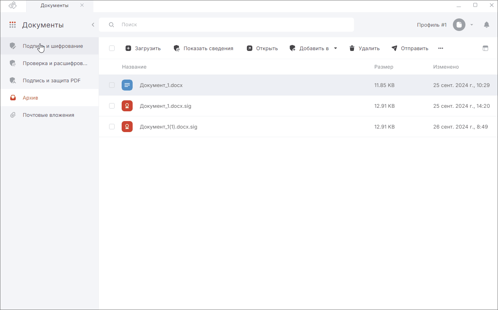

***Важно:*** чтобы шифровать документы, у вас на рабочем месте должен быть установлен криптопровайдер КриптоПро CSP.  

Для шифрования документов нужно установить в хранилище Других пользователей сертификат или привязать сертификат к контакту, в адрес которого будет проводиться шифрование.  

Перейти в мастер **Подписи и шифрования** вы можете из раздела **Документы**.  

Вы можете зашифровать любые произвольные документы, загрузив их с помощью drag-and-drop либо выбрать документы из вкладки **Архив**.  

## Шифрование документа с использованием профиля  

1. Перейдите во вкладку **Архив**.  
2. Выберите в списке документы, которые нужно зашифровать, или ничего не выбирайте, если хотите добавить документы из системы.
3. Перейдите в мастер **Подписи и шифрования** через левое боковое меню  или с помощью кнопки **Добавить в**.
4. При необходимости добавьте документы в мастер.
5. Выберите профиль, в котором заданы настройки шифрования.
При выборе профиля в мастере автоматически заполняются **Настройки операций**, **Сертификаты шифрования**, каталоги сохранения зашифрованных файлов.    
6. Нажмите кнопку **Выполнить**.
7. Подтвердите действие.

## Шифрование документа с использованием настроек операций в мастере без изменения выбранного профиля  

Если вы хотите изменить параметры шифрования, не изменяя настройки в профиле, то воспользуйтесь настройками в открытом мастере.  

1. Перейдите во вкладку **Архив**.  
2. Выберите в списке документы, которые нужно зашифровать, или ничего не выбирайте, если хотите добавить документы из системы.  
3. Перейдите в мастер **Подписи и шифрования** через левое боковое меню или с помощью кнопки **Добавить в**.
4. При необходимости добавьте документы в мастер.
5. Включите на правой боковой панели операцию **Зашифровать**. В **Настройках операции** становятся доступны параметры шифрования.
6. Установите параметры шифрования (алгоритм, кодировку, удаление исходных файлов после шифрования), выберите сертификаты шифрования и настройте каталоги сохранения зашифрованных файлов.
При шифровании допускается выбор нескольких сертификатов из категории **Личные** и **Других пользователей** и **Контактов**, у которых есть привязанные сертификаты. Для этого нажмите на кнопку **Добавить сертификаты**, в открывшейся боковой панели выберите сертификаты и/или контакты.
7. Нажмите кнопку **Выполнить**.
8. Подтвердите действие.

## Результат выполнения операции  

На вкладке **Подпись и шифрование** отображаются ход и результаты выполнения операции.  

При успешном выполнении операции зашифрованные файлы сохраняются в заданном каталоге, если выбран каталог для сохранения результатов. Или рядом с исходным файлом, если каталог не задан.   

Если установлен флаг **Создать копию в Архиве**, то копия зашифрованного файла сохраняется в папке пользователя. Файлы из данного каталога доступны в разделе **Документы** — вкладка **Архив**.   

Если в параметрах шифрования была выбрана опция **Удалить файлы после шифрования**, то в результате операции будут только полученные зашифрованные файлы; промежуточные файлы и оригиналы документов удаляются.    

Действия с файлами после выполнения операции:  

- **Показать сведения** - в правой боковой панели показывается информация о зашифрованном файле;
- **Открыть** — файл откроется в соответствующей программе после ввода пароля на контейнер;
- **Сохранить в Архив** — результат операции будет сохранён в специальную папку на устройстве и будет отображаться во вкладке **Архив** раздела **Документы**;
- **Добавить в Подпись и шифрование / Проверка и расшифрование** — результат операции будет добавлен в мастер **Подпись и шифрование** или **Проверка и расшифрование**;
- **Промежуточные файлы** — откроется список промежуточных файлов (оригинал документов);
- **Отправить** - откроется новое письмо с вложением в виде файлов, которые были в окне результатов операции. 

Если какие-то документы не удалось зашифровать, то операция считается выполненной с ошибками. Вы можете посмотреть, какие файлы зашифрованы успешно, а какие с ошибками.   

Ошибки при операции выводятся как уведомления. Вы можете их посмотреть, нажав на иконку.   

Для просмотра подробного описания ошибки или отправки в техническую поддержку нажмите кнопку **Перейти в журнал** в правой боковой панели списка уведомлений.  

## Возможные уведомления  

**Не удалось зашифровать файл** — добавленные в мастер документы были удалены или по какой-то причине не доступны; добавлен пустой файл (с нулевым размером).  

## Инструкции по теме  

1. [Как создать профиль подписи.](./02-sign-profiles.md/#_2)  
2. [Как переключаться между профилями подписи.](./02-sign-profiles.md/#_4)  
3. [Как добавить документы в мастер.](./08-add-docs.md)  
4. [Как выбрать сертификаты шифрования.](./07-select-cipher-certs.md)  
5. [Как посмотреть уведомления.](../008-cryptoarm/01-notifications.md)  
6. [Действия с результатами операций.](./19-operations-result.md)  
7. [Как импортировать сертификаты других пользователей.](../006-certs/06-import-certs.md)  
8. [Как привязать сертификат к контакту.](../007-contacts/05-link-contact-cert.md)  