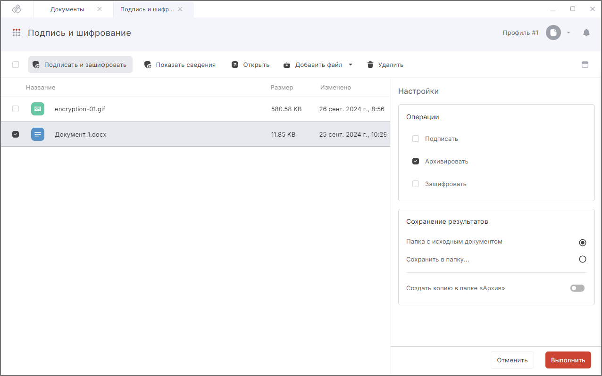

## Архивирование в мастере Подписи и шифрования

Архивировать документы вы можете в мастере **Подписи и шифрования**.  

Вы можете архивировать любые произвольные документы, загрузив их с помощью drag-and-drop либо выбрать документы из раздела.  

Для архивирования документов дополнительные настройки не нужны, можно выбрать каталог сохранения архива и сохранение копии во вкладку **Архив**.  

1. Перейдите в раздел **Документы** — вкладка **Архив**.  
2. Выберите в списке документы, которые нужно заархивировать, или ничего не выбирайте, если хотите добавить документы из системы.  
3. Перейдите в мастер **Подписи и шифрования** через левое боковое меню  или с помощью кнопки **Добавить в**.
4. При необходимости, добавьте файл в мастер.
5. Включите на правой боковой панели операцию **Архивировать**.   
6. При необходимости выберите каталог сохранения архива, опцию сохранения копии в **Архив**.      
7. Нажмите кнопку **Выполнить**.  

## Результат выполнения операции  

При успешном выполнении операции документ отображается в мастере **Результаты операции**.  

Документ сохраняется в заданном каталоге, если выбран каталог для сохранения результатов, или рядом с первым добавленным файлом, если каталог не задан.  

Если вы добавили для архивирования документы из разных каталогов, то при выполнении операции вам надо выбрать каталог для сохранения документов.   

Если установлен флаг **Создать копию в Архив**, то копия созданных документов сохраняется в папке пользователя. Файлы из данного каталога доступны во вкладке **Архив**.  

Чтобы каждый раз не задавать операцию в мастере подписи и шифрования, вы можете настроить профиль с архивированием и каталогами сохранения результатов и выбирать его.    

## Инструкции по теме  

1. [Как добавить документы в мастер.](./08-add-docs.md)  
2. [Как создать профиль подписи.](./02-sign-profiles.md/#_2)  
3. [Как переключаться между профилями подписи.](./02-sign-profiles.md/#_4)  
4. [Как посмотреть уведомления.](../008-cryptoarm/01-notifications.md)  
5. [Действия с результатами операций.](./19-operations-result.md)  