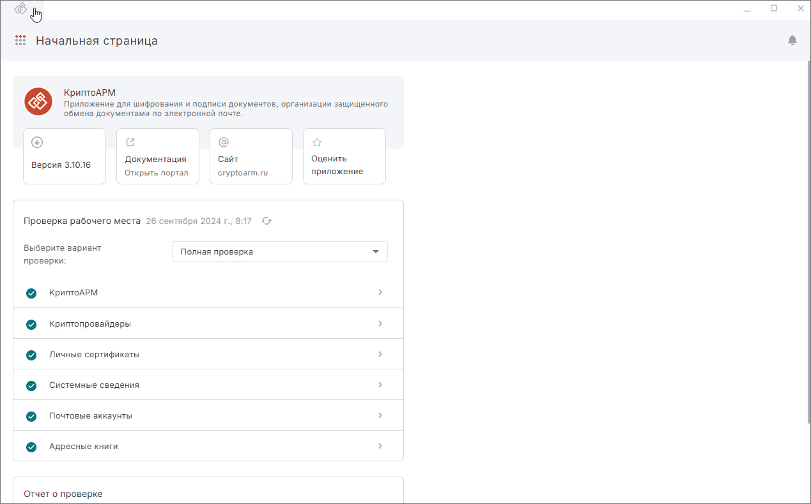

***Важно:*** чтобы расшифровывать документы, у вас на рабочем месте должен быть установлен криптопровайдер КриптоПро CSP с лицензией. КриптоАРМ также должен быть лицензирован.  

Для расшифрования документа у вас в хранилище Личных сертификатов должен быть сертификат с закрытым ключом, который был выбран в качестве сертификата получателя при шифровании.  

Для расшифрования достаточно выбрать зашифрованные файлы с расширением .enc.  

Выбор профиля подписи и настройка дополнительных параметров для операции расшифрования не требуется.  

## Расшифрование документа  

1. Перейдите в раздел **Документы**.
2. Перейдите в мастер **Проверка и расшифрование** через левое боковое меню.
3. Добавьте зашифрованный файл в мастер.
4. После добавления зашифрованного файла, автоматически начнется поиск сертификата расшифрования в хранилище **Личные**. Если сертификат был найден, то файл расшифруется. 

На вкладке **Проверка и расшифрование** отображаются ход и результаты выполнения операции.  

При успешном расшифровании полученные оригиналы документов сохраняются во временной папке и удаляются после выполнения другой операции. Вы можете сохранить полученные после расшифрования документы на компьютере или в папку Архив, нажав **Сохранить** и выбрав действие в меню **На компьютере** или **В Архив**.  

## Действия с файлами  

Действия с файлами после выполнения операции: 

- **Показать сведения** — в правой боковой панели показывается информация о зашифрованном файле.
- **Открыть** — файл откроется в соответствующей программе после ввода пароля на контейнер.
- **Сохранить в Архив** — результат операции можно сохранить на устройство в определённую пользователем папку или в специальную папку на устройстве (файл будет отображаться во вкладке **Архив** раздела **Документы**).
- **Добавить файлы с компьютера / из Архива** — в мастер **Проверка и расшифрование** будет добавлен файл, указанный пользователем.
- **Добавить в Подпись и шифрование / Проверка и расшифрование** — результат операции будет добавлен в мастер **Подпись и шифрование** или **Проверка и расшифрование**.
- **Отправить** — откроется новое письмо с вложением в виде файлов, которые были в окне результатов операции. 
 
Если какие-то документы не удалось расшифровать, то операция считается выполненной с ошибками. Вы можете посмотреть, какие файлы расшифрованы успешно, а какие с ошибками.  

Ошибки при операции выводятся как уведомления. Вы можете их посмотреть, нажав на иконку.   

Для просмотра подробного описания ошибки или отправки в техническую поддержку нажмите на кнопку **Перейти в журнал** в правой боковой панели списка уведомлений.  

## Возможные уведомления  

1. **Не удалось открыть файл** — добавленные в мастер документы были удалены или по какой-то причине не доступны.  
2. **Не удалось расшифровать файл** — добавлен пустой файл (с нулевым размером). Не найден сертификат для расшифрования.   
3. **Не удалось расшифровать файл** — ошибки, связанные с истекшей лицензией КриптоПро CSP.  

## Инструкции по теме  

1. [Как установить личный сертификат.](../006-certs/01-import-my-cert.md)  
2. [Как добавить документы в мастер.](./08-add-docs.md)  
3. [Как посмотреть уведомления.](../008-cryptoarm/01-notifications.md)  
4. [Действия с результатами операций.](./19-operations-result.md)  