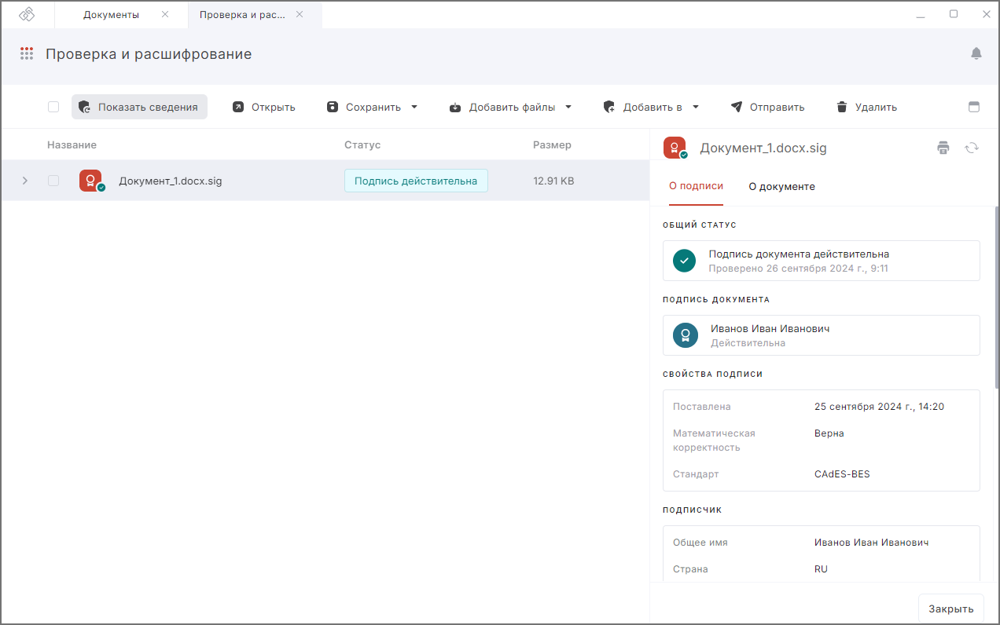

***Важно:*** чтобы проверять подпись документов, у вас на рабочем месте должен быть установлен криптопровайдер КриптоПро CSP.  

Для проверки подписи достаточно выделить файл расширением .sig, .p7s, .sgn, .sign, .bin или XMLDSig, который содержит электронную подпись. Никаких дополнительных настроек при проверке подписи производить не нужно.  

***Примечание:*** для корректной проверки подписи у вас должны быть установлены корневой и промежуточные сертификаты подписанта документа. 

## Просмотр информации о подписи документа на вкладке Архив  

1. Перейдите на вкладку **Архив**.  
2. Выделите в списке подписанный документ (с расширением .sig, .p7s, .sgn, .sign, .bin или XMLDSig).  
3. Нажмите на иконку просмотра  или на кнопку **Показать сведения** на панели действий. 
4. На правой боковой панели отобразится информация о свойствах подписи и о документе.  

## Просмотр информации о подписи документа в мастерах  

1. Перейдите на вкладку **Архив**.  
2. Выберите в списке файлы, подпись которых нужно проверить, или ничего не выбирайте, если хотите добавить файлы из системы.  
3. Перейдите в мастер **Проверка и расшифрование** через левое боковое меню  или с помощью кнопки **Добавить в**.  
4. При необходимости добавьте документы в список.  
5. Выделите один или несколько подписанных файлов с расширением .sig, .p7s, .sgn, .sign, .bin, либо файлы XML или PDF со встроенной в документ подписью.
6. Нажмите на иконку просмотра  или на кнопку **Показать сведения** на панели действий.   
7. На правой боковой панели отобразится информация о свойствах подписи и о документе.  

## Статус проверки подписи списка документов  

1. Перейдите во вкладку **Архив**.  
2. Выберите в списке файлы, подпись которых нужно проверить. Если хотите добавить файлы из системы, ничего не выбирайте.  
3. Перейдите в мастер **Проверка и расшифрование** через левое боковое меню  или с помощью кнопки **Добавить в**.  
4. При необходимости добавьте документы в список.  
5. В списке документов отображается общий статус проверки подписи, который дублируется в виде иконок: подпись действительна,  подпись недействительна, ошибка.  
6. Для более подробной информации о подписи откройте информацию о файле.  

## Просмотр информации о подписи документа с соподписями  

Если документ подписан несколькими подписями (имеет соподписи), то для просмотра конкретной подписи в правой боковой панели в информации о подписи выберите подпись из списка.  

## Действия с файлами   

Действия с файлами после выполнения операции: 

- **Показать сведения** — в правой боковой панели показывается информация о зашифрованном файле.
- **Открыть** — файл откроется в соответствующей программе.
- **Сохранить на компьютере / в Архив** — результат операции можно сохранить на устройство в определённую пользователем папку, или он будет сохранён в специальную папку на устройстве и будет отображаться во вкладке **Архив** раздела **Документы**. 
- **Добавить файлы с компьютера / из Архива** — в мастер **Проверка и расшифрование** будет добавлен файл, указанный пользователем.  
- **Добавить в Подпись и шифрование / Проверка и расшифрование** — результат операции будет добавлен в мастер **Подпись и шифрование** или **Проверка и расшифрование**. 
- **Отправить** — откроется новое письмо с вложением в виде файлов, которые были в окне результатов операции.

## Возможные уведомления  

1. **Не удалось открыть файл** — добавленные в мастер документы были удалены или по какой-то причине доступны.  
2. **Не удалось найти исходный файл для подписи** — в мастер добавлен файл с отсоединённой подписью без исходного документа.  

## Инструкции по теме

1. [Как добавить документы в мастер.](./08-add-docs.md)  
2. [Как посмотреть уведомления.](../008-cryptoarm/01-notifications.md)  
3. [Как установить корневой и промежуточный сертификаты.](../006-certs/05-import-UC-certs.md)    
4. [Действия с результатами операций.](./19-operations-result.md)  

