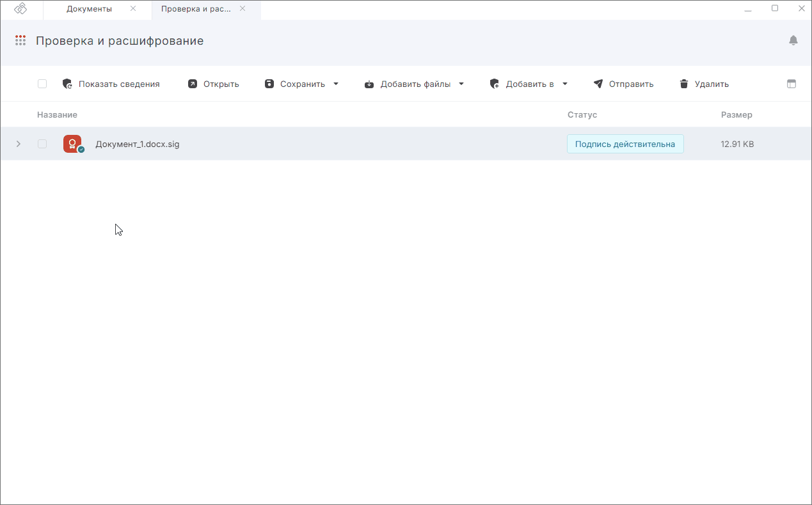

***Важно:*** чтобы снять подпись, у вас на рабочем месте должен быть установлен криптопровайдер КриптоПро CSP.  

Для снятия подписи достаточно выбрать файлы расширением .sig/.p7s/.sgn/.sign/.bin, которые содержат электронную подпись. Никаких дополнительных настроек производить не нужно.  

Для этого:

1. Перейдите в раздел **Документы** — вкладка **Архив**.
2. Выберите в списке файлы, подпись с которых нужно снять, или ничего не выбирайте, если хотите добавить файлы из системы.
3. Перейдите в мастер **Проверка и расшифрование** через левое боковое меню  или с помощью кнопки **Добавить в**.
4. При необходимости добавьте документы в список.
5. Нажмите кнопку слева от файла, с которого надо снять подпись.  

На вкладке **Проверка и расшифрование** отображаются ход и результаты выполнения операции.  

При успешном снятии подписи полученные оригиналы документов сохраняются во временной папке и удаляются после выполнения другой операции. Вы можете сохранить полученные документы на компьютер или в папку Архив, нажав **Сохранить** и выбрав действие в меню **На компьютере** или **В Архив**. 

Если с каких-то документов не удалось снять подпись, то операция считается выполненной с ошибками. Вы можете посмотреть, с каких документов подпись снята успешно, а с каких — с ошибками.   

Ошибки при операции выводятся как уведомления. Вы можете их посмотреть, нажав на иконку.  

Для просмотра подробного описания ошибки или отправки в техническую поддержку нажмите на кнопку **Перейти в журнал** в правой боковой панели списка уведомлений.  

## Возможные уведомления  

1. **Нельзя снять откреплённую подпись с файла** — при открепленной подписи оригинал документа и так находится в отдельном файле.  
2. **Не удалось открыть файл** — добавленные в мастер документы были удалены или по какой-то причине не доступны.  

## Инструкции по теме  

1. [Как добавить документы в мастер.](./08-add-docs.md)  
2. [Как посмотреть уведомления.](../008-cryptoarm/01-notifications.md)  
3. [Действия с результатами операций.](./19-operations-result.md)  
