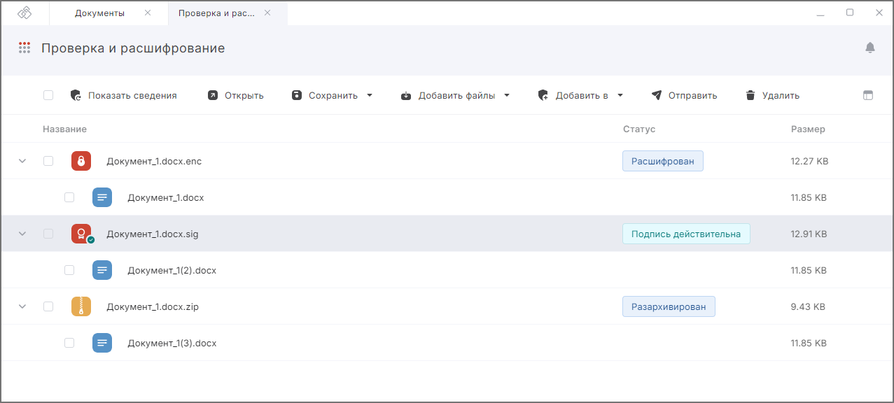

Вы можете выполнять расшифрование, разархивирование, проверку и снятие подписи. Для их выполнения предназначен мастер **Проверки и расшифрования**.  

***Важно:*** чтобы проверять подпись, у вас на рабочем месте должен быть установлен криптопровайдер КриптоПро CSP. Для расшифрования потребуются лицензии на КриптоАРМ и на КриптоПро CSP.

Чтобы расшифровывать документы, нужно установить в Личное хранилище сертификат с закрытым ключом.    

Для корректной проверки подписи у вас должны быть установлены корневой и промежуточные сертификаты подписанта документа.   

По итогам проверки подписанных документов в списке выводится информация о подписи.    

По итогам расшифрования и разархивирования автоматически раскрывается первый уровень вложенности.    

Если вам требуется получить исходный документ, необходимо перейти на уровень ниже, нажав на кнопку слева от файла.    

В этом случае появится текст совершаемой операции: «Расшифрован», «Разархивирован», «Результат проверки подписи». И по итогу выполнения операции в раскрывшейся панели станет доступным исходный документ.  

Для просмотра информации о подписи выделите один документ в списке и нажмите на иконку просмотра.   

Для выполнения обратных операций выбор профиля подписи и настройка параметров операций не требуется.  

Выполните следующие действия:

1. Откройте мастер **Проверки и расшифрования**. Перейти в мастер вы можете из раздела **Документы** через левое боковое меню  или с помощью кнопки **Добавить в**.   
2. Добавьте документы в список одним из способов:  
   
      - перетащите документы или папки с документами из файлового менеджера в область формирования списка файлов. При перетаскивании папки и файлы добавляются одноуровневым списком;  
      - нажмите кнопку **Загрузить с компьютера** для пустого списка файлов или кнопку **Добавить файлы** на панели действий, а затем в файловом менеджере выберите необходимые документы;  
      - нажмите **Добавить из Архива** для пустого списка или кнопку **Добавить файлы** на панели действий, если в списке документы уже добавлены.  

3. Нажмите кнопку **Выполнить**.  

На вкладке **Проверка и расшифрование** отображаются ход и результаты выполнения операций.  

При успешном выполнении операций полученные документы сохраняются во временной папке и удаляются после выполнения другой операции. Вы можете сохранить полученные документы на компьютер или в папку Архив, нажав **Сохранить** и выбрав действие в меню **На компьютере** или **В Архив**.    

Если какие-то документы не удалось обработать, то операция считается выполненной с ошибками. Вы можете посмотреть, какие файлы обработаны успешно, а какие с ошибками.  

Ошибки при операции выводятся как уведомления. Вы можете их посмотреть, нажав на иконку.   

Для просмотра подробного описания ошибки или отправки в техническую поддержку нажмите кнопку **Перейти в журнал** в правой боковой панели списка уведомлений.  

## Возможные уведомления  

1. **Не удалось открыть файл** — добавленные в мастер документы были удалены или по какой-то причине недоступны, добавлен пустой файл (с нулевым размером).  
2. **Не удалось расшифровать файл** — не найден сертификат для расшифрования.   
3. **Не удалось расшифровать файл** — ошибки, связанные с истекшей лицензией КриптоПро CSP.  
4. **Нельзя снять откреплённую подпись с файла** — при открепленной подписи оригинал документа и так находится в отдельном файле.  

## Инструкции по теме 

1. [Как добавить документы в мастер.](./08-add-docs.md)  
2. [Как посмотреть уведомления.](../008-cryptoarm/01-notifications.md)  
3. [Как проверить подпись.](./14-verify.md)  
4. [Действия с результатами операций.](./19-operations-result.md)  
5. [Как установить личный сертификат.](../006-certs/01-import-my-cert.md)  