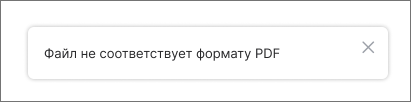

Для начала работы необходимо загрузить документ. Допускается загрузка одного документа в формате PDF.

Загрузить документ можно несколькими способами:

- Перетащить файл с помощью мыши в область приложения.
- Нажать кнопку **Загрузить с компьютера** и выбрать файл в файловом менеджере.

При загрузке документа происходит проверка документа на формат PDF и на содержание в документе подписи и размеченных областей.

Если документ соответствует формату PDF, то он загружается в мастер. Для загруженного файла становятся доступны функции просмотра документа. Если документ не соответствует формату PDF, появляется уведомление об ошибке. Следует выбрать другой документ.

Если документ содержит одну или несколько подписей, то запускается проверка валидности подписей. Подробнее в [Проверка подписи PDF-документа](./07-verify-signature.md).