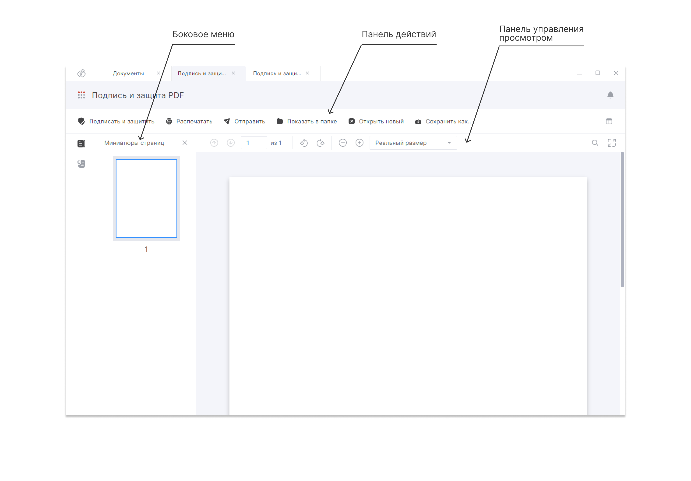
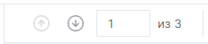
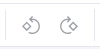

Для загруженного документа становятся доступны панель действий, панель управления просмотром и боковое меню.

**Панель действий** содержит кнопки вызова функций для работы с PDF-документом:

- **Подписать и защитить** – переход к настройкам подписи и разметке областей.
- **Распечатать** – отправка документа на печать.
- **Показать в папке** – открытие каталога, в котором располагается файл.
- **Открыть новый** – замена загруженного документа.
- **Сохранить как** – создание копии документа.
- **Подробно**  – открытие правой боковой панели, содержащей подробные сведения о файле или подписи документа.

**Панель управления просмотром** позволяет настраивать режимы просмотра PDF-документа:

- **Следующая и предыдущая страницы** - переход между страницами по стрелкам вверх и вниз. Также можно ввести номер страницы в текстовом поле, чтобы перейти к нужной странице.

    

- **Повернуть против и по часовой стрелке**  – поворот страниц документа с шагом 90 градусов. Это действие не является изменением ориентации страницы.

    
    
- **Уменьшить и увеличить** – уменьшение или увеличение масштаба отображения страниц документа. При изменении масштаба автоматически меняется значение в поле выбора масштаба. Возможно изменение масштаба страниц документа с помощью меню.
- **Найти в документе** – поиск слов внутри документа.
- **На весь экран и свернуть** – скрыть или развернуть панель действий и панель с кнопкой основного меню и заголовком раздела.

В **боковом меню** доступна навигация по содержимому документа:

- **Миниатюры страниц** – отображение панели с миниатюрным представлением страниц. При выборе миниатюры страницы происходит переход к нужной странице документа в основной области.
- **Вложения** – открытие панели вложений со списком вложенных файлов. Вложенные файлы могут быть открыты для просмотра средствами ОС.
- **Подписи** – отображение панели с проставленными подписями и свободными областями для подписантов. 