Для обеспечения юридической значимости, гарантии авторства и неизменности содержания файла PDF-документы могут быть подписаны «встроенной» электронной подписью. 

«Встроенная» подпись позволяет подписывать электронные документы без изменения формата файла и без создания отдельного файла подписи, как это происходит при использовании присоединенной и отсоединенной подписи соответственно. Подпись встраивается в электронный документ, и получатель может проверить документ на действительность электронной подписи.

***Важно:*** если подписанный документ содержит свободные размеченные области для подписантов, то можно поставить подпись в любую из этих свободных областей.  

Для подписи PDF-документа выполните следующие действия:

1. Загрузите PDF-документ. 
2. Нажмите на кнопку **Подписать и защитить** на панели действий.
3. В открывшейся правой боковой панели: 

    - Выберите [сертификат подписи](#_1).
    - Настройте [стандарт подписи](#_2).
    - При необходимости разместите [штамп для личной подписи](#_3) и настройте его [оформление](#_4).  
    - При необходимости [добавьте подписантов](#_5).
    - При необходимости [добавьте произвольную область](#_6) и настройте ее [оформление](#_7). 
    - Настройте [параметры защиты PDF-документа](./05-convert-file.md).

4. Укажите каталог для сохранения результата операции.
5. Нажмите кнопку **Выполнить**.

При успешном выполнении операции новый файл сохраняется в заданном каталоге, если выбран каталог для сохранения результатов, или рядом с исходным файлом, если каталог не задан. Документ открывается в режиме просмотра и проверки подписи.

***Важно:*** настройки мастера можно выставить в Профиле подписи и использовать при последующих запусках программы. 

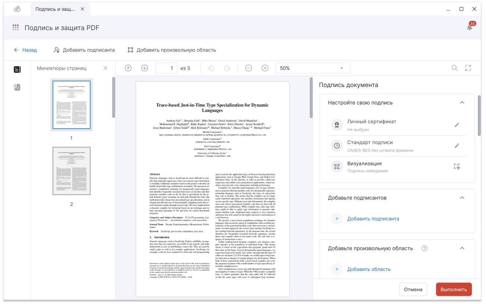

## Выбор сертификата подписи

Для выбора сертификата выполните следующие действия:

1. Нажмите на кнопку **Выбрать** в блоке **Личный сертификат**. 
2. В открывшейся правой боковой панели отметьте чекбоксом нужный сертификат.
3. Закройте панель с помощью кнопки **Закрыть**.

Выбранный сертификат можно изменить с помощью кнопки **Заменить** в блоке **Личный сертификат**.

***Важно:*** для подписи необходимо указать сертификат с привязкой к закрытому ключу. Если в приложении такой сертификат отсутствует, то можно установить его в разделе **Сертификаты**. 

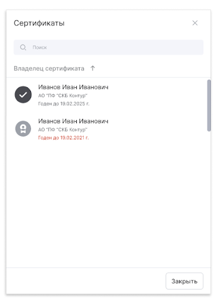

## Настройка стандарта подписи

В приложении доступна подпись PDF-документа со стандартами:

- **CAdES-BES** - «классическая» подпись;
- **CAdES-Т** - подпись, которая содержит информацию о времени создания подписи (TSP);
- **CAdES-X Long Type 1** - подпись, которая содержит информацию о времени создания подписи (TSP) и о статусе сертификата электронной подписи (OCSP) в момент подписания;
- **CAdES-А** - подпись с архивными штампами времени.

По умолчанию будет произведена «классическая» подпись со стандартом CAdES-BES. 

***Важно:*** создание подписи со штампами возможно только при установленных модулях КриптоПро TSP Client и КриптоПро OCSP Client и лицензий на них.

Для выбора стандарта подписи выполните следующие действия:

1. Нажмите кнопку **Редактировать** в блоке **Стандарт подписи**.
2. В появившейся правой боковой панели выставите необходимый стандарт подписи.
3. Для стандартов CAdES-Т, CAdES-X Long Type 1 и CAdES-А заполните обязательное поле **Служба штампов времени** (TSP). Адрес службы штампов времени можно узнать у поставщика услуги. Например, услуги службы штампов времени могут предоставлять удостоверяющие центры.
4. Поле **Служба онлайн статусов** (OCSP) заполняется в случае, если адрес отсутствует в сертификате.
5. Если при подключении к службам TSP и OCSP используется прокси сервер, активируйте настройку **Использовать прокси сервер** и укажите настройки подключения.
6. Закройте панель с настройкой стандарта подписи по кнопке **Закрыть**.

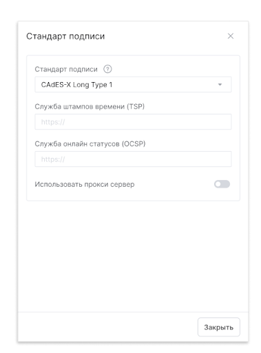

Изменить настройки стандарта можно нажатием кнопки **Редактировать** в блоке **Стандарт подписи**.

## Размещение штампа подписи

Личная подпись может быть добавлена в документ как видимая или невидимая.

Видимая подпись отображается на странице документа в виде штампа. Невидимая подпись визуально на странице документа не видна. При проверке как видимой, так и невидимой подписи можно получить сведения о статусе подписи и сертификате подписанта.

По умолчанию будет проставлена видимая подпись. 

Для разметки области для видимой подписи выполните следующие действия:

1. Нажмите кнопку **Разметить** в блоке **Визуализация**. 
2. На странице документа появятся пунктирные направляющие. При наведении курсора мыши на пересечении направляющих отобразится схематичный прямоугольник.
3. Наведите курсор мыши в место размещения штампа на странице документа и кликните левой кнопкой мыши. В этом случае размер области будет соответствовать размеру схематичного прямоугольника. Для того чтобы задать собственный размер области, наведите курсор мыши в место размещения штампа и, зажав левую кнопку мыши, разметьте область нужного размера.

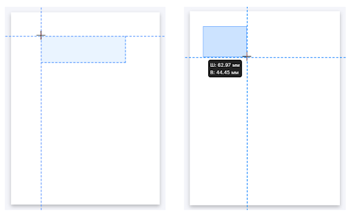

***Важно:*** после разметки в области для подписи будет отображен лейбл **Моя подпись**. Лейбл носит информационный характер и не будет отображаться после подписи документа.

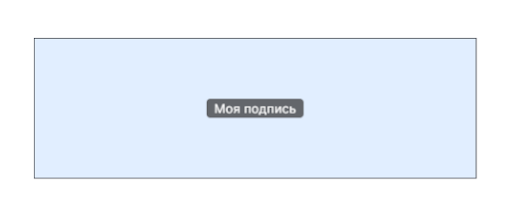

Размер и положение области для подписи можно изменить. Для этого выполните следующие действия:

1. Нажмите на кнопку **Свойства** в блоке **Визуализация**. Откроется правая боковая панель **Свойства области**.
2. В блоке **Размер** укажите новые значения ширины и высоты области в миллиметрах. 
3. В блоке **Положение** измените страницу расположения области, способ выравнивания области на странице и укажите новые значения для отступов от края страницы. 
4. Закройте панель с настройкой положения области по кнопке **Закрыть**.

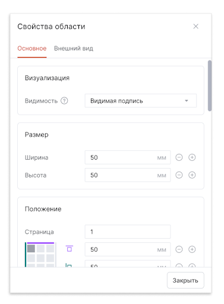

Можно изменить вид подписи с видимой на невидимую. Для этого выполните следующие действия:

1. Нажмите на кнопку **Свойства** в блоке **Визуализация**. Откроется правая боковая панель **Свойства области**.
2. В блоке **Визуализация** выставите настройку **Видимость** на **Невидимая подпись**. 
3. Закройте панель с настройкой положения области по кнопке **Закрыть**.

## Оформление штампа подписи

По умолчанию визуализация информации об электронной подписи задается  в соответствии с требованиями ГОСТ Р 7.0.97-2016. В штамп подписи выводятся заголовок «Документ подписан электронной подписью», серийный номер сертификата, имя владельца сертификата и срок действия сертификата.

Для изменения выводимой информации выполните следующие действия:

1. Разместите штамп подписи на странице документа. 
2. Нажмите на кнопку **Свойства** в блоке **Визуализация**. 
3. В появившейся правой боковой панели перейдите на вкладку **Внешний вид**. 
4. Настройте **Вид штампа** в блоке **Настройки макета**:
    - Штамп - в области будет размещен только штамп.
    - Штамп с реквизитами слева - в области будет размещен штамп, а также блок с реквизитами слева от штампа.
    - Штамп с реквизитами справа - в области будет размещен штамп, а также блок с реквизитами справа от штампа.
    - Штамп с реквизитами слева и справа - в области будет размещен штамп, а также блок с реквизитами слева и справа от штампа.
    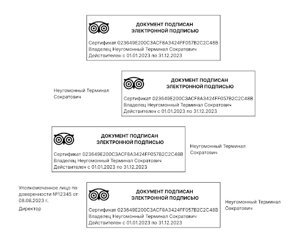

5. Настройте вывод информации в штампе. Для этого нажмите на кнопку **Редактировать** в блоке **Реквизиты** и укажите вывод информации **По ГОСТу** или **Произвольно**:
    - По ГОСТу - в штамп будут выведены обязательные реквизиты, перечисленные в ГОСТ. 
    - Произвольно - самостоятельная настройка выводимых реквизитов.
6. Аналогичным образом настройте вывод информации для блоков слева или справа от штампа, если их отображение активировано. 
7. Настройте отображение границы и фона штампа в блоке Оформление. 
8. Загрузите изображение с гербом или эмблемой в блоке Логотип. Изображение будет размещено в верхнем левом углу штампа подписи. 

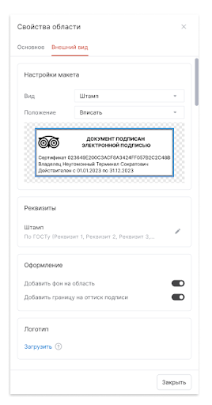

## Добавление подписантов

В приложении в документ можно добавить до 10 подписантов. По аналогии с личной подписью подпись подписантов может быть видимой и невидимой.

Для добавления подписанта выполните следующие действия:

1. Нажмите кнопку **Добавить подписанта**. 
2. В блоке **Добавьте подписантов** появится подписант с невидимой подписью.

Для разметки области для видимой подписи подписанта выполните следующие действия:

1. Нажмите кнопку **Разметить** на панели с подписантом. 
2. На странице документа появятся пунктирные направляющие. При наведении курсора мыши на пересечении направляющих отобразится схематичный прямоугольник.
3. Наведите курсор мыши в место размещения штампа на странице документа и кликните левой кнопкой мыши. В этом случае размер области будет соответствовать размеру схематичного прямоугольника. Для того, чтобы задать собственный размер области, наведите курсор мыши в место размещения штампа и, зажав левую кнопку мыши, разметьте область нужного размера.

***Важно:*** после разметки в области для подписанта будет отображен лейбл с названием подписанта. Лейбл носит информационный характер и не будет отображаться после простановки подписи в область.

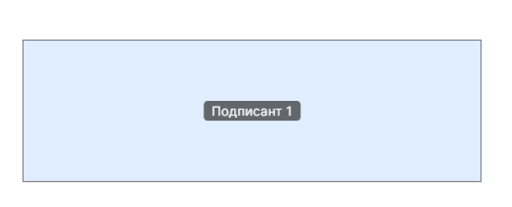

Размер и положение области для подписанта можно изменить. Для этого выполните следующие действия:

1. Нажмите на кнопку **Свойства** в блоке **Визуализация**. Откроется правая боковая панель **Свойства области**.
2. В блоке **Размер** укажите новые значения ширины и высоты области в миллиметрах. 
3. В блоке **Положение** измените страницу расположения области, способ выравнивания области на странице и укажите новые значения для отступов от края страницы. 
4. Закройте панель с настройкой положения области по кнопке **Закрыть**.

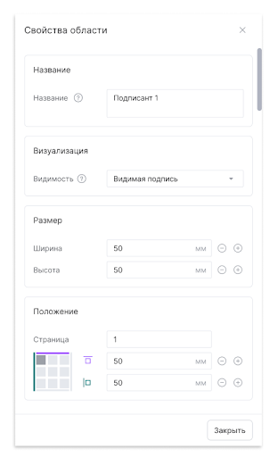

## Размещение произвольной области

**Произвольная область** – это область для графического изображения или текста. В области можно разместить свой комментарий, статус или отметку о конфиденциальности документа.

Для разметки области для произвольного штампа выполните следующие действия:

1. Нажмите кнопку **Добавить область** в блоке **Добавьте произвольную область**. 
2. На странице документа появятся пунктирные направляющие. При наведении курсора мыши на пересечении направляющих отобразится схематичный прямоугольник.
3. Наведите курсор мыши в место размещения штампа на странице документа и кликните левой кнопкой мыши. В этом случае размер области будет соответствовать размеру схематичного прямоугольника. Для того, чтобы задать собственный размер области, наведите курсор мыши в место размещения штампа и, зажав левую кнопку мыши, разметьте область нужного размера.

***Важно:*** после разметки в области для штампа будет отображен лейбл с названием области. Лейбл носит информационный характер и не будет отображаться после настройки внешнего вида штампа. 

Название, размер и положение области для штампа можно изменить. Для этого выполните следующие действия:

1. Нажмите на кнопку **Свойства** в блоке **Добавьте произвольную область**. Откроется правая боковая панель **Свойства области**.
2. В блоке **Название** укажите новое название для области.
3. В блоке **Размер** укажите новые значения ширины и высоты области в миллиметрах. 
4. В блоке **Положение** настройте страницы расположения области, способ выравнивания области на странице и укажите новые значения для отступов от края страницы. Если на некоторых страницах документа требуется поместить штамп в другом месте, то можно использовать настройку Добавить исключение.  
5. Закройте панель с настройкой положения области по кнопке **Закрыть**.

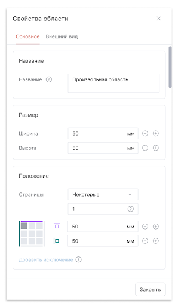

Для удаления произвольной области из документа нажмите на кнопку **Удалить** в блоке **Добавьте произвольную область**.

***Важно:*** нельзя удалить произвольную область в подписанном документе.

## Оформление произвольной области

В произвольную область можно загрузить любое изображение или напечатать текст. 

Для настройки оформления области выполните следующие действия:

1. Разместите область на странице документа. 
2. Нажмите на кнопку **Свойства** в блоке **Добавьте произвольную область**. 
3. В появившейся правой боковой панели перейдите на вкладку **Внешний вид**. 
4. Настройте **Вид области** в блоке **Настройки макета**:
    - Изображение - в области можно будет загрузить любое изображение размером до 10 МБ.
    - Текст - в области можно напечатать любой текст с помощью текстового редактора.
    - Оставить пустым - полномочия по оформлению области будут переданы следующему подписанту.
5. Настройте Положение области в блоке **Настройки макета**:
    - Вписать - штамп будет вписан по ширине и высоте в размеченную область.
    - Подогнать область под макет - размер размеченной области будет подогнан под размер изображения или текста. 
6. Настройте прозрачность контента произвольной области и отображение границы и фона штампа в блоке **Оформление**.

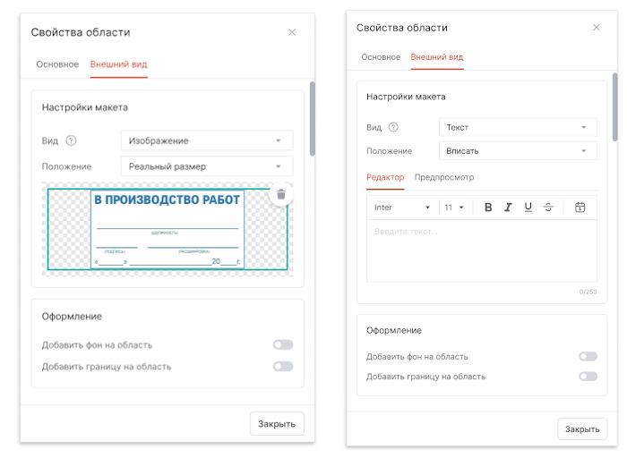  

## Настройка сохранения результата

Для подписанного документа можно настроить каталог для сохранения результата.

Для этого в блоке **Сохранение** результатов необходимо выбрать вариант сохранения:

1. **Папка с исходным документом**. В таком случае подписанный файл сохраняется рядом с исходным файлом. Настройка выбрана по умолчанию.
2. **Сохранить в папку…** При выборе опции становится доступно поле для выбора каталога.
Для автоматического сохранения результата операции в папке **«Архив»** нужно активировать настройку **Создать копию в папке «Архив»**.

## Выполнение операции 

Перед выполнением операции происходит проверка на корректность заполнения настроек и возможность выполнения.

При успешном выполнении операции новый файл сохраняется в заданном каталоге, если выбран каталог для сохранения результатов, или рядом с исходным файлом, если каталог не задан. Происходит запись события в **Журнал событий**.

Подписанный документ открывается в режиме просмотра и проверки подписи.

Ошибки, возникающие при выполнении подписи, выводятся в уведомления. Просмотреть уведомления можно, открыв правую панель **События** по кнопке   

Для просмотра подробного описания ошибки или отправки в техническую поддержку необходимо нажать на кнопку **Перейти в журнал** в правой боковой панели списка уведомлений.

Если были внесены изменения в настройки подписи, то по кнопке **Назад** или при нажатии на кнопку **Отмена** в правой боковой панели возникает окно с предупреждением. Настроенные параметры подписи не запоминаются программой, если ранее не были сохранены в **Профиль подписи**.

***Важно:*** настройки мастера можно выставить в **Профиле подписи** и использовать при последующих запусках программы. Процесс сохранения и изменения настроек описан в главе [Профили подписи](../004-documents/02-sign-profiles.md).