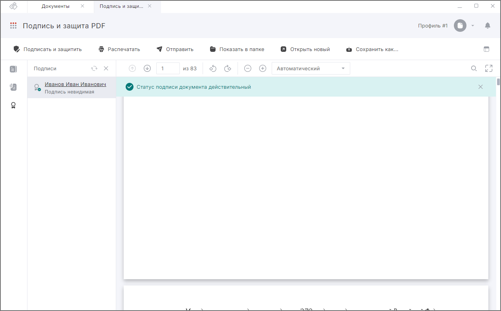

Сертификация позволяет защитить PDF-документ от изменений путем его подписания электронной подписью, с указанием типа изменений, разрешенных для документа. В приложении при сертификации разрешается заполнение размеченных областей для подписантов и для произвольной области.
При сертификации выполняется обязательная конвертация документа в формат PDF/A-2b. [Подробнее.](./05-convert-file.md)

***Важно:*** сертификация доступна только для неподписанных документов. 

Для активации настройки сертификации выполните следующие действия:

1. [Загрузите PDF-документ](./01-load-file.md).
2. Нажмите кнопку **Подписать и защитить** на панели действий.
3. Укажите настройки подписи, перечисленные в [Подпись PDF-документа](./03-sign-file.md).
4. Нажмите кнопку **Выполнить**.

При успешном выполнении операции новый файл сохраняется в заданном каталоге, если выбран каталог для сохранения результатов, или рядом с исходным файлом, если каталог не задан. Документ открывается в режиме просмотра и проверки подписи.

