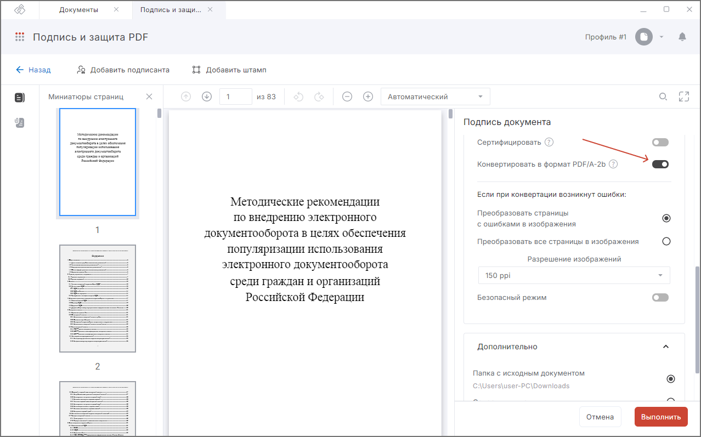

При конвертации документа в формат PDF/A-2b происходит удаление скриптов, форм и прочие элементов, влияющие на безопасность и целостность документа.

***Важно:*** 

- Конвертация выполняется только вместе с подписью документа.
- Конвертация доступна только для неподписанных документов.

Для активации настройки конвертации выполните следующие действия:

1. [Загрузите PDF-документ](./01-load-file.md).
2. Нажмите кнопку **Подписать и защитить** на панели действий.
3. Укажите настройки подписи, перечисленные в [Подпись PDF-документа](./03-sign-file.md).
4. Активируйте настройку **Конвертировать в PDF/A-2b** в блоке **Защитите документ**. 
5. При возникновении ошибок в ходе конвертации можно настроить вариант действий с документом:
    - Преобразовать страницы с ошибками в изображения (выставлено по умолчанию).
    - Преобразовать все страницы в изображения.
    - Остановить операцию и сообщить об ошибке.
6. Укажите каталог для сохранения результата операции.
7. Нажмите кнопку **Выполнить**.

При успешном выполнении операции новый файл сохраняется в заданном каталоге, если выбран каталог для сохранения результатов, или рядом с исходным файлом, если каталог не задан. Документ открывается в режиме просмотра и проверки подписи.