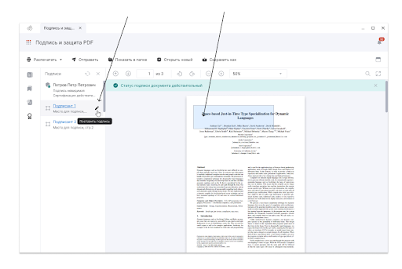

Если подписанный документ содержит свободные размеченные области для подписантов, то можно поставить подпись в любую из этих свободных областей. 

Для проставления подписи в свободную область для подписанта выполните следующие действия:

1. [Загрузите PDF-документ.](./01-load-file.md)
2. Наведите курсор мыши на область в боковом меню и нажмите на кнопку **Поставить подпись**, либо кликните по области на странице документа.
3. В открывшейся правой боковой панели: 
    - Выберите [сертификат подписи](./03-sign-file.md/#_1).
    - Настройте [стандарт подписи](./03-sign-file.md/#_2).
    - При необходимости настройте [оформление произвольной области](./03-sign-file.md/#_7).
4. Укажите каталог для [сохранения результата операции](./03-sign-file.md/#_8).
5. Нажмите кнопку **Выполнить**.

При успешном выполнении операции новый файл сохраняется в заданном каталоге, если выбран каталог для сохранения результатов, или рядом с исходным файлом, если каталог не задан. Документ открывается в режиме просмотра и проверки подписи.

***Важно:*** настройки мастера можно выставить в **Профиле подписи** и использовать при последующих запусках программы. 

 
