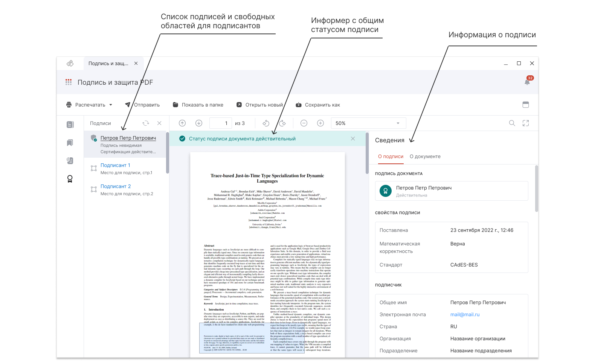

Общий статус подписи отображается в виде информера в области просмотра документа.
Список подписей PDF-документа и свободных областей для подписантов выводятся в боковом меню.

Для просмотра подробной информации о подписи необходимо выделить подпись в списке бокового меню и нажать кнопку **Подробно** в строке с подписью или на панели действий. 

***Важно:*** если в документе статус подписи недействительный по причине недействительности сертификата, то следует проверить построение цепочки сертификатов и, при необходимости, [установить недостающие сертификаты](../006-certs/05-import-UC-certs.md).