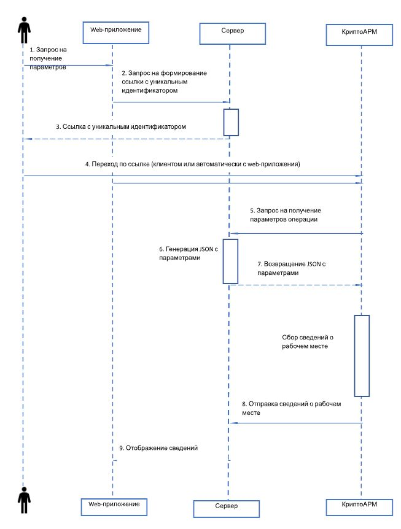

Команда `diagnostics` используется для диагностики рабочего места пользователя.  Схема взаимодействия:ката или списка сертификатов, а импорта сертификата в локальное хранилище, просмотра информации о сертификате. 

