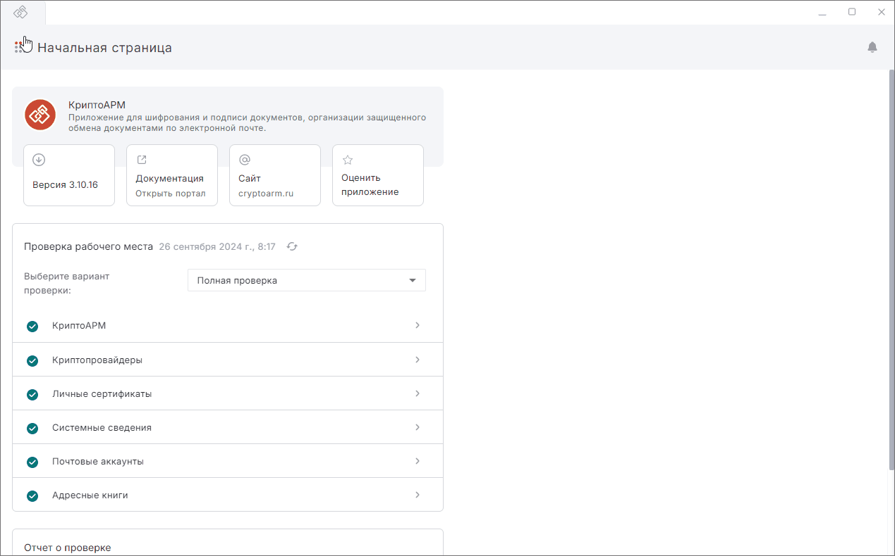
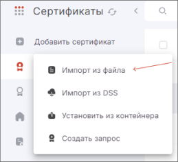

Если у вас сертификат на защищённом носителе или в локальном хранилище устройства, то воспользуйтесь [инструкцией по установке сертификата из ключевого контейнера](#_1).  

Если у вас сертификат и закрытый ключ находятся в контейнере .pfx, то воспользуйтесь [инструкцией по установке сертификата из файла .pfx](#pfx).  

Если у вас есть сгенерированный закрытый ключ и вы получили сертификат в Удостоверяющем центре, то для установки сертификата воспользуйтесь [инструкцией по установке сертификата с привязкой к ключевому контейнеру](#_2).  

Перед импортом личного сертификата убедитесь, что у вас установлен криптопровайдер КриптоПро CSP.  

***Примечание:*** для того чтобы сертификат был действительный, у вас должны быть установлены корневые сертификаты УЦ и актуальный список отзыва сертификатов (СОС).  

## Установка сертификата из ключевого контейнера  

***Примечание:*** возможно, понадобится установка драйверов для токена.  

Данный способ возможен, если сертификат присутствует в контейнере. Иначе функция установки будет недоступна.  

1. При необходимости подключите токен к устройству.  
2. Выберите раздел **Сертификаты**.  
3. Выберите раздел **Ключи**.    
   Или нажмите кнопку **Добавить сертификат** в правой части окна и в открывшемся списке действий выберите **Установить из контейнера**.   Открывается список контейнеров.  
4. В списке выделите контейнер.  
5. Нажмите кнопку **Установить**.  
6. При необходимости введите пароль к ключевому контейнеру.  

Сертификат установлен в личное хранилище и отображается в списке. Теперь вы можете подписывать и расшифровывать документы этим сертификатом.  

## Установка сертификата с закрытым ключом из файла .pfx   

1. Выберите раздел **Сертификаты**.  
2. Нажмите кнопку **Добавить сертификат** в правой части окна.  
3. В открывшемся списке действий выберите **Импорт из файла**.

    

4. В файловом менеджере выберите файл сертификата .pfx.  
5. Введите пароль к контейнеру pfx.  
6. Задайте новый пароль к ключевому контейнеру.  

Сертификат установлен в личное хранилище и отображается в списке. Теперь вы можете подписывать и расшифровывать документы этим сертификатом.  

## Установка сертификата с  привязкой к ключевому контейнеру  

1. Выберите раздел  **Сертификаты**.    
2. Нажмите кнопку **Добавить сертификат** в правой части окна.  
3. В открывшемся списке действий выберите **Импорт из файла**.  
4. В файловом менеджере выберите файл сертификата .cer или .crt.  
5. Введите пароль к ключевому контейнеру, если требуется.  

Сертификат установлен в личное хранилище и отображается в списке. Теперь вы можете подписывать и расшифровывать документы этим сертификатом.  

Если при импорте возникает ошибка, она выводится как уведомление в правом верхнем углу. Вы можете посмотреть уведомления, нажав на иконку.  

   

Для просмотра подробного описания ошибки или отправки в техническую поддержку нажмите кнопку **Перейти в журнал** в правой боковой панели списка уведомлений.  

## Инструкции по теме  

1. [Как установить корневой и промежуточный сертификаты.](./05-import-UC-certs.md)  
2. [Как импортировать список отзыва сертификатов (СОС).](./07-import-crl.md)  
3. [Как посмотреть уведомления.](../008-cryptoarm/01-notifications.md)  