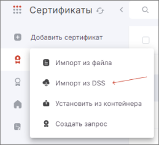
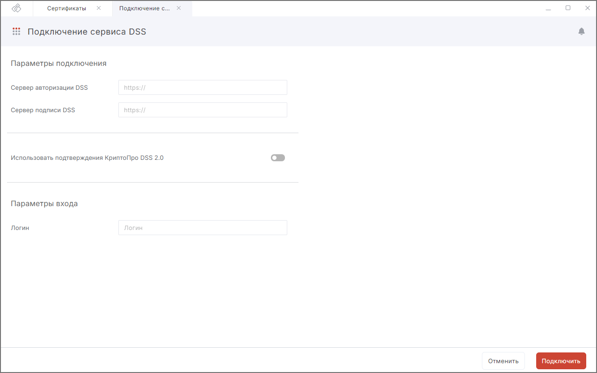
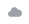

Для установки сертификата из DSS надо сначала создать подключение к DSS.  

## Создание подключения к сервису DSS  

Чтобы создать подключение к сервису DSS необходимо выполнить следующие действия:

1. Перейти в раздел **Сертификаты**.  
2. Нажать кнопку **Добавить сертификат** в левом боковом меню.  
3. В открывшемся списке действий выбрать **Импорт из DSS**.
 
     

4. Заполнить поля:  
   
     - **Название подключения** — любое название (может состоять из латинских букв, цифр и знака подчеркивания);  
     - **Сервер авторизации DSS** и **Сервер DSS** — данные адреса необходимо получить в организации, предоставившей вам сертификат электронной подписи;  
     - **Использовать подтверждения КриптоПро DSS 2.0** — нужно включить данную опцию, если используется КриптоПро DSS 2.0;  
     - **Логин** — ваш логин  для доступа к сертификату.  
     
     
5. Нажать на кнопку **Подключить**.  
6. Если в личном кабинете DSS в настройках стоит подтверждение по паролю, то на следующем шаге ввести пароль для подключения к сервису DSS и нажать кнопку **Применить**.

     Чтобы каждый раз не вводить пароль для подключения при работе с сертификатом DSS, можно установить флаг **Запоминать пароль до выхода из приложения**.

     Eсли пароль не задан, то данный шаг пропускается.  

7. Если в личном кабинете DSS в настройках стоит подтверждение аутентификации по SIM-карте или с помощью мобильного приложения, то на следующем шаге появляется информационное окно с ожиданием подтверждения операции на телефоне.  
  
     **Подтвердить** операцию на телефоне.    

     Если идентификация настроена не с помощью телефона, то данный шаг пропускается.  

При успешной аутентификации сертификат DSS автоматически помещается в хранилище **Личные сертификаты**.  

Сертификаты DSS в списке отличаются иконкой облачного контейнера.   

***Важно:*** для того чтобы сертификат был действительный, должны быть установлены корневые сертификаты УЦ и актуальный список отзыва сертификатов (СОС).  

Если при подключении к сервису возникают ошибки, они выводятся как уведомления. Нажав на иконку, можно их просмотреть.    

Для просмотра подробного описания ошибки или отправки в техническую поддержку нажать кнопку **Перейти в журнал** в правой боковой панели списка уведомлений.  

## Возможные уведомления   

1. **Не удалось подключиться к серверу DSS: неверный логин или пароль** — проверить правильность заполнения данных.  
2. **Не удалось подключиться к серверу DSS** — проверить правильность ввода адресов серверов, доступ к сети Интернет.  

## Инструкции по теме

1. [Как установить корневой и промежуточный сертификаты.](./05-import-UC-certs.md)  
2. [Как импортировать список отзыва сертификатов (СОС).](./07-import-crl.md)  