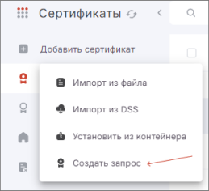
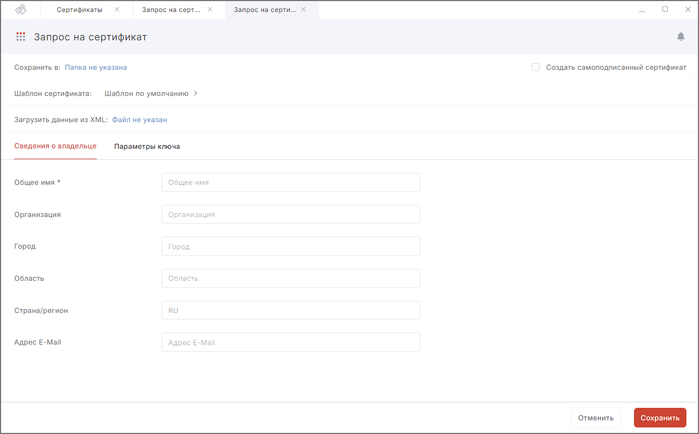

Чтобы получить личный сертификат для выполнения криптографических операций, необходимо создать запрос на сертификат и направить его на рассмотрение в Удостоверяющий центр (УЦ).  

## Создание запроса

Для создания запроса выполните следующие действия:

1. Перейдите в раздел **Сертификаты**.  
2. Нажмите кнопку **Добавить сертификат** в правой части окна и в открывшемся списке действий выберите **Создать запрос**.  
    

3. Форма создания запроса на сертификат открывается в новой вкладке. 
    

4. **Выберите** папку для сохранения файла запроса.     
    Если папка не выбрана, файл запроса сохранится в папку пользователя.
5. **Выберите** шаблон сертификата, открыв правую боковую панель со списком шаблонов. Можно выбрать шаблон из списка или выбрать пользовательский шаблон. Для этого нужно **Загрузить шаблон** в формате .json. Для получения инструкции по заполнению шаблона пишите на электронную почту support@trusted.ru. Импортированные шаблоны можно удалить.  
6. **Загрузите данные из XML** — позволяет автоматически заполнить поля в запросе с помощью загрузки файлов XML. Данные в полях можно редактировать.
7. Заполните поля раздела **Сведения о владельце**.  
    Набор полей меняется в зависимости от  выбранного на предыдущем шаге шаблона.  
8. Перейдите в раздел **Параметры ключа**.  
    В данном разделе вы можете задать следующее:  

    - идентификация заявителя;  
    - алгоритм ключа;  
    - назначение ключа;  
    - название ключевого контейнера — создан на основе нового ключевого набора, но вы можете задать свое имя или оставить созданное автоматически;  
    - флаг **Пометить ключи как экспортируемые** — данная опция позволит экспортировать сертификат вместе с закрытым ключом для переноса на другое устройство;  
    - использование ключа;  
    - назначение сертификата (EKU).  
    
9. После заполнения всех полей нажмите на кнопку **Сохранить**.    
10. Выберите ключевой носитель для хранения контейнера (реестр, диск, токен), если требуется.  
11. На запрос системы **установите** пароль на данный контейнер и **подтвердите** его.   

На основе указанных данных формируется запрос на сертификат.    

При успешной генерации запрос сохраняется в файл <CN сертификата\>_<алгоритм \>_<дата генерации\>.req в заданной папке и отображается во вкладке **Запросы** раздела **Сертификаты**.  

Созданный файл запроса на сертификат следует направить на рассмотрение в Удостоверяющий центр (УЦ). Полученный из УЦ сертификат следует импортировать для работы в приложении.  

Если создании запроса возникает ошибка, она выводится как уведомление в правом верхнем углу. Вы можете посмотреть уведомления, нажав на иконку.  

    

Для просмотра подробного описания ошибки или отправки в техническую поддержку нажмите кнопку **Перейти в журнал** в правой боковой панели списка уведомлений.  

## Инструкции по теме

1. [Как установить корневой и промежуточный сертификаты.](./05-import-UC-certs.md)  
2. [Как импортировать список отзыва сертификатов (СОС).](./07-import-crl.md)  
3. [Как установить личный сертификат.](./01-import-my-cert.md)  
4. [Как создать самоподписанный сертификат.](./04-self-signed-cert.md)  
5. [Как посмотреть уведомления.](../008-cryptoarm/01-notifications.md)  
