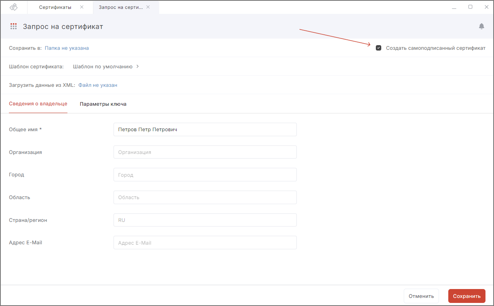
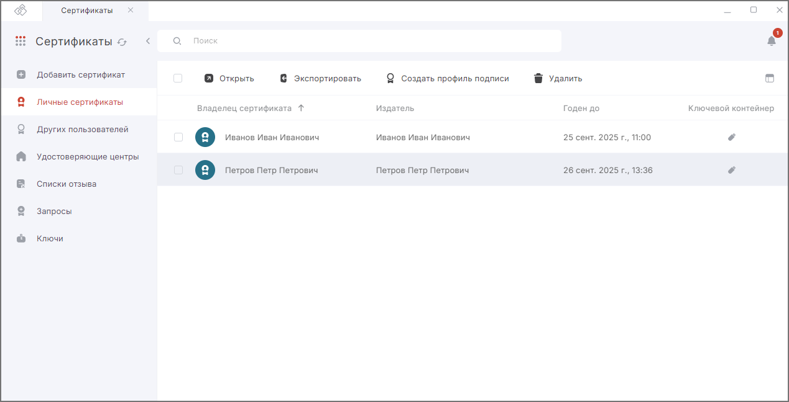

## Назначение

**Самоподписанный сертификат** – сертификат, изданный самим пользователем, без обращения к Удостоверяющему центру. Самоподписанный сертификат является одновременно личным и корневым (устанавливается в Личное хранилище сертификатов и Доверенные корневые центры сертификации).   

Самоподписанные сертификаты используются для обмена зашифрованными или подписанными документами между людьми, доверяющими друг другу, например, 
друзьями, коллегами.  

## Создание самоподписанного сертификата

Чтобы создать самоподписанный сертификат:

1. Перейдите в раздел **Сертификаты**.  
2. Нажмите кнопку **Добавить сертификат** в правой части окна и в открывшемся списке действий выберите **Создать запрос**.  
3. Форма создания запроса на сертификат открывается в новой вкладке.  
4. При необходимости выберите шаблон сертификата, открыв правую боковую панель со списком шаблонов.  
5. В правом верхнем углу установите флаг **Создать самоподписанный сертификат**.  
    

6. Заполните поля раздела **Сведения о владельце**.  
    Набор полей меняется в зависимости от  выбранного на предыдущем шаге шаблона.  
7. Перейдите в раздел **Параметры ключа**.  
    В данном разделе вы можете задать следующее:  

    - идентификация заявителя;  
    - алгоритм ключа;  
    - назначение ключа;  
    - название ключевого контейнера — создан на основе нового ключевого набора, но вы можете задать свое имя или оставить созданное автоматически;  
    - установить флаг **Пометить ключи как экспортируемые** — данная опция позволит экспортировать сертификат вместе с закрытым ключом для переноса на другое устройство;  
    - использование ключа;  
    - назначение сертификата (EKU).  

8. После заполнения всех полей нажмите на кнопку **Сохранить**.  
9. **Выберите** ключевой носитель для хранения контейнера (реестр, диск, токен), если требуется.  
10. На запрос системы **установите** пароль на данный контейнер и **подтвердите** его.   

На основе указанных данных формируется самоподписанный сертификат.    

При успешной генерации сертификат устанавливается в хранилище **Личные сертификаты** раздела **Сертификаты**.   

При генерации самоподписанного сертификата запрос на сертификат не создается.  

Чтобы самоподписанный сертификат был действительным, нужно импортировать его в раздел **Удостоверяющие центры**. Для этого сначала необходимо сертификат экспортировать в файл без закрытого ключа, а потом импортировать в раздел УЦ.  

Если при создании сертификата возникает ошибка, она выводится как уведомление в правом верхнем углу. Вы можете посмотреть уведомления, нажав на иконку.    

Для просмотра подробного описания ошибки или отправки в техническую поддержку нажмите кнопку **Перейти в журнал** в правой боковой панели списка уведомлений.  

## Инструкции по теме

1. [Как экспортировать сертификат.](./08-export-my-cert.md)  
2. [Как установить корневой и промежуточный сертификаты.](./05-import-UC-certs.md)  
3. [Как импортировать список отзыва сертификатов (СОС).](./07-import-crl.md)  
4. [Как создать запрос на сертификат.](./03-request.md)  
5. [Как посмотреть уведомления.](../008-cryptoarm/01-notifications.md)