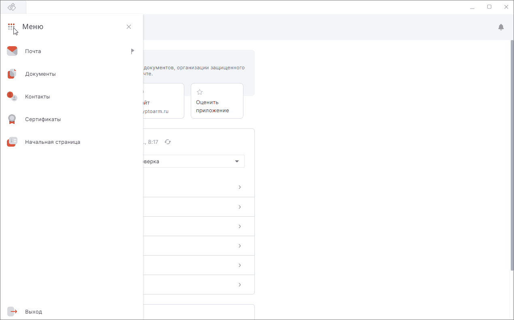

Для обмена шифрованными данными с другими пользователями экспортируйте сертификат без закрытого ключа.  

Экспортируйте сертификат с закрытым ключом, если вам нужно:  

- сохранить копию сертификата и связанного с ним закрытого ключа;  
- удалить сертификат и его закрытый ключ с устройства и установить на другое устройство.  

## Экспорт сертификата без закрытого ключа  

1. Выберите раздел **Сертификаты**.  
2. Выберите вкладку **Личные сертификаты**.  
3. В списке выделите личный сертификат.  
4. Нажмите кнопку **Экспортировать** на панели действий.  
5. Введите пароль к ключевому контейнеру или нажмите **Отмена**.    
     Если пароль не задан, то данный шаг пропускается.  
6. В выпадающем списке выберите **Не экспортировать закрытый ключ**. Выбор может быть заблокирован, если ключ не экспортируемый.  
7. Выберите тип кодировки BASE64 или DER.  
8. Нажмите кнопку **Выполнить**.  
9. В файловом менеджере задайте путь к файлу сертификата и имя файла.  

## Экспорт сертификата с закрытым ключом в контейнер pfx  

***Важно:*** вы можете экспортировать сертификат вместе с закрытым ключом, если ключ имеет флаг "экспортируемый". В противном случае, эта функция недоступна.  

1. Выберите раздел **Сертификаты**.  
2. Выберите вкладку **Личные сертификаты**.  
3. В списке выделите личный сертификат.  
4. Нажмите кнопку **Экспортировать** в верхней панели действий.  
5. Введите пароль к ключевому контейнеру.  
     Если пароль не задан, то данный шаг пропускается.  
6. В выпадающем списке выберите **Экспортировать закрытый ключ**. Выбор заблокирован, если ключ не экспортируемый.  
7. Задайте пароль к файлу .pfx.  
8. Нажмите **Выполнить**.  
9. В файловом менеджере задайте путь к файлу сертификата и имя файла.  

При успешном выполнении операции сертификат экспортируется в файл.  

Если при экспорте возникает ошибка, она выводится как уведомление в правом верхнем углу. Вы можете посмотреть уведомления, нажав на иконку.   

Для просмотра подробного описания ошибки или отправки в техническую поддержку нажмите кнопку **Перейти в журнал** в правой боковой панели списка уведомлений.  

## Инструкции по теме

1. [Как посмотреть уведомления.](../008-cryptoarm/01-notifications.md)  
2. [Как экспортировать сертификат.](./09-export-cert.md)  
3. [Как установить личный сертификат.](./01-import-my-cert.md)  
4. [Как импортировать сертификаты других пользователей.](./06-import-certs.md)  