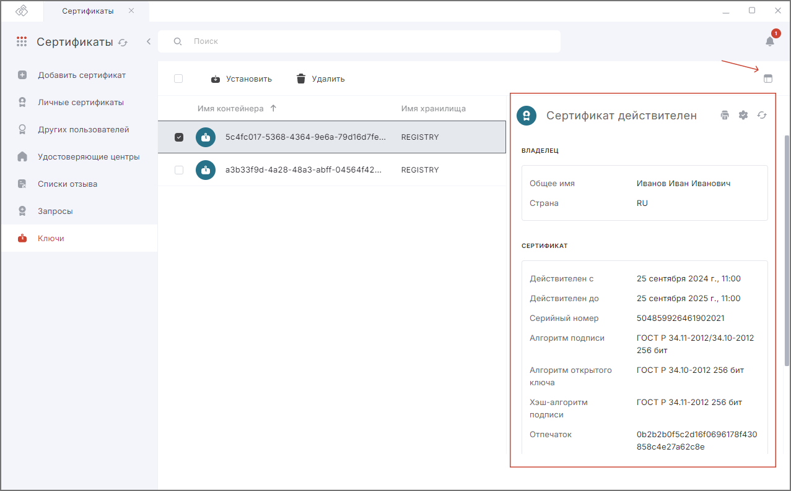
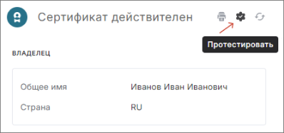

В программе отображаются ключевые контейнеры, расположенные в системе и на отчуждаемых носителях, например, USB-токенах и смарт-картах.  

## Просмотр сертификата в контейнере  

1. При необходимости подключите ключевой носитель к устройству.  
2. Выберите раздел **Сертификаты**.  
3. Выберите  хранилище **Ключи**.    
   Открывается список контейнеров.  
5. В списке выделите контейнер.  
6. Нажмите на иконку просмотра.   

В правой боковой панели отображается информация о сертификате в контейнере. Если выводится надпись «В контейнере отсутствуют сертификаты», значит, контейнер не содержит сертификат и его стоит импортировать.  

Для сертификата в контейнере доступны **действия**:  

- **Печать** — для печати информации о сертификате.
- **Протестировать** — для тестирования контейнера закрытого ключа.
- **Обновить** — для обновления информации о сертификате.  
    

## Печать информации о сертификате в контейнере  

***Примечание:*** данная функция доступна только для контейнеров, в которых есть сертификат.  

1. При необходимости подключите ключевой носитель к устройству.  
2. Выберите раздел **Сертификаты**.  
3. Выберите хранилище **Ключи**.    
   Открывается список контейнеров.  
4. В списке выделите контейнер.  
5. Нажмите на иконку просмотра.   
6. В правой боковой панели нажмите на кнопку **Печать**.  

## Тестирование контейнера  

***Примечание:*** данная функция доступна только для контейнеров, в которых есть сертификат.  
 
1. При необходимости подключите ключевой носитель к устройству.  
2. Выберите раздел **Сертификаты**.  
3. Выберите хранилище **Ключи**.    
   Открывается список контейнеров.  
4. В списке выделите контейнер.  
5. Нажмите на иконку просмотра.   
6. В правой боковой панели нажмите на кнопку **Протестировать**.  
   
   
7. При необходимости введите пароль к ключевому контейнеру.  

В правой боковой панели отображается информационное сообщение о результатах тестирования контейнера.  

## Установка сертификата из ключевого контейнера  

***Примечание:*** данная функция доступна только для контейнеров, в которых есть сертификат.  

1. При необходимости подключите ключевой носитель к устройству.
2. Выберите раздел **Сертификаты**.  
3. Выберите хранилище **Ключи**.    
   Открывается список контейнеров.  
4. В списке выделите контейнер.  
5. Нажмите кнопку **Установить**.  
6. При необходимости введите пароль к ключевому контейнеру.  

Сертификат установлен в личное хранилище.  

## Удаление контейнера  

***Важно:*** удаленный контейнер не подлежит восстановлению! Вам придется перевыпускать сертификат.  

1. Выберите раздел **Сертификаты**.  
2. Выберите хранилище **Ключи**.    
   Открывается список контейнеров.  
3. В списке выделите контейнер.  
4. Нажмите кнопку **Удалить**.  
5. Подтвердите удаление.  

Если во время удаления был установлен флаг **Удалить связанный с контейнером сертификат**, то сертификат удалится из хранилища **Личные сертификаты**.  

## Обновление списка контейнеров  

Вы можете обновить список контейнеров, нажав иконку **Обновить**.  

## Инструкции по теме

1. [Как установить личный сертификат.](./01-import-my-cert.md)  
