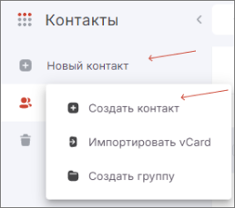
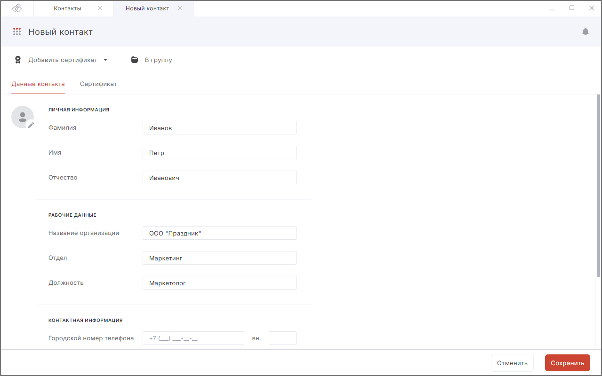

Вы можете создавать контакты для хранения имен, адресов электронной почты, номеров телефонов и других данных. При вводе получателя нового письма этот контакт появится в списке для выбора.  

Вы можете привязать сертификат к контакту для шифрования писем в его адрес.  

## Создание контакта из раздела Контакты  

1. Перейдите в раздел **Контакты**.  
2. Нажмите на кнопку **Новый контакт** в левом меню.  
3. Выберите **Создать контакт**.  
    

4. Заполните поля.  
5. Нажмите кнопку **Сохранить**.  

## Создание контакта из раздела Сертификаты  

1. Перейдите в раздел **Сертификаты**.  
2. Выберите хранилище сертификатов **Других пользователей**.  
3. Выделите сертификат в списке.  
4. На верхней панели действий нажмите кнопку **Создать контакт**. Форма создания контакта открывается в новой вкладке. Данные контакта заполнены доступными данными из сертификата.  
5. Заполните необходимые поля.  
6. Нажмите кнопку **Сохранить**.  

При успешном выполнении операции созданный контакт появляется в списке контактов.  

Вы можете редактировать и удалять контакты.  

## Описание полей формы добавления контакта  

Поля сгруппированы по вкладкам **Данные контакта** и **Сертификат**.  

Поля раздела **Данные контакта**:  

- личная информация: фамилия, имя, отчество;  
- рабочие данные: название организации, отдел, должность;  
- контактная информация: городской номер телефона, мобильный номер телефона, e-mail;  
- дополнительная информация: день рождения, адрес, примечание.  

Кнопка **Добавить** добавляет дополнительное поле. Доступна для полей: мобильный номер телефона и адрес электронной почты.   

В разделе **Сертификат** отображается список привязанных к контакту сертификатов.  

Также контакт можно добавить в группу контактов.  

## Инструкции по теме

1. [Как привязать сертификат к контакту.](./05-link-contact-cert.md)  
2. [Как удалять локальные контакты.](./09-delete-contact.md)  
3. [Как редактировать локальные контакты.](./06-edit-contact.md)  
4. [Как добавить адресную книгу LDAP.](./03-add-ldap.md)  
